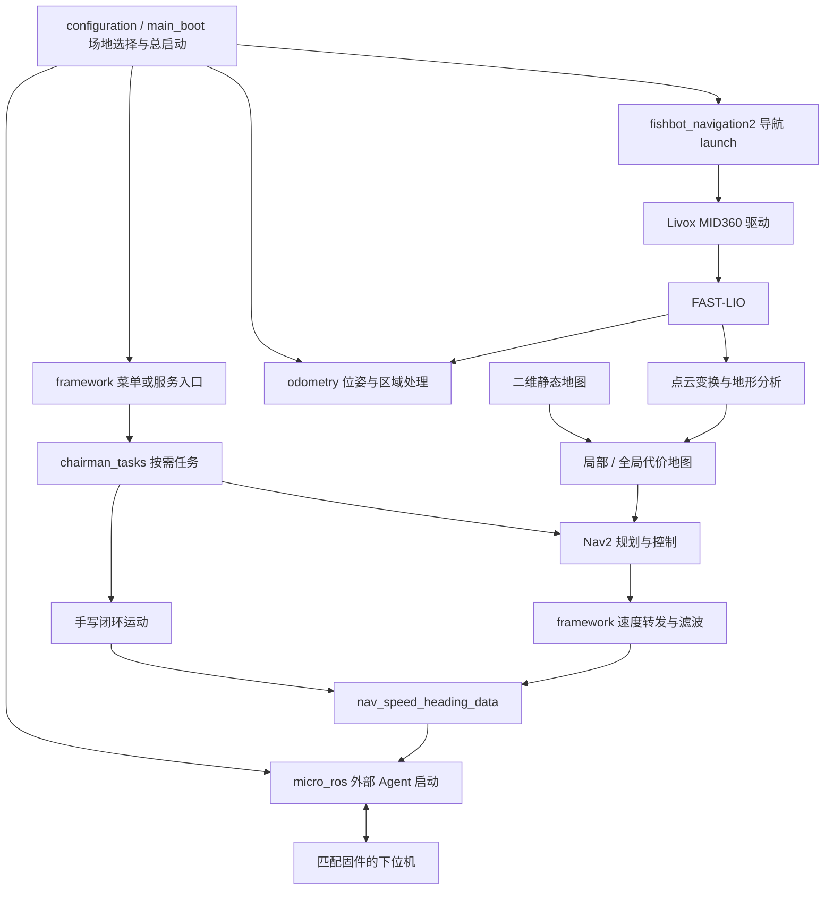

# 项目程序：https://github.com/qingyaozhuozhang/chairman_lidar


# chairman导航框架（实车功能框架）

本文依据本地 `chairman_navigation/` 源码及配套文档整理，核对日期为 **2026-09-30**。下文路径均相对于该工程根目录，描述的是当前实现；仓库内的地图、点位、外参和控制参数仍需与实际车辆及场地匹配。

## 1. 项目定位与整体思路

`chairman_navigation` 是面向 BR 建筑机器人的 **ROS2 实车导航与功能调度工程**，从 `odometry_navigation` 整理而来。底层采用 Livox MID360、FAST-LIO、地形分析和 Nav2，上层提供场地选择、红蓝点位导航、临时速度/PID 模式、旋转/移动/登阶等按需任务，并通过 micro-ROS 对接下位机。

整个工程围绕三条主线组织：

- **导航主线**：传感器数据 → 里程计与坐标变换 → 地形和代价地图 → 路径规划与跟踪。
- **功能主线**：菜单或 ROS 服务请求 → 任务调度 → Nav2 导航或手写闭环动作 → 结果返回与清理。
- **配置主线**：基础参数集中保存并同步，任务参数按功能登记，任务模式在运行期间临时应用并恢复。

当前仍沿用原 FAST-LIO 里程计和运动算法。`small_gicp_relocalization` 虽然随导航启动，**点云配准计算及持续重定位已经禁用**，主要保留初始位姿处理与 `map → odom` 变换发布。因此不能将当前系统理解为具有持续 GICP 地图纠偏能力的定位方案。

## 2. 总体架构



图中的下位机链路表示集成关系：本工程启动 Agent 并提供 ROS 接口，实际串口连接、下位机订阅和执行依赖外部 Agent 环境及固件。

| 层级 | 主要组成 | 职责 |
|---|---|---|
| 启动与交互 | `configuration`、`framework/sum.py` | 选择场地、启动进程、展示功能菜单 |
| 任务与运行框架 | `framework/core/`、`detail/on_demand/` | 调度任务、调用 Nav2、手写运动、取消与恢复 |
| 导航算法 | FAST-LIO、地形分析、Nav2 及自定义插件 | 估计运动、感知障碍、规划路径、跟踪目标 |
| 持续功能与设备 | `odometry`、`micro_ros`、Livox 驱动 | 位姿输出、区域处理、传感器与下位机连接 |
| 配置与工具 | `chairman_config`、功能 YAML、`tool` | 管理参数、采集点位、处理 PCD 地图 |

## 3. 目录与 ROS 包

```text
chairman_navigation/
├── configuration/                 # 场地选择与总启动；含框架测试
├── src/
│   ├── config/                    # chairman_config：中央基础配置与同步脚本
│   ├── fishbot/                   # 驱动、算法、Nav2 插件、消息定义
│   └── function/
│       ├── config/on_demand/      # points.yaml、functions.yaml、modes/
│       ├── detail/
│       │   ├── continuous/        # odometry、micro_ros 持续运行包
│       │   └── on_demand/         # fixed_point、special；安装为 chairman_tasks
│       └── framework/             # sum.py 与 core/ 公共运行框架
├── tool/                          # 初始位姿、目标点、地图降采样工具
├── docs/                          # 参数说明、开发说明、功能模板
├── runtime/                       # 运行生成内容
├── build/、install/、log/          # 本机构建与安装产物
└── README.md
```

当前工程有 **16 个 ROS 包**。目录名和包名并非全部相同，例如 `src/config/` 对应 `chairman_config`；`chairman_tasks` 是由 `framework` 安装的 Python 包，不是额外的独立 ROS 包。

| ROS 包 | 主要职责 |
|---|---|
| `configuration` | `main_boot` 总启动、场地环境传递、无多终端模式进程管理 |
| `chairman_config` | 通过 `manifest.json` 和 `sync.py` 同步中央基础配置 |
| `framework` | 菜单、服务、任务注册与调度、速度转发、临时参数恢复 |
| `odometry` | 点云坐标变换、真实 map 位姿输出、初始位姿与区域逻辑 |
| `micro_ros` | 按工作空间、设备与波特率配置启动外部 Agent |
| `tool` | `get_init_pose`、`get_pose`、`downsample_map` |
| `livox_ros_driver2` | MID360 点云和 IMU 驱动 |
| `fast_lio` | 激光惯性里程计、点云与动态 TF 输出 |
| `fishbot_navigation2` | 总导航 launch、Nav2 配置、地图、URDF、RViz 资源 |
| `terrain_analysis` | 局部地形分析，输出 `/terrain_map` |
| `terrain_analysis_ext` | 扩展地形分析，输出 `/terrain_map_ext` |
| `pointcloud_to_laserscan` | 地形点云转 `/scan_local` 与 `/scan_global` |
| `small_gicp_relocalization` | 当前保留初始位姿和 map→odom 发布，配准禁用 |
| `pb_nav2_plugins` | 提供当前使用的 `IntensityVoxelLayer` 等插件 |
| `pb_omni_pid_pursuit_controller` | 全向底盘 PID 路径跟踪控制器 |
| `custom_msg` | `PoseEuler`、`SpeedHeading`、`SetNavTarget` 自定义接口 |

## 4. 导航数据链路与坐标系

### 4.1 从雷达到代价地图

MID360 驱动向 FAST-LIO 提供雷达与 IMU 数据。FAST-LIO 输出 `/Odometry`、`/cloud_registered`、`/cloud_registered_body` 等信息。导航 launch 启动 `odometry/trans`，将 `/cloud_registered_body` 转换到 `odom`，发布 `/livox/lidar/pointcloud_odom`。

地形分析节点消费该点云，分别形成 `/terrain_map` 与 `/terrain_map_ext`。当前 Nav2 配置中的局部和全局 `IntensityVoxelLayer` **直接订阅这两路 PointCloud2**，结合静态层与膨胀层形成代价地图。

launch 同时将地形点云转换为 `/scan_local`、`/scan_global`，但当前代价地图的障碍输入不是这两路 LaserScan。分析障碍更新问题时，应优先检查实际的点云订阅链路。

当前地图资源为 `fishbot_navigation2/maps/room.yaml` 与 `PCD/test.pcd`。二维地图由 Map Server 提供；PCD 被定位节点引用，但不能因其被加载就认为 GICP 配准正在运行。

### 4.2 TF 与初始位姿

核心 TF 链可概括为：

```text
map → odom → camera_init → body → base_footprint → 机器人模型其他坐标系
```

| 变换 | 主要来源 |
|---|---|
| `map → odom` | `small_gicp_relocalization` 根据初始位姿更新并持续发布 |
| `odom → camera_init` | 导航 launch 中的单位静态变换 |
| `camera_init → body` | FAST-LIO 动态里程计 |
| `body → base_footprint` | 导航 launch 中的静态安装偏移，当前 x 为 `-0.2365 m` |
| 机器人模型内部变换 | URDF/xacro 与 robot_state_publisher |

`odometry_transform_math` 由 `/Odometry` 回调驱动，通过 TF 获取真实 map 位姿，启动阶段等待 TF 稳定后发布 `/initialpose`，随后输出 `/odom_map`。其初始位姿实际来自 `odometry/config/initial_poses.yaml`，中央编辑副本位于 `src/config/odometry/initial_poses.yaml`。

导航 launch 中仍保留 `PRESET_POSES` 和 `init_pose_str`，但当前没有将该字符串加入初始位姿发布动作。修改实车初始位姿应沿 YAML → sync → 重启 odometry 的链路进行，避免只改到未使用的 launch 变量。

### 4.3 规划、控制与速度下发

当前全局规划器使用 `nav2_navfn_planner/NavfnPlanner`，路径控制器使用 `pb_omni_pid_pursuit_controller::OmniPidPursuitController`，并配有 Nav2 平滑、行为和生命周期管理组件。

`framework` 订阅 `/cmd_vel`，在框架显式开启导航速度转发期间进行滤波，以 50 Hz 定时器发布 `/nav_speed_heading_data`。手写闭环动作直接转换并发布同一自定义速度消息，通过手动控制状态协调输出。

`SpeedHeading` 的实际字段是 `linear_x`、`linear_y`、`angular_z`，应以字段定义理解接口，不能仅凭消息名称将其当作“速度大小加航向角”。

**功能框架也承担底盘速度转发职责。** 使用 `--no-sum` 会同时跳过该框架服务；即使 Nav2 正在运行，也不能据此认为本工程的底盘输出链路已经完整建立。直接从 RViz 发目标同样不会自动开启框架内部的任务速度转发。

## 5. 持续功能与按需任务

### 5.1 持续功能

`detail/continuous/` 下的功能以独立 ROS 包形式长期运行：

| 功能 | 运行行为 |
|---|---|
| `odometry` | 初始化位姿、读取 TF、发布 `/odom_map`、识别红蓝区域 |
| 区域参数联动 | 进入 ID 1～13 的梅林区域时请求将局部/全局膨胀半径设为 0，离开时恢复配置的默认值 |
| `micro_ros` | 启动外部串口 Agent；当前配置为 `/dev/ttyUSB0`、`921600` 波特率，外部工作空间默认留空 |

区域膨胀参数更新由 odometry 独立触发，不属于按需任务的速度/PID 模式恢复流程。

### 5.2 定点导航与模式

`points.yaml` 分别登记红蓝点位，当前两组均覆盖编号 0～32。每个条目包括名称、`pose: [x, y, qz, qw]` 和 `mode`。其中 15、16 是动态目标占位，由特殊功能计算实际目标。

| 模式 ID | 文件 | 行为 |
|---|---|---|
| 1 | `modes/base.yaml` | 基础慢速档，适用于梅林等精细导航 |
| 2 | `modes/dynamic.yaml` | 前段冲刺、接近目标时切换控制参数；当前切换距离配置为 1.5 m |
| 3 | `modes/pre_align.yaml` | 带接近目标预对齐处理的导航模式 |

模式涉及速度上限、加减速度、PID、到点误差和旋转策略。它们在任务期间通过 ROS 参数接口生效，不会写回磁盘中的 `nav2_params.yaml`。

### 5.3 特殊功能

特殊功能在 `functions.yaml` 登记，代码位于 `detail/on_demand/special/<功能名>/task.py`。

| 编号 | 功能 | 当前主要行为 |
|---|---|---|
| -1 | `turn_180` | 旋转 180° |
| -2 | `uphill` | 沿世界 X 方向执行上坡动作 |
| -3 | `shift_right` | 右移 0.2 m |
| -4 | `move_forward` | 前移 1.2 m |
| -5 / -6 | `turn_right` / `turn_left` | 旋转 -90° / +90° |
| -7 / -8 | `stair_forward` / `stair_backward` | 以 0.3 m/s 前进/后退，等待停止信号 |
| -9 | `kfs_move` | 根据输入偏置执行闭环移动 |
| -10 | `stair_left` | 以 0.1 m/s 左移，等待停止信号 |
| -11 | `lift_wait` | 等待 `/odom_map.z` 相对起始高度正向增加到阈值 |
| 15 | `align_region` | 对准当前梅林区域中心 |
| 16 | `kfs_navigation` | 将车体局部 x/y 偏置转换为 map 目标，调用 Nav2 |

-9 和 16 的请求携带 `kfs_offset`，菜单会提示输入 `x y z`。具体字段使用以任务实现为准，例如 16 使用 x/y 计算平面目标，并将目标朝向吸附到最近的 90° 方向。登阶类动作依赖 `/nav_topic=0` 结束；抬升检测只等待高度条件，不负责驱动抬升机构。

## 6. 统一调用接口与任务生命周期

### 6.1 外部接口

| 接口 | 类型 | 用途 |
|---|---|---|
| `/set_nav_target` | `custom_msg/srv/SetNavTarget` | 提交编号和偏置，等待任务结果 |
| `/emergency_stop` | `std_msgs/msg/Empty` | 请求中断当前任务并停止相关运动输出 |
| `/restore_navigation_parameters` | `std_srvs/srv/Trigger` | 重试未完成的导航结束确认与参数恢复 |
| `/nav_topic` | `std_msgs/msg/Int8` | 登阶等动作的外部控制信号 |
| `/odom_map` | `custom_msg/msg/PoseEuler` | map 坐标中的 x、y、z、yaw |
| `/nav_speed_heading_data` | `custom_msg/msg/SpeedHeading` | 向下位机侧提供平面速度与角速度 |

`SetNavTarget` 请求包含 `int8 target`、`geometry_msgs/Point kfs_offset`，响应为 `bool success` 和 `string message`。它是等待功能执行结果的服务调用，不是单纯“已接收任务”的确认。

### 6.2 内部执行过程

1. 菜单或外部调用者提交 `/set_nav_target`。
2. `runtime.py` 获取任务锁，拒绝同时执行第二个任务，检查上次动作和参数是否已清理。
3. `registry.py` 优先匹配特殊功能登记；普通点位转到 `fixed_point.task`。
4. 调用统一入口 `run(ctx, request)`，任务必须返回 `True` 或 `False`。
5. 导航片段读取并保存运行中的参数原值，应用模式，再调用 Nav2；手动片段由对应动作控制器执行。
6. 成功、失败或取消后，框架停止速度输出、确认 Nav2 动作结束并恢复原参数。
7. 若动作结束确认或恢复失败，则返回失败并阻止下一任务，直至恢复流程完成。

参数事务位于 `core/transaction.py`。它保存的是**任务开始时的实际运行值**，恢复后还会读回核对，因此不等同于重新加载某个默认 YAML。`core/actions.py` 跟踪异步目标，处理迟到的目标响应和取消确认。

菜单执行过程中按 Ctrl+C 中止本次功能，清理后返回菜单；在菜单空闲时输入 `q` 或按 Ctrl+C 退出。不能同时启动两个 `sum`，也不应同时运行 `sum` 与仅服务入口 `preset_nav_node`。

## 7. 配置体系与生效规则

### 7.1 基础配置：中央副本与同步

`src/config/` 保存 FAST-LIO、Nav2、Livox、初始位姿和区域等中央配置，`manifest.json` 登记其实际目标路径。节点通常加载各包安装目录中的配置，而不是直接读取中央编辑副本。

```bash
ros2 run chairman_config sync --files fishbot_navigation2/nav2_params.yaml
ros2 run chairman_config sync --files odometry/initial_poses.yaml odometry/regions.yaml
# 需要同步所有已登记基础配置时使用
ros2 run chairman_config sync --all
```

同步会覆盖目标源码文件及已有安装副本，旧文件备份到 `.configuration_backups/`。`--all` 和 `--files` 二选一；当前同步工具没有内容校验和预览模式。同步后仍需重启相关节点。

### 7.2 任务配置与设备配置

| 修改对象 | 编辑位置 | 生效方式 |
|---|---|---|
| 雷达 IP、FAST-LIO、Nav2、初始位姿、区域 | `src/config/` 对应文件 | sync 后重启相关节点 |
| 点位、特殊任务参数、模式 | `src/function/config/on_demand/` | 构建 `framework` 并重启功能进程 |
| 按需任务代码 | `src/function/detail/on_demand/` | 构建 `framework` 并重启功能进程 |
| 串口、波特率、Agent 工作空间 | `detail/continuous/micro_ros/config/boot.yaml` | 构建 `micro_ros` 并重启 Agent |
| 地图、URDF、导航 launch | `src/fishbot/fishbot_navigation2/` | 构建 `fishbot_navigation2` 并重启导航 |
| 持续功能、总启动、工具代码 | 对应 ROS 包 | 构建对应包并重启入口 |

`colcon build` 不会代替 `sync`，也不会更新已经运行的进程。排查参数是否生效时，应同时区分中央文件、安装文件、进程实际参数和任务临时覆盖。

## 8. 构建与启动流程

项目 README 记录的构建环境是 Ubuntu 22.04 x86_64、ROS2 Humble、Python 3.10。除 ROS2/Nav2 等依赖外，还需准备 Livox SDK2、small_gicp C++ 依赖，以及需要下位机通信时使用的外部 micro-ROS Agent。即使禁用配准，当前定位节点源码仍依赖 small_gicp 头文件。

依赖就绪后，仅在 `chairman_navigation/` 工程内构建，避免将上级目录中原 `odometry_navigation` 的同名包一起纳入：

```bash
cd /home/chairman/lidar_chairman/chairman_navigation
source /opt/ros/humble/setup.bash
colcon build
source install/setup.bash
ros2 run configuration main_boot
```

首次运行前核对雷达网络、传感器外参、机器人模型、地图、场地点位、串口与运动参数。总启动选择为：1 红武馆、2 红对抗、3 蓝武馆、4 蓝对抗。

默认模式使用 `gnome-terminal` 打开四个入口：

| 入口 | 命令 |
|---|---|
| 通信 | `ros2 run micro_ros agent` |
| 导航 | `ros2 launch fishbot_navigation2 navigation2.launch.py` |
| 功能 | `ros2 run framework sum` |
| 位姿 | `ros2 run odometry odometry` |

`main_boot` 通过 `SELECTED_POSE` 将同一场地传给子进程。功能菜单不重复选择场地；在另一个终端单独启动时，应手动传入一致的场地，例如 `SELECTED_POSE=4 ros2 run framework sum`，否则默认使用场地 1。

| 参数 | 含义 |
|---|---|
| `--selected-pose 1\|2\|3\|4` | 跳过交互，直接指定场地 |
| `--no-micro-ros` | 跳过 Agent |
| `--no-sum` | 跳过菜单及功能服务，也跳过该框架速度转发 |
| `--headless` | 当前终端管理子进程，以 `preset_nav_node` 提供功能服务 |
| `--workspace 路径` | 指定工程根目录 |
| `--dry-run` | 打印启动命令，不启动进程 |

`--headless` 只改变进程管理方式，当前导航 launch 仍启动 RViz，并不等于完整的无图形界面运行。

启动命令下发后需等待 TF、地图、Nav2 Action 和参数服务就绪，再调用功能。默认多终端模式分别停止各终端；`--headless` 由总启动清理进程组。

## 9. 工具与开发扩展

| 工具命令 | 用途 |
|---|---|
| `ros2 run tool get_init_pose` | 监听 RViz `/initialpose`，输出初始 x、y、qz、qw |
| `ros2 run tool get_pose` | 监听 `/goal_pose`，输出目标 x、y、qz、qw |
| `ros2 run tool downsample_map input.pcd output.pcd --voxel-size 0.1` | 使用 Open3D 对 PCD 做体素降采样 |

位姿工具输出中的 Z/W 是四元数 qz/qw，不是高度。`get_pose` 本身只监听，但 RViz 发出的目标可能同时被导航系统接收。

新增功能按以下位置扩展：

| 需求 | 扩展方式 |
|---|---|
| 新增固定点 | 在 `points.yaml` 的对应红蓝组添加点位与模式 |
| 新增速度/PID 组合 | 添加唯一 ID 的 `modes/*.yaml` |
| 新增特殊任务或多点流程 | 新建 `special/<名称>/task.py`，实现 `run(ctx, request)`，登记到 `functions.yaml` |
| 新增任务专用参数 | 在任务登记的 `parameters` 中配置，代码从 `ctx.config` 读取 |
| 新增持续节点 | 在 `detail/continuous/` 新建 ROS 包，并按需接入总启动或 launch |
| 新增基础配置 | 添加中央文件、manifest 映射，并确保目标包安装和加载该文件 |

`TaskContext` 提供 `go_to_point`、`go_to_pose`、`rotate`、`move`、`move_offset`、`stair`、`wait_lift` 等公共方法，使组合任务复用现有动作与清理机制。项目已有按需任务、多点流程、速度模式和持续节点模板，位于 `docs/templates/`。

## 10. 当前边界与阅读入口

当前工程已经具备统一启动、导航链路、红蓝功能目录、服务调用、任务取消和参数恢复机制。理解或继续开发时，应特别保留以下事实：

- GICP 节点存在，但持续配准未启用；当前全局定位依赖初始对齐与 FAST-LIO 里程计推进。
- 当前总导航 launch 使用已有地图，不包含一套完整的交互式建图和地图保存流程。
- 点云代价地图、速度转发和初始位姿都有各自实际入口，不能只凭文件名或遗留注释判断运行链路。
- 下位机固件与外部 Agent 需要另行匹配；主机侧软件急停接口也不能直接作为硬件急停能力的证明。
- `configuration/tests/` 包含启动、配置同步、目录加载、菜单、事务、动作和模板等测试。本次文档整理核对了源码，未运行这些测试，也未进行实车验证。

建议按以下顺序阅读源码：

1. `README.md`：构建、启动与日常修改流程。
2. `configuration/main_boot.py`：进程组织与场地传递。
3. `src/fishbot/fishbot_navigation2/launch/navigation2.launch.py`：实际导航节点图。
4. `src/function/framework/core/runtime.py`、`registry.py`、`task_context.py`：任务调用与生命周期。
5. `src/function/detail/on_demand/`：定点、模式和特殊动作实现。
6. `src/function/detail/continuous/odometry/`：初始位姿、TF 和区域处理。
7. `docs/parameter_modification.md`、`docs/function_development.md`：配置修改和新功能开发细节。
