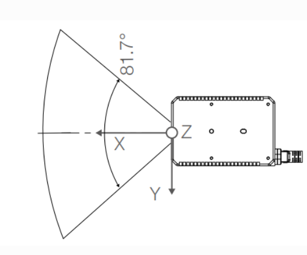

**修改时间:2026.1.26**

**参与者:刘志钰**

## Livox-Mid-360激光雷达

官网：https://www.livoxtech.com/cn/mid-360/downloads

- 雷达的基本概念

  - 点云帧：雷达驱动每次向外发送的一组雷达数据几何称为一帧雷达数据。如果帧率是10Hz，那么每帧点云数据是100ms内雷达扫描的点云几何。
  - 点云帧发布频率
  - 扫描频率

- Livox的扫描特性

  - 视场覆盖率
  - 非重复式扫描方式（市场中被激光照射到的区域面积会随时间增大）



- 运行代码

  - livox_ros_driver2

  - ```
    #终端进入到/src/livox_ros_driver2目录下
    source /opt/ros/humble/setup.sh
    ./build.sh humble
    ```

  - fast_lio

  - 单独colcon build

  - 只显示雷达检测效果（需要先启动雷达）

    - rviz_MID360_launch.py

  - 雷达3d建图（需要先启动雷达）

    - msg_MID360_launch.py

    - mapping.launch.py

    - ---

    - start.launch.py

- mid-360激光雷达ROS2话题等通信接口

  - 一.话题总览（ros2 topic list -t）

    - 查看消息（ros2 interface show 消息接口）

  - ```
    /Laser_map [sensor_msgs/msg/PointCloud2]
    /Odometry [nav_msgs/msg/Odometry]
    /clicked_point [geometry_msgs/msg/PointStamped]
    /cloud_effected [sensor_msgs/msg/PointCloud2]
    /cloud_registered [sensor_msgs/msg/PointCloud2]
    /cloud_registered_body [sensor_msgs/msg/PointCloud2]
    /goal_pose [geometry_msgs/msg/PoseStamped]
    /initialpose [geometry_msgs/msg/PoseWithCovarianceStamped]
    /livox/imu [sensor_msgs/msg/Imu]
    /livox/lidar [livox_ros_driver2/msg/CustomMsg]
    /parameter_events [rcl_interfaces/msg/ParameterEvent]
    /path [nav_msgs/msg/Path]
    /rosout [rcl_interfaces/msg/Log]
    /tf [tf2_msgs/msg/TFMessage]
    /tf_static [tf2_msgs/msg/TFMessage]
    ```

  - 二.话题分析

    - /Odometry [nav_msgs/msg/Odometry]

      （1）Header

      ​	std_msgs/Header header：包含消息的元数据

      ​	builtin_interfaces/Time stamp：消息的时间戳

      ​	int32 sec：秒数

      ​	uint32 nanosec：纳秒数

      ​	string frame_id：标识父坐标系的帧ID

      （2）Child Frame ID

      ​	string child_frame_id：指定这个位置和速度估计所使用的坐标系，通常是机器人本体坐标系

      （3）Pose

      ​	geometry_msgs/PoseWithCovariance pose：标识机器人在指定位置和姿态

      ​	Pose pose：包含位置和方向

      ​	Point position：机器人的位置

      ​	float64 x，float64 y，floatz

      ​	Quaternion orientation：机器人方向，使用四元数表示

      ​	float64 x，float64 y，float64 z，float64 w

      ​	float64[36] covariance：位置和姿态的协方差矩阵，表示对这些估计的信息

      （4）Twist

      ​	geometry_msgs/TwistWithCovariance twist：标识相对于child_frame_id的线性和角速度估计

      ​	Twist twist：包含线性和角速度

      ​	Vector3 linear：线性速度

      ​	float64 x，float64 y，float64 z

      ​	Vector3 angular：角速度

      ​	float64 x，float64 y，float64 z

    - /livox/imu[sensor_msgs/msg/Imu]

      （1）Header

      ​	std_msgs/Header header：包含消息的元数据

      ​	builtin_interfaces/Time stamp：消息的时间戳

      ​	int32 sec，uint32 nanosec

      ​	string frame_id：指定坐标系的帧ID，通常是IMU的参考框架

      （2）Orientation

      ​	geometry_msgs/Quaternion orientation：表示IMU的当前方向，使用四元数表示

      ​	float64 x，float64 y，float64 z，float64 w

      （3）Orientation Covariance

      ​	float64[9] orientation_covariance：标识方向的协方差矩阵，通常是3x3的矩阵，按行主序排列。它表示对方向估计的信息：

      ​	对角线上的元素表示各个方向的方差

      ​	非对角线元素表示方向之间的协方差

      （4）Angular Velocity

      ​	geometry_msgs/Vector3 angular_velocity：表示IMU的角速度

      ​	float64 x，float64 y，float64 z

      （5）Angular Velocity Covariance

      ​	float64[9] angular_velocity_covariance：表示角速度的协方差矩阵，类似于方向协方差，表示对角速度估计的信息

      （6）Linear Acceleration

      ​	geometry_msgs/Vector3 linear_acceleration：标识IMU的线性加速度

      ​	float64 x，float64 y，float64 z

      （7）Linear Acceleration Covarance

      ​	float64[9] linear_acceleration_covariance：表示线性加速度的协方差矩阵，标识对加速度估计的信息

    - /Laser_map[sensor_msgs/msg/PointCloud2]

      激光雷达构建环境地图，以点云形式存储环境的三维结构信息

    - /clicked_point[geometry_msgs/msg/PointStamped]

      类型：带时间戳的点

      用途：在RViz等可视化工具中点击的三维点，可用于设置目标点或标记感兴趣区域

    - /cloud_effected[sensor_msgs/msg/PointCloud2]

      经过处理过后的点云数据

    - /cloud_registered[sensor_msgs/msg/PointCloud2]

      类型：点云数据

      用途：配准到某个坐标系下的点云

    - /cloud_registered_body[sensor_msgs/msg/PointCloud2]

      配准到机器人本体坐标系下的点云数据

    - /goal_pose[geometry_msgs/msg/PoseStamped]

      类型：带时间戳的位姿

      用途：机器人的目标位置和姿态，通常用于导航任务中设置目的地

    - /initialpose[geometry_msgs/msg/PoseWithCovarianceStamped]

      类型：带协方差的时间戳的位姿

      用途：机器人的初始位姿估计，用于SLAM（同步定位与地图构建）或导航的初始化

    - /livox/lidar[livox_ros_driver2/msg/CustomMsg]

      类型：Livox激光雷达自定义消息

      用途：来自Livox激光雷达的原始点云数据，使用设备自定义格式

    - /parameter_events[rcl_interfaces/msg/ParameterEvent]

      类型：参数事件

      用途：记录ROS节点参数的变化时间，如参数的设置、修改等

    - /path[nav_msgs/msg/Path]

      类型：路径数据

      用途：包含一系列位姿的序列，通常标识机器人的规划路径或已行驶路径

    - /rosout[rcl_interfaces/msg/Log]

      日志信息

    - tf[tf2_msgs/msg/TFMessage]

      坐标变换消息

      实时发布各个坐标系之间的变换信息，用于不同传感器数据的坐标转换

    - tf_static[tf2_msgs/msg/TFMessage]

      静态坐标变换消息

- 文件分析

  - fast_lio

    - 主要流程集中在laserMapping.cpp

    - **变量初始化**

    - **数据处理循环**，该循环会不断处理IMU和LiDAR接受到的数据

    - **数据同步与处理**，通过bool sync_packages(MeasureGroup &meas)函数处理IMU和Lidar接受buffer中的数据，将一帧激光点云以及这一帧点云扫描期间的IMU数据一起打包放到MeasureGroup里

    - **点云畸变补偿与状态预测**，调用p_imu->Process(Measures,kf,feats_undistort)函数，其中UndistortPcl函数用于补偿点云畸变，并用IMU进行状态预测

    - **局部地图更新与点云降采样**，调用lasermap_fov_segment()函数更新localmap边界，然后降采样当前帧点云

    - **状态更新**，调用kf.update_iterated_dyn_share_modified(LASER_POINT_COV,solve_H_time)函数进行状态更新，这是算法的核心部分

    - **里程计发布与地图更新**，发布里程计信息，并调用map_incremental()函数更新kdtree

    - 修改雷达扫描范围（在mid360.yaml文件）

      - 探测距离（DET_RANGE）

        - ```cpp
          float DET_RANGE = 300.0f; // 单位为米 
          ```

    - 建图需要让它多移动，不然点云和imu不变会被卡断

    - 扫描的是整个“房间”，不要当成你扫到的是前面的“墙”

  - livox_ros_driver2

    - 启动文件配置说明

      - **_HAP.launch（连接HAP激光雷达设备）
      - rviz_MID360.launch（连接MID360激光雷达设备，发布pointcloud2格式数据，自动加载rviz）
      - msg_MID360.launch（连接MID360激光雷达设备，发布Livox自定义点云数据）

    - Livox ros driver2 内部主要参数配置说明

      - Livox_ros_driver2的所有参数都在启动文件中配置

      - publish_freq设置点云发布频率（最大发布频率为100Hz）（最好是20Hz）

      - multi_topic激光雷达设备是否拥有独立的话题来发布点云数据（0 - 所有共用一个，1 - 每个激光雷达各自使用）

      - xfer-format设置点云格式（0 - Livox pointcloud2点云格式，1 - Livox自定义点云格式，2 - PCL库中的标准pointcloud2点云格式）

        - 0 

        - ```
          float32 x               # X 轴，单位: m
          float32 y               # Y 轴，单位: m
          float32 z               # Z 轴，单位: m
          float32 intensity       # 反射率值，范围 0.0~255.0
          uint8   tag             # livox 标签
          uint8   line            # 激光器在雷达中的编号
          float64 timestamp       # 点的时间戳
          ```

        - 1

        - ```
          Livox自定义数据包格式
          std_msgs/Header header     # ROS 标准消息头
          uint64          timebase   # 第一个点的时间基准
          uint32          point_num  # 点云总数
          uint8           lidar_id   # 激光雷达设备 ID 号
          uint8[3]        rsvd       # 保留字段
          CustomPoint[]   points     # 点云数据
          ```

        - ```
          自定义数据包中的自定义点云
          uint32  offset_time     # 相对于基准时间的偏移时间 (单位: ns)
          float32 x               # X 轴，单位: m
          float32 y               # Y 轴，单位: m
          float32 z               # Z 轴，单位: m
          uint8   reflectivity    # 反射率，范围 0~255
          uint8   tag             # livox 标签
          uint8   line            # 激光器在雷达中的编号
          
          ```

      - 场景选择

        - 优先选择1的情况：（1）计划使用FAST-LIO等依赖Livox自定义消息和每个点时间戳的SLAM算法；（2）需要进行精确的运动畸变矫正；（3）希望更好地利用Livox雷达的多回波和噪点标记信息
        - 优先选择0的情况：（1）使用RVIZ进行简单的点云可视化；（2）使用标准PCL库功能进行点云处理，且不需要每个点的精确时间戳；（3）需要与其他只支持标准PointCloud2格式的ROS节点后工具链进行交互
        - 用2：再ROS中通常也是以sensor_msgs/PointCloud2的形式传输，但字段只有x,y,z和intensity（信息量最少）

      - src/comm/comm.h注册了LivoxPointXyzrtlt的点云格式

        - ```
          typedef struct {
            float x;            /**< X axis, Unit:m */
            float y;            /**< Y axis, Unit:m */
            float z;            /**< Z axis, Unit:m */
            float reflectivity; /**< Reflectivity  or intensity */
            uint8_t tag;        /**< Livox point tag   */
            uint8_t line;       /**< Laser line id     */
            double timestamp;   /**< Timestamp of point*/
          } LivoxPointXyzrtlt;
          ```

      - src/lddc.cpp：可发布3种类型的点云数据

### pcd点云图转栅格地图

1.pcd点云图转为pgm地图，然后再发布话题后用rviz2显示出来

### 里程计的坐标发布

1.fast_lio发布里程计的数据，然后用一个功能包接收odometry话题的数据

2.我只需要获取目标点位的数据和初始点位的数据（上层），下层的事情不需要考虑（pid算法等会自己调节），雷达的功能就是实时得到点位数据

3.**雷达里程计原理**
	雷达里程计的目标是通过激光雷达的连续帧数据，计算机器人相对于初始位置的实时位姿，本质是”帧间匹配“与”位姿积累“

- 数据预处理，激光雷达输出的原始点云需经过滤波，减少后续计算量
- 帧间匹配：将当前帧点云与上一帧点云（或局部地图）进行匹配
- 位姿积累：将每帧计算出的相对位姿（相对于上一帧）叠加到初始位姿上，得到机器人相对于世界坐标系的绝对位姿，即里程计数据（nav_msgs/msg/Odometry）

4.里程计的误差不会很大（1cm）左右

### 世界坐标系（右手法则）

1.世界坐标系是一种笛卡尔坐标系

2.x是前后运动，y是左右运动，z是上下运动，RX是姿态绕x轴旋转，RY是姿态绕y轴旋转，RZ是姿态绕z轴旋转（livox_mid360的roll，pitch，yaw则分别是绕x运动，顺时针翻滚是正方向。绕y运动，朝下俯瞰是正方向。绕z运动，朝左转是正方向）

3.激光雷达标定

- 激光雷达标定是只确定激光雷达传感器内部参数（内参）和相对于其他传感器和世界坐标系的位姿参数（外参）的过程
- （1）激光雷达坐标系（2）世界坐标系：固定的全局坐标系（3）其他传感器坐标系
- 世界坐标系以激光雷达启动时的初始位姿为原点

### 坐标变换

1.ROS2用命令行（tf工具）计算坐标系之间的变换关系

ros2 run tf2_ros tf2_echo base_link wall_point（第一个参数是父坐标系，第二个参数是子坐标系）

2.雷达坐标系 -> 机械臂的底座基坐标系 -> 机械臂的tcp坐标系

3.机械臂相对于雷达的坐标可以通过2D Goal Pose工具来实现，点击点云会显示其三维坐标和四元数

### 重定位

1.雷达在此处位置信息失效、偏移或环境变化后，通过重新采集环境特征、匹配参考数据或融合多源信息，恢复/矫正雷达空间位置与姿态，确保其探测数据（如目标距离、方位）能精准对应真实地理坐标

2.（1）基于“外部参考信号”的重定位（依赖外部系统，精度高）

- 雷达实时接收外部参考信息 -> 对比自身当前位置/姿态数据 -> 计算偏差值 ->自动校正雷达探测坐标（如将“雷达相对坐标”转换为“地理坐标系”时的参数修正

（2）基于“环境特征匹配”的重定位

- 雷达扫描周围环境，提取特征 ->将提取的特征与预存的“环境参考地图”（如包含梭鱼固定目标位置的数据库）进行匹配 -> 通过匹配的结果反推雷达当前位置 -> 用反推的位置校正雷达后续探测数据

（3）基于“多雷达协同”的重定位

- 位置已知的“主雷达”向周围发送自身位置信号，并探测其他“从雷达”的位置 -> “从雷达”同时探测“主雷达”的位置，形成“双向探测数据” -> 通过多组雷达间的距离、方位角数据，建立协同定位模型，计算出“从雷达”的准确位置

3.雷达里程计有缺陷（1）累积误差（2）绝对位置缺陷。雷达里程计的本质是“相对位移传感器”，而重定位是“绝对位置传感器”，重定位可作为“备用位置源“，帮助李成绩恢复工作或直接替代其输出位置

4.单只用一个里程计是没有办法进行重定位的，必须结合预先建好的地图

---

细节处理：

1.雷达的范围就用360的就行

2.nav_msgs中的数据基本上是用于监听机器人的运动状态以规划机器人的路径避障等等操作。过阶梯，爬坡用不到

3.系统找不到liblivox_lidar_sdk_shared.so动态库，需要用export设置库路径环境变量

- 临时生效
  - export LD_LIBRARY_PATH = /usr/local/lib:$LD_LIBRARY_PATH
- echo "export LD_LIBRARY_PATH = /usr/local/lib:\$LD_LIBRARY_PATH" >> ~/.bashrc source ~/.bashrc

