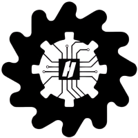
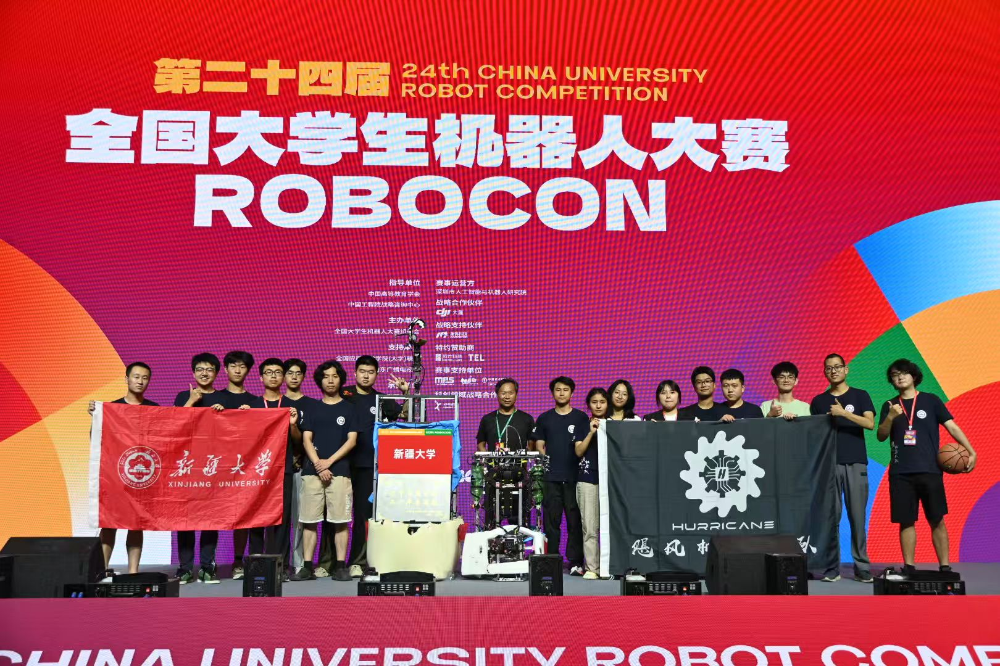
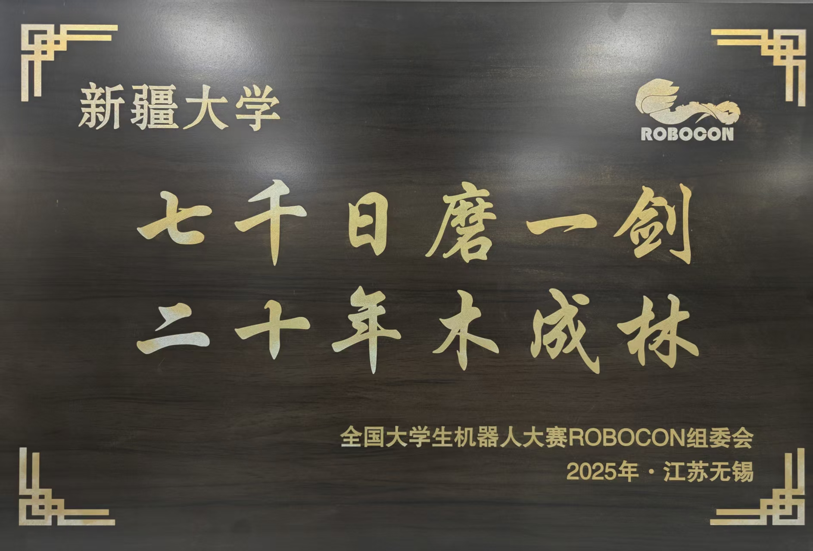
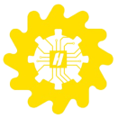

 

{.normal}

​	我们是新疆大学飓风机器人战队，一个致力于[全国大学生机器人大赛](http://cnrobocon.net/)（`ROBOCON`）的大学生团体。我们战队从2005年参赛至今多次取得国家一等奖，二等奖的好成绩。

​	而我们的目标一直都是实现自我突破，成为更好的团队，为此我们不会停下脚步，并以更加积极，开放，严谨的态度投入之后的比赛——更好的我们永远在下一次！

​	这也是本站创建的原因，我们将在这里记录队内的技术文档，并且在`GitHub`上开源我们每个赛季的[项目](https://github.com/XJU-Hurricane-Team)。希望能通过本网站与其他队伍进行技术交流，为`ROBOCON`比赛开放的技术交流氛围贡一份献绵薄之力！

{.normal}

{.normal}