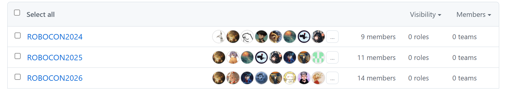
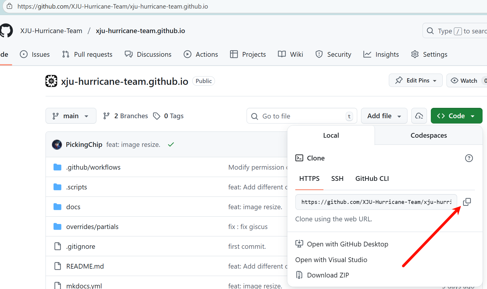
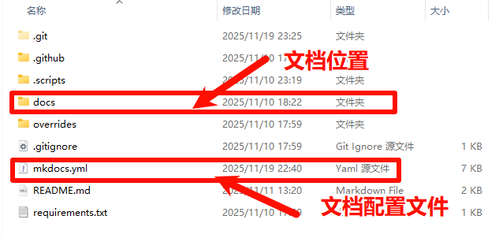
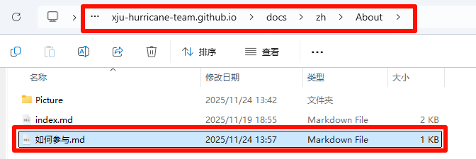
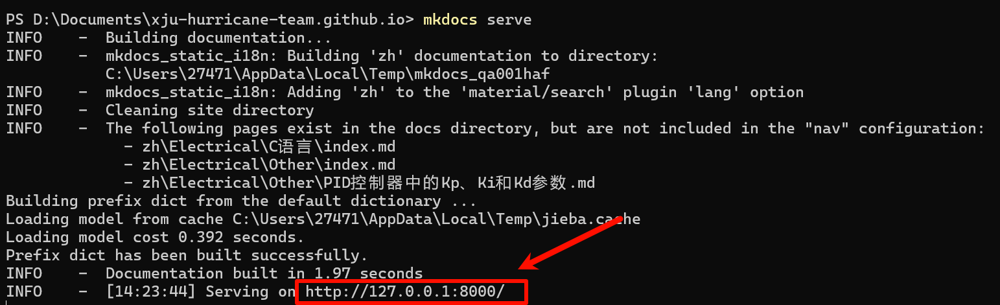

> 更新日期：2025/11/24
>
> 参与者：PickingChip

### 战队成员

首先确保具有GitHub账户，并且已安装Git。

检查自己是否加入当前赛季的成员分组确保具有编辑权限。



找到战队文档仓库，复制仓库地址。



在你想要存放仓库的位置打开终端，执行下面命令克隆仓库

```bash
git clone https://github.com/XJU-Hurricane-Team/xju-hurricane-team.github.io.git
```

打开克隆下来的仓库，结构如下：



**在`xju-hurricane-team.github.io\docs\zh`路径下的合适位置创建`Markdown`文本编写你的文档**。

下面以本篇介绍的创建作为示例：

首先在`About`文件夹下创建了`Markdown`文本，并进行编辑文本编辑（**文档中的图片存放在同一目录下的`Picture`文件夹内，在文档中采用相对路径引用**）。



编辑完成后保存文本 ，打开仓库根目录下的`mkdocs.yaml`文件，找打`nav`配置项将你编辑的文档的路径添加进来（注意缩进，不要用中文冒号），如果编辑的是已经存在的文档则无需添加，这里的`nav`的结构实际上就是网站导航栏的结构。


如果想要在本地查看编辑的效果需要确保已安装`python`，在根目录执行下面命令安装依赖。

```python
pip install -r requirements.txt
```

编辑完成之后在项目根目录打开右键终端输入下面命令。

```python
mkdocs serve
```

点击图中的`ip`即可在浏览器中本地打开网站查看编辑效果。



检擦配置无误之后，在根目录下执行下面git命令。

```bash
git pull #先进行拉取防止存在冲突
git add .
git commit -m'[简单描述一下你提交的内容]'
git push
```

提交成功后GitHub会自动将编辑的内容推送至网站，稍等片刻即可在网站查看到更新内容。


### 非战队成员

非战队成员如果对文档的内容有疑问或者发现错误，可以在网站的评论区进行留言，我们收到消息之后会第一时间回复并进行更正。

同时也可以提交`PR`我们审核通过后也会将内容更新至网站。

