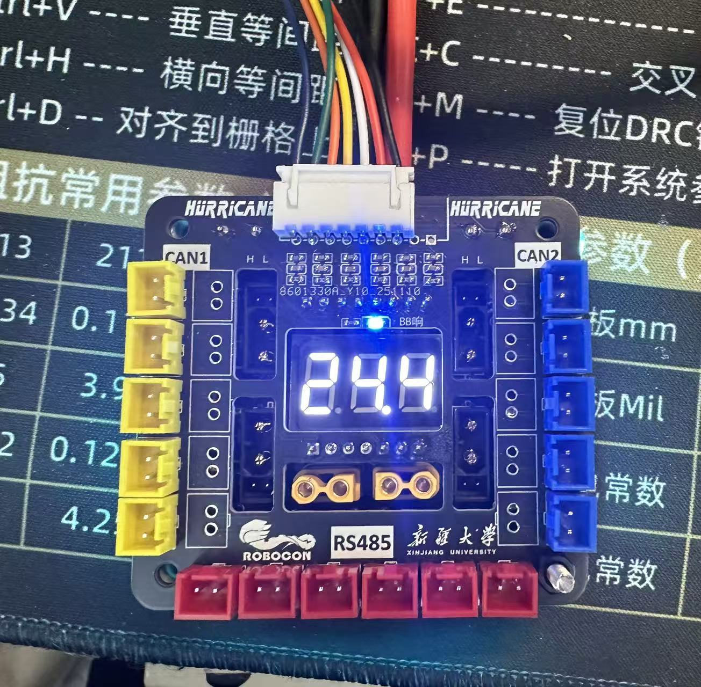
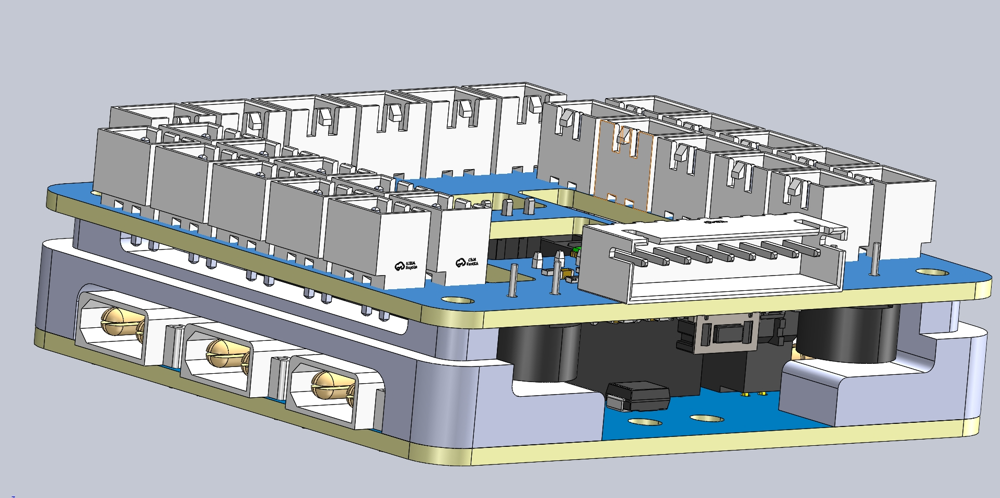

# 【分电+分CAN+bb响】

## 1.引言

在竞赛与调试过程中，**合理使用电池至关重要**。然而实际操作中，队员常常因为专注调试而忘记接BB 响，导致欠压或异常状态无法及时提醒，影响设备安全与调车效率。为了解决这一痛点，我们在最新版本的**分电板上集成了 BB 响功能**。确保电池状态在任意使用场景下都能够被实时提示，提升了使用便利性与安全可靠性。

## 2.效果展示

## 3.模块说明

顶板主要用来分CAN、485等电机控制接口，往年都用的gh1.25接口，虽然有卡扣但是长期拔插接口会变松，所以今年决定用XHB2.54。7pin线接电池的平衡头，长度不够可以接公对母排线。锂电池 BB 响可直接参考嘉立创开源平台方案，具体链接：[基于RISC-V MCU CH32X035的锂电池BB响 - 立创开源硬件平台](https://oshwhub.com/temperslee_t/lipo_test)。注意：下载器是WCH-LinkE。

底板用于 24V 电源分配，共引出 9 个 XT30 公头、2 个 XT30 母头以及 4 个 XT30 2+2 公头。特别感谢 Amass 此前通过连接器赞助活动提供的大量优质连接器支持。

## 4.说明

附件里有**工程文件**、**支撑外壳.step文件**、**CH32固件**、**WCH-LinkUtility调试工具**。工程文件是嘉立创V3版本，客户端可能打不开，网页版可以。**新手开源，多有不足请多见谅**。通讯信息（Wechat）：RipMgAl

附件在这里下载：[【分电+分CAN+bb响】新疆大学RC主赛硬件开源 - ROBOCON资料站 / 新疆大学 - Roma Club](https://rcbbs.top/t/topic/3733)

