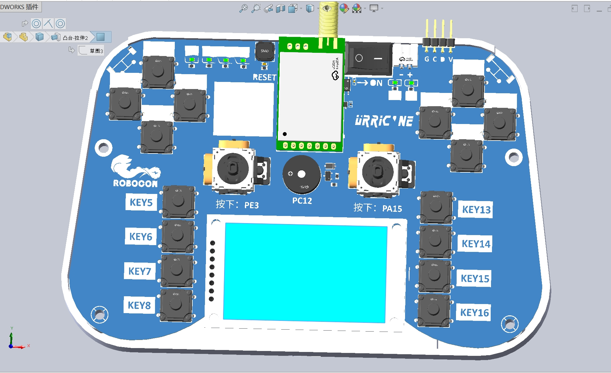
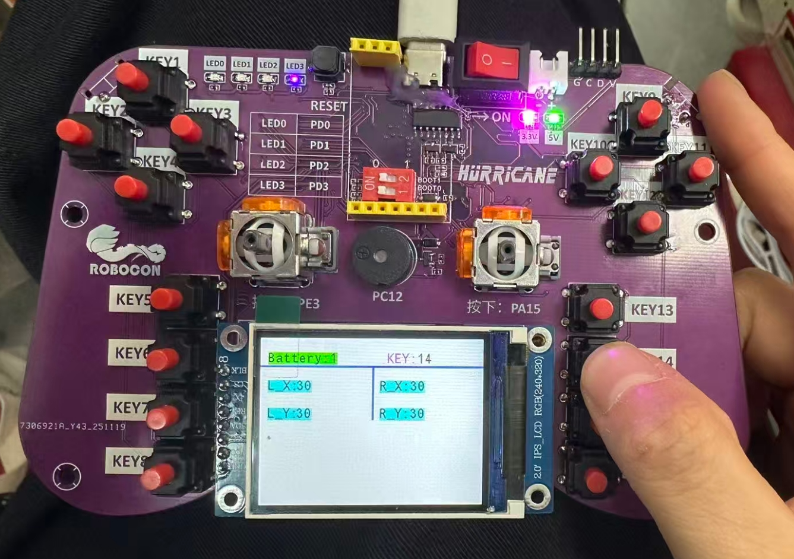
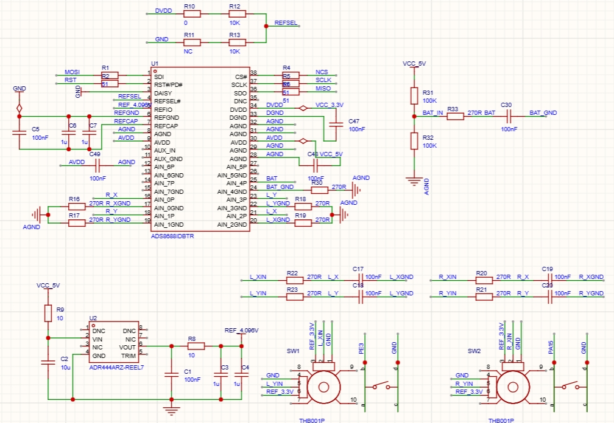
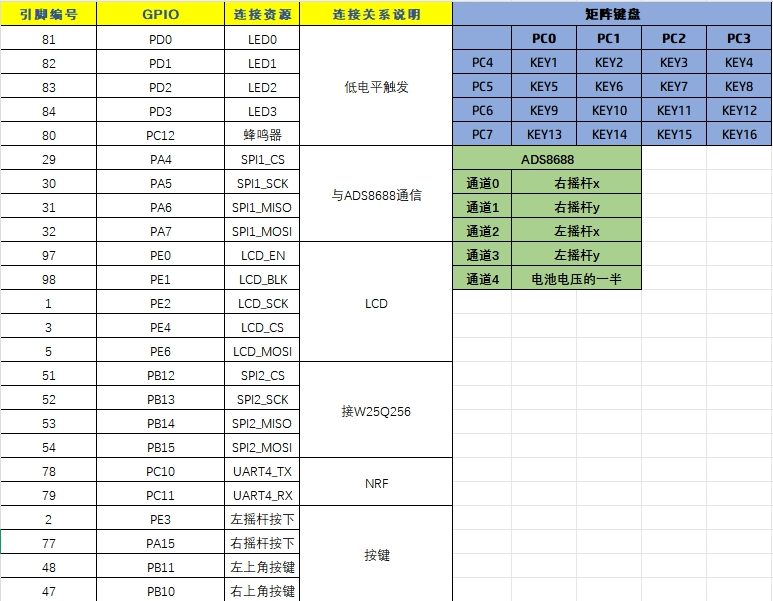

# 【F4-ADS】基于STM32F429VET6和ADS8688的遥控器

## V1.1版本

**更新了以下内容：**

1.电源模块。V1.0 版本采用单节 18650 电池供电，搭载战队现成的单节 18650 升压保护模块。经测试发现该方案存在两个问题：一是模块具备强制升压功能，即便 18650 电池处于过放状态，仍会强制将输出电压抬升至 5V，导致 ADS 芯片无法采集电池真实剩余电量，进而无法实现低压报警功能，存在电池过度放电损坏的风险；二是单节 18650 电池容量有限，持续工作场景下续航能力不足，影响系统连续运行稳定性。为解决上述问题，V1.1版本对电源模块进行迭代优化：采用两节 18650 电池串联供电，提升续航能力与供电稳定性；将电池保护模块与降压模块集成于遥控器，简化外部接线并提升系统集成度；保留 ADS 电压采集功能，通过采集两节电池串联后的真实电压数据，确保低压报警功能可靠实现，有效避免电池过放损坏。

2.有线调试。NRF跟CH340接同一个串口。

3.板子大小。V1.0版本板子大小是15cmx10cm，V1.1版本增加大小到17cmx11cm。

4.新增按键。增加拨轮开关。

5.新增该网页二维码。

## V1.0版本

### 引言

自我进实验室以来，见过两种遥控器，一种是以STM32F103RCT6为主控，摇杆的四个通道直接接到32的ADC引脚采数据，痛点就是STM32F103RCT6的ADC只有12位，采摇杆数据很鸡肋，遂出现了第二种，我们发现STM32H7的ADC是16位，正点原子阿波罗核心板上还有外接的sdram，可以上ui，用了4.3寸IPS显示屏，痛点是成本高，程序调起来也复杂。

总之，第一种遥控器太简陋，第二种遥控器太豪华，遂设计一款折中的遥控器——基于STM32F429VET6和ADS8688的遥控器，简称F4-ADS。

### 模块说明

F4-ADS的配置如下：

摇杆：PS5 TMR霍尔摇杆

ADC：ADS8688是16位8通道500kspsADC芯片，我们使用其中4个通道采两个摇杆的xy，1个通道采电池电量

MCU：STM32F429VET6

屏幕：ST7789驱动的2寸屏幕

外设：1个NOR FLASH、4个LED、1个4x4矩阵键盘、2个独立按键、1个蜂鸣器、1个typeC+CH340有线调试、1个NRF

原理图较简单，只说明ADS8688采集电路

通道引脚串联270R电阻，起限流作用，信号和GND间接100nF电容滤波，外接ADR444电压基准芯片为ADS8688提供4.096V基准电压

PCB大概是15cm x 10cm，为了节约成本画了2层板，大部分电容电阻是0402封装，节省空间。

### IO说明

### 资料

资料包含工程文件、IO说明、外壳.step文件
链接：https://pan.quark.cn/s/e70b1f419f03

