# XJU-ESP32 1.0

## 一、原理图模块

### 主控

主控使用[ESP32-S3-WROOM-1-N16R8](https://www.semiee.com/file2/a7379a9c1a6837fdb5ec9a8303ea94e9/Espressif/Espressif-esp32-s3-wroom-1_wroom-1u.pdf)，内置ESP32-S3 系列芯片，Xtensa 双核 32 位 LX7 微处理器(支持单精度浮点运算单元)，支持高达**240MHz**的时钟频率。

外设有**36个GPIO**，可配置为SPI、LCD、Camera接口、UART、I2C、I2S、红外遥控、脉冲计数器、LEDPWM、全速USB2.0OTG、 USB串口/JTAG控制器、MCPWM、SD/MMC主机控制器、GDMA、TWAI®控制器（兼容ISO 118981-1）、ADC、触摸传感器、温度传感器、定时器和看门狗。

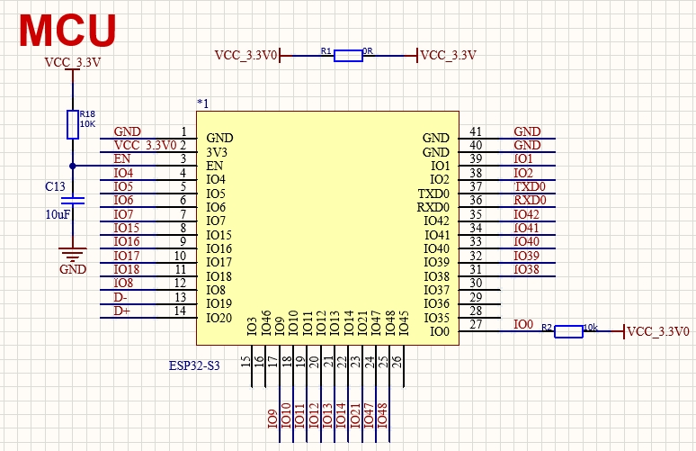

### 降压

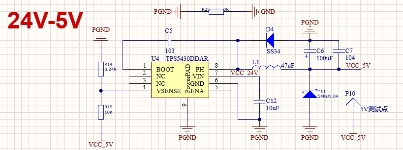

### 电源输入

24V或5V输入，下面电路实现**过压保护、防反接、缓启动**

**1.过压保护**

正常输入时，D2截止，此时Q3的发射极和基极都为VCC_IN，即Vbe=0，PNP截止。Q2为PMOS，源极接VCC_IN，栅极接GND，Vgs<0，PMOS导通，输出24V。

过压输入时，D2被击穿，D2将电压钳制在28-30V，此时PNP的发射极为过压的VCC，Vbe<-0.7V，PNP导通，此时PMOS管的源极和栅极都接VCC，即Vgs=0，PMOS不导通。

**2.防反接**

如果24V反接，Q4为NMOS，此时NMOS的栅极为低电平，源极为高电平，Vgs<0，NMOS截止

另外使用XT60插头，减少反接可能

**3.缓启动**

MOS管内部的任何两级之间分别存在3个电容：Cgs、Cds、Cgd。缓启动通过MOS管内部的Cgs和外部电路中的C2进行充电实现。其中MOS内部的电容充电也就是**米勒效应**，米勒效应会使导通时间变长，在高频开关状态会严重增加MOS的开通损耗，但是在电源缓启动中有很大的用处。

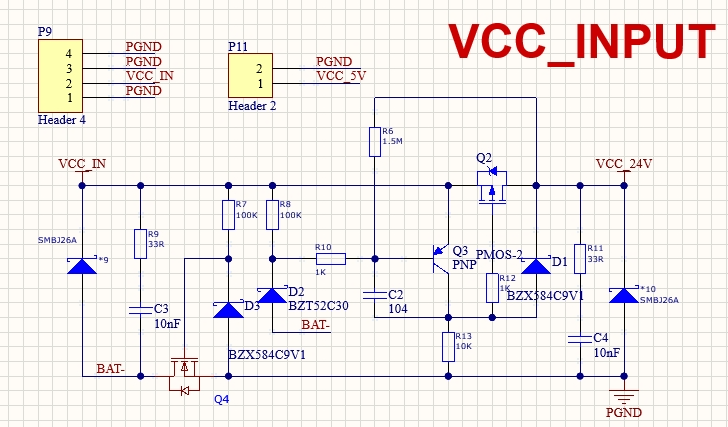

### 电源输出

24V用于驱动电机，5V和3.3V可给其他外设供电

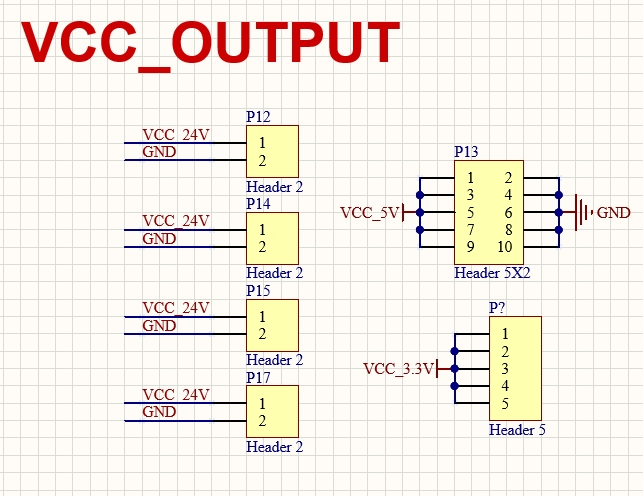

### USB下载

按住BOOT按键然后插入TypeC插口然后松开按键即可进入程序下载模式

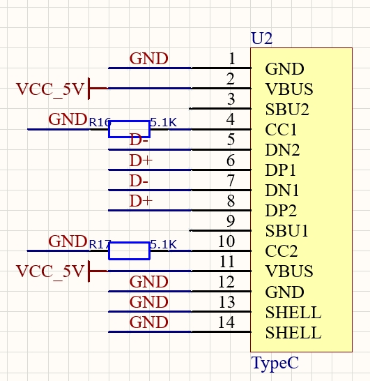
### CAN

ESP32内部自带一个CAN，所以只外接一个CAN。总共引出了四个CAN口

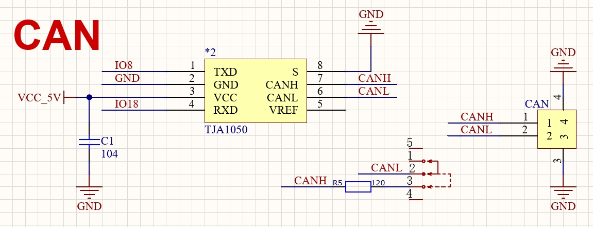

### 外设

ESP32有4个SPI、3个UART、2个I2C。

#### SPI

SPI0：供 ESP32-S3 和加密 DMA (EDMA) 访问封装内或封装外 flash/PSRAM

SPI1：供 CPU 访问封装内或封装外 flash/PSRAM

SPI2：通用 SPI 控制器，具有单独的 DMA 通道

SPI3：通用 SPI 控制器，和部分外设共用一个 DMA 通道

#### UART

UART0：默认TX为IO43，RX为IO44，不可更改为其他GPIO。UART0用于传输信息

UART1：默认TX为IO17，TX为IO18，可更改为其他任意IO。UART1用于FLASH的读写

UART2：无默认IO，可更改为其他任意IO。

#### I2C

I2C0：默认SCL为IO0，SDA为IO1，硬件可以定义0和1，通过配置可以在任意IO上实现I2C功能

I2C1：默认SCL为IO2，SDA为IO3，硬件可以定义0和1，通过配置可以在任意IO上实现I2C功能

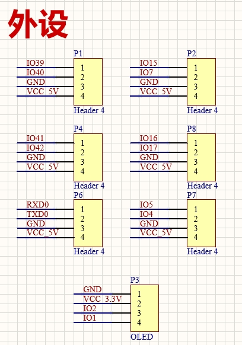

### 8路PWM输出

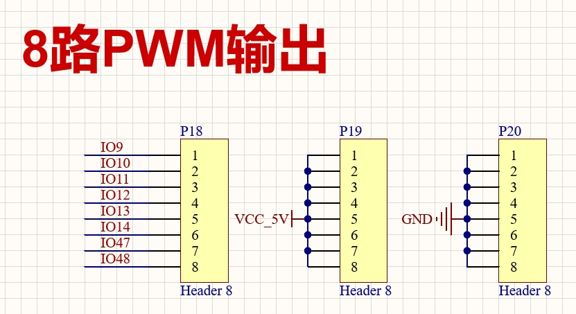

### LED

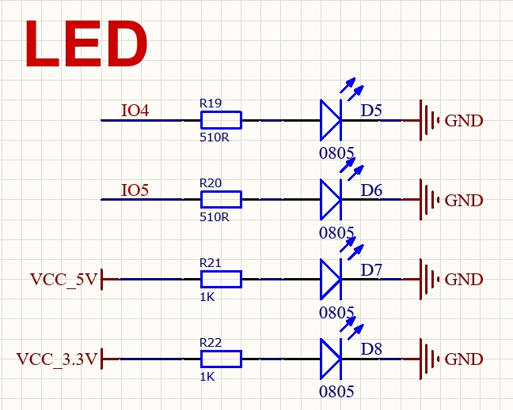

### 蜂鸣器

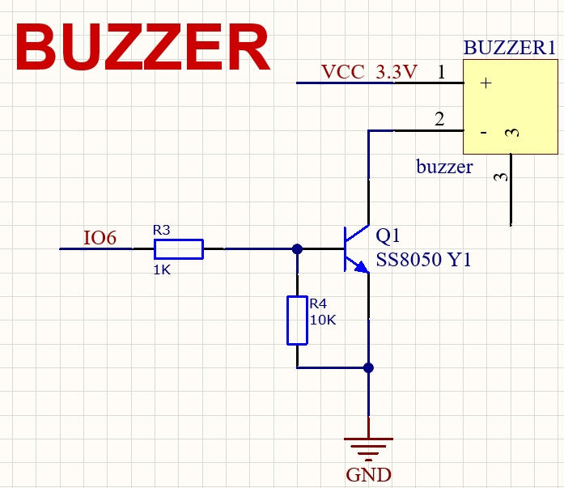

### 按键

BOOT为下载按键，EN为RESET按键

=======
## 二、PCB

PCB的大小的打孔位置和大疆开发板A板相同，8.5cm x 5.8cm

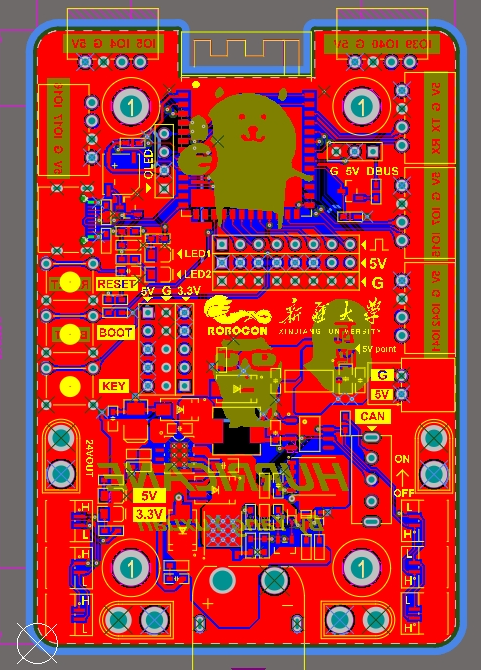

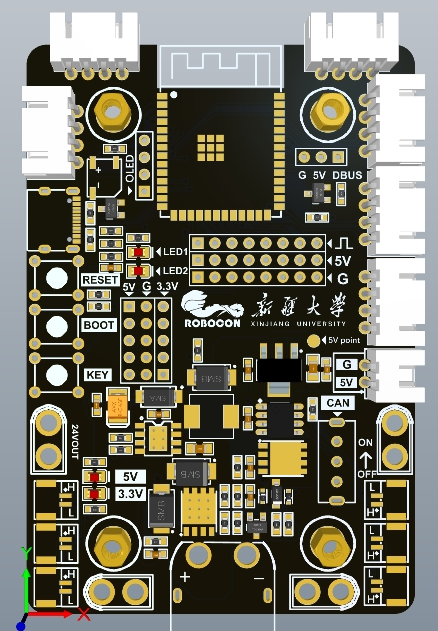

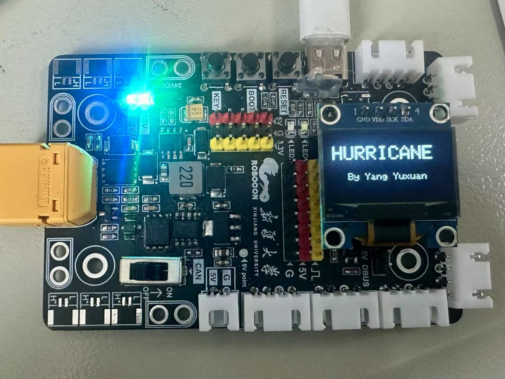

## 三、引脚分配（程序请看）

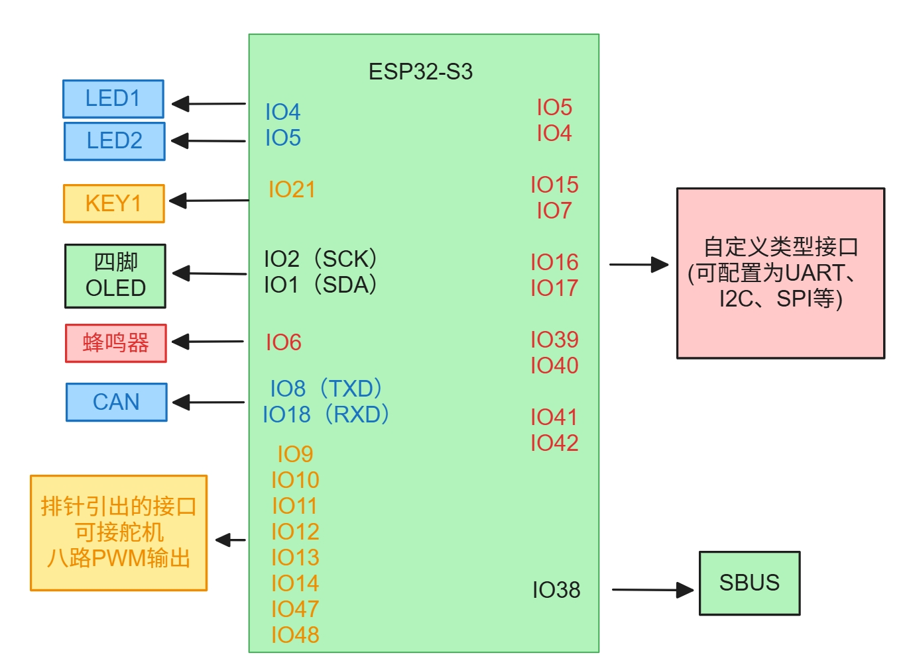
