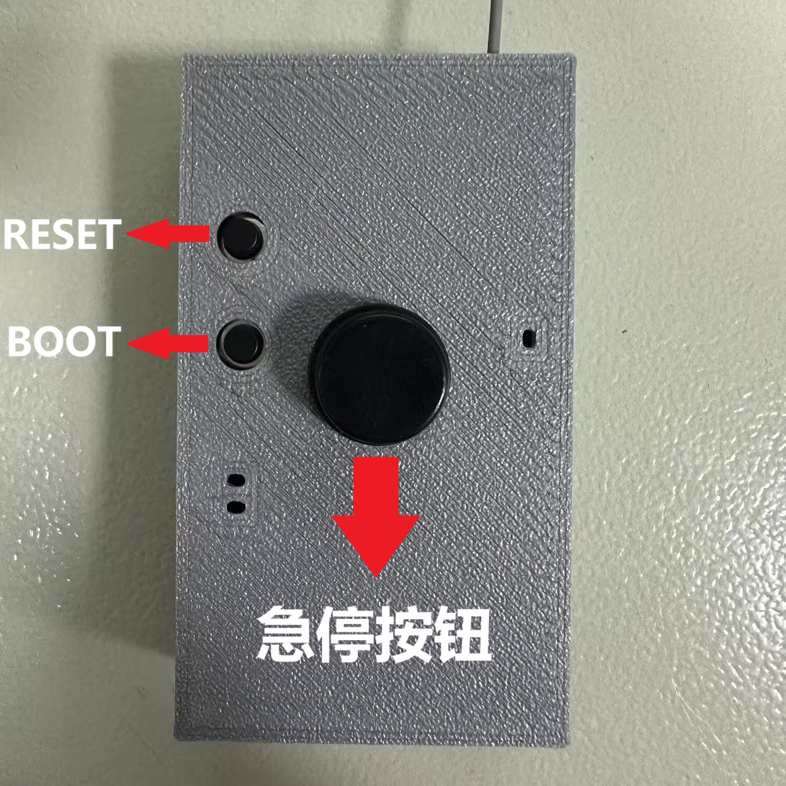
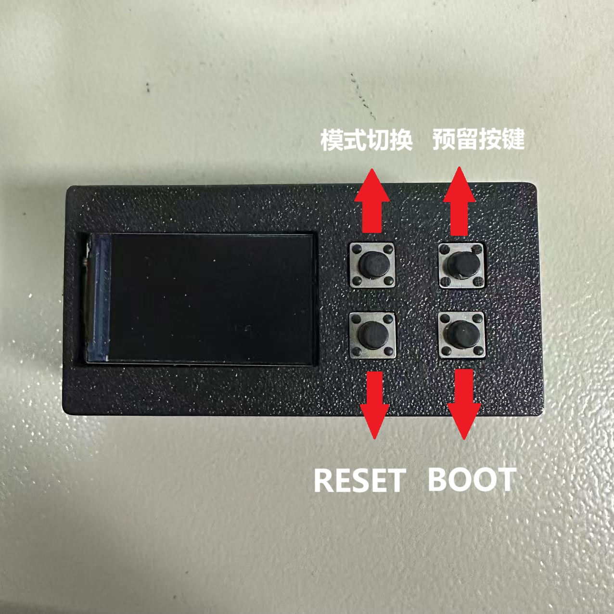

# 功率计&无线急停

## 使用方法

1.功率计插上电池即可开机，保险加一个手动急停

2.功率计开机后，**按一下**远程开关的急停按钮会连接对应功率计的wifi，**长按两秒左右**控制功率计通电，**按一下**控制功率计断电

3.按功率计的模式切换按键可以切换显示模式：显示mAH和mWH、显示电压波形、显示mac地址

4.远程开关使用Type-C充电，**充电最好不要超过三分钟，不然电池会发热**

## 说明

源代码和原理图在重邮开源的github：https://github.com/CQUPTHXC/wireless-switching-power-meter

原理图没有做太大修改，PCB和代码有修改，修改后的代码在 https://github.com/AnPuppyg/xju_wireless-emergency-stop

1.修改了两对功率计和开关的mac地址，不然会乱连

白色（1号）：48:CA:43:F5:D0:30

黑色（2号）：48:CA:43:F5:CF:F4

2.修改了源代码的温度阈值和电压阈值，增加了高电压保护，功率计温度超过55度、电压低于23V或高于25.6V都会自动切断电源并且报警

3.修改了一点GUI

4.最后，其他组成员用完远程开关请交给电路组
