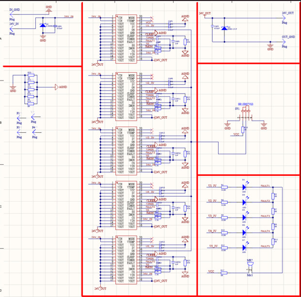
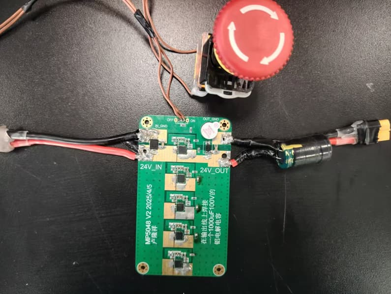

# MP5048并联大功率稳压电源

## 一、引言

我们24届R1机器人运用了摩擦带发射方案，通过测量得到的整车电流最大能到40多安，功率能到1000W左右，因此我们采取了MP5048芯片的5片并联方案来保证我们整车电源的稳定性。

## 二、**模块介绍**

基于MP5048的5片并联方案，输入24-60V，每个MP5048芯片最多可驱动15A连续电流，5片电流能到75A，功率能到1600W左右，具有短路、过流、过温保护，故障信号输出功能。

我们把急停直接接在了MP5048并联板的开关上，用急停开关控制SW引脚，保护整车电源。板子功能是，当后级电路短路或者电机堵转的时候会断电，然后蜂鸣器报警，此功能在比赛中表现比较突出。

## 三、**故障解除**

如果MP5048器件设置为锁存关闭模式，可以使用两种方法清除故障。第一，MP5048将保持在故障状态，直到ON引脚的电源先降至低电平再升至高电平，以清除故障并开始SS开启序列。第二，将输入电压（VIN）降至3V以下持续100毫秒，以触发VCC电压（VCC）欠压锁定（UVLO）下降阈值。这将导致器件完全复位，并且在VIN上升时会发生插入延迟。在正常运行期间，VIN必须超过5.25V的欠压锁定阈值。

## 四、**电路原理图**

因为5片芯片的fault引脚是连着的，所以只要一个出问题故障灯会亮且蜂鸣器响，若需要判断哪个芯片出问题需要把四个0Ω电阻拆下来，测完一个焊一个，继续测试直至找到出问题的芯片。

## 五、**实物图**

在输出端需要焊接一个1000uF/100V的铝电解电容。