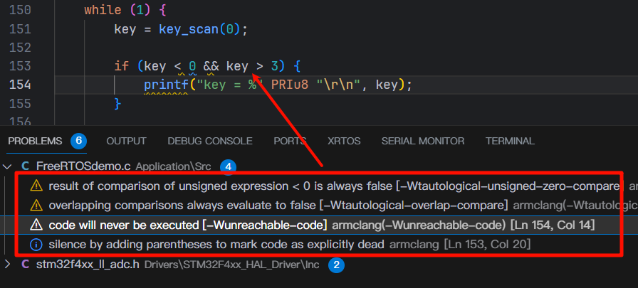
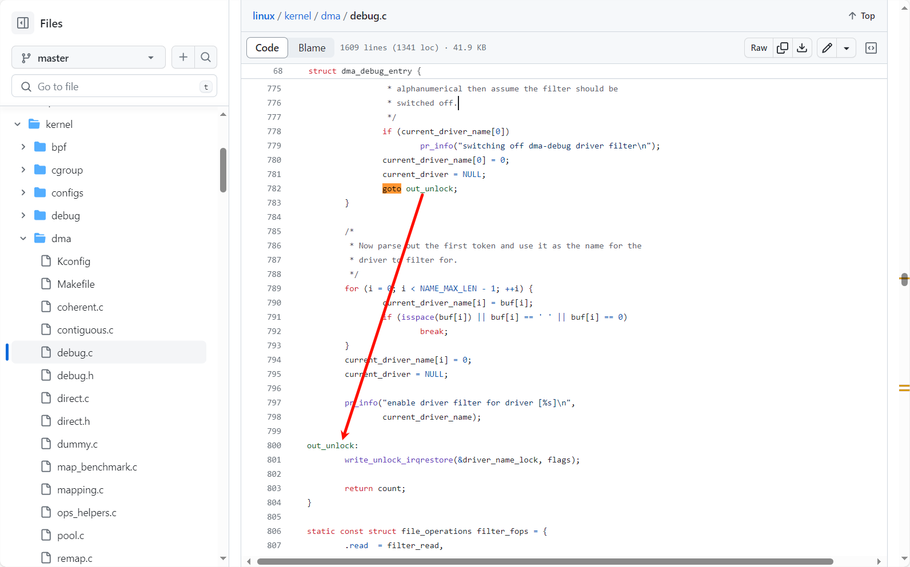
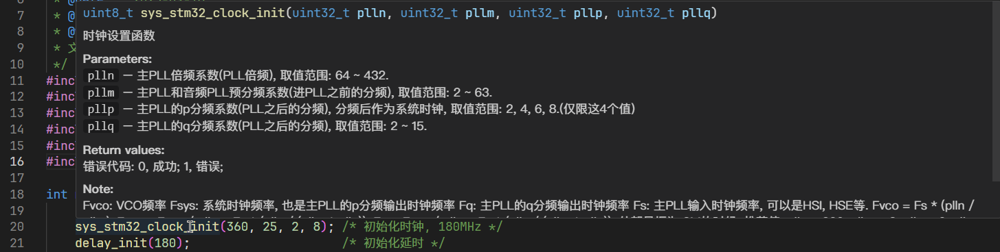
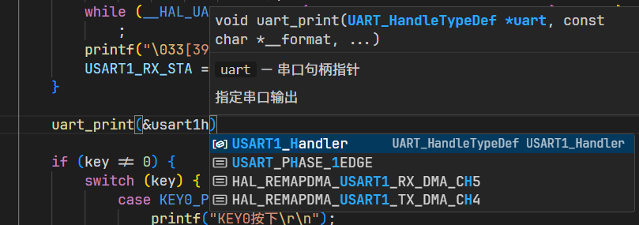
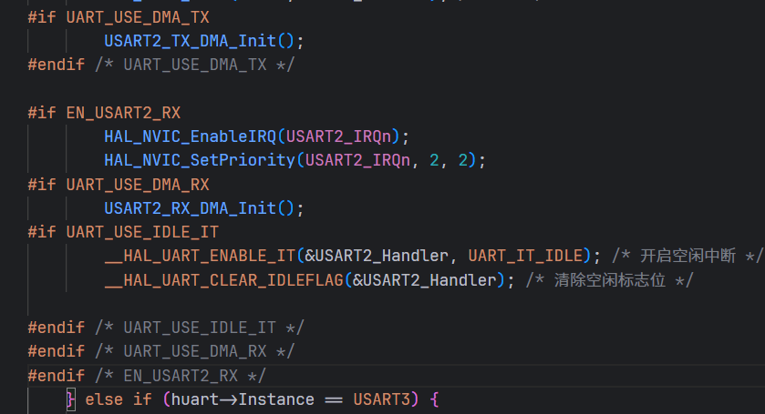
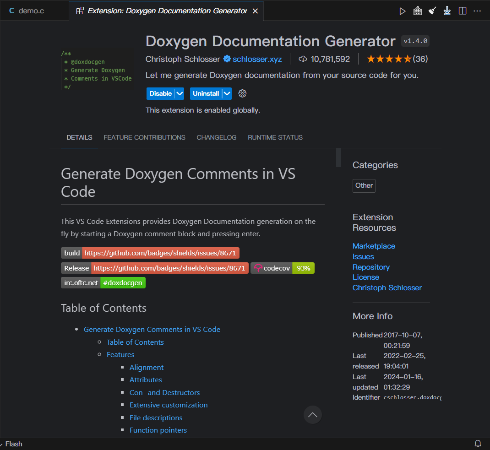
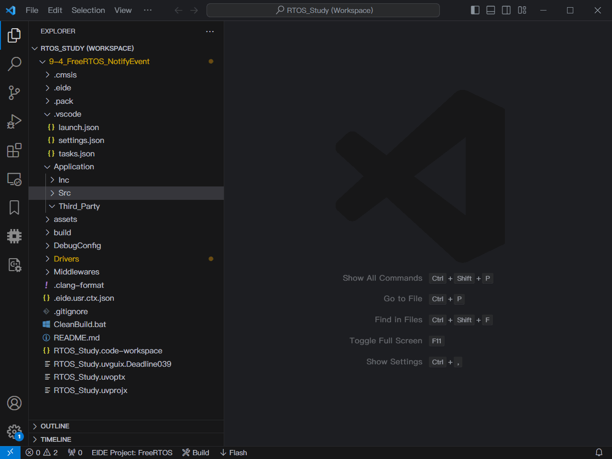
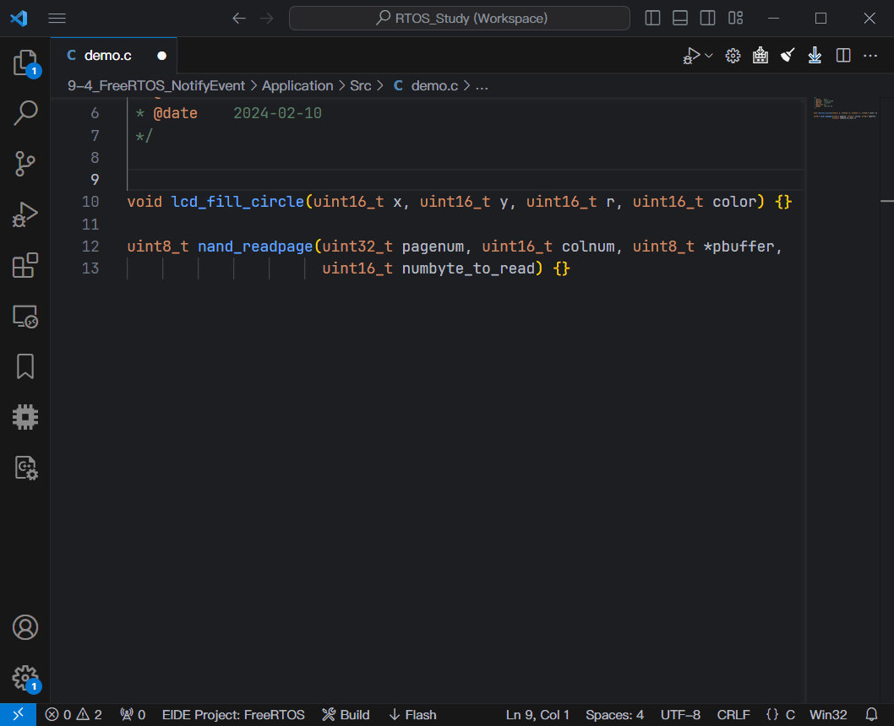
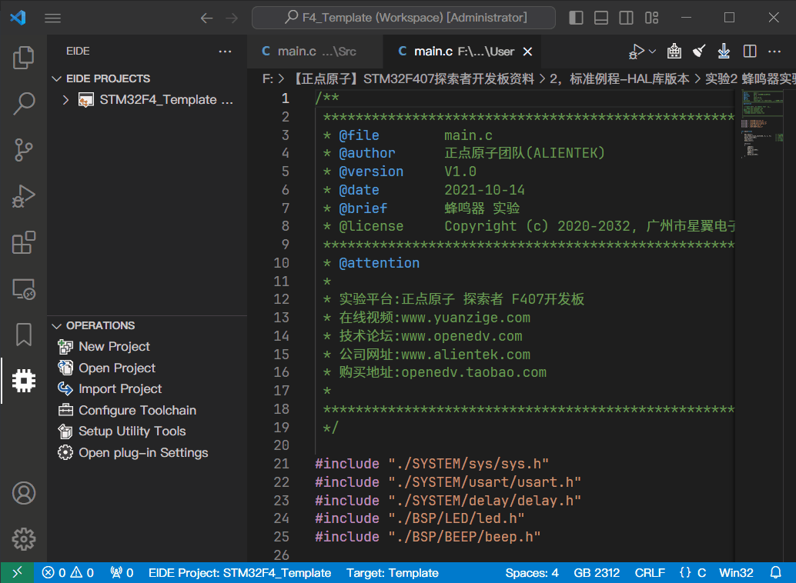
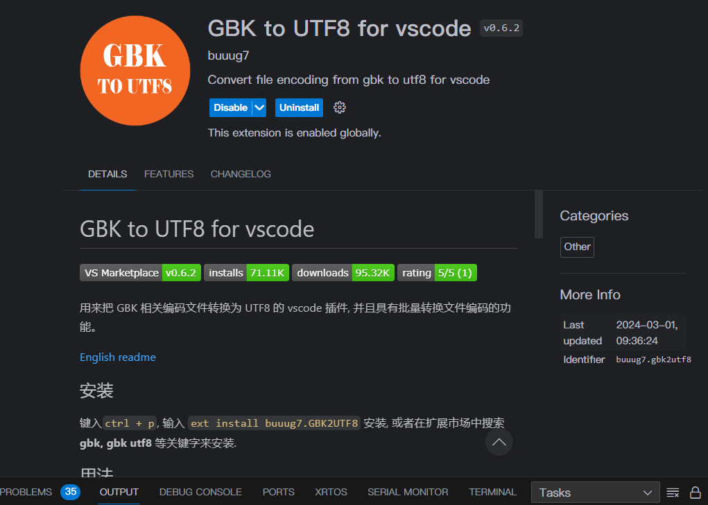

# C编码风格与规范
> If you need more than 3 levels of indentation, you’re screwed anyway, and should fix your program.
> 
> 如果你的代码缩进超过三层，意味着你已经搞砸了，你需要重构。
> 
> ——Linux之父Linus Torvalds

你的代码是给别人看的，不是光你自己看的。因此代码可读性是第一位。

下面有些代码技巧只是建议，实际代码怎么写还要靠你自己去斟酌，比如我说我们大部分声明的变量值都不会变，那么可以适当考虑添加`const`修饰符，不要见到个变量就加。

总之，我不希望把写代码当成中学的作业一样，完成功能就完事，顶多老师讲题的时候review一下。代码怎么写，怎么处理现实世界复杂的逻辑，企业是如何构建和管理一个复杂的大型项目的，没有老师或者课程能教会你，也没有标准答案。

***Try to regard code as art. Code contains huge power to change the world. Just enjoy it!*** 

## 省流

- 代码规范对于提高代码质量非常重要

- 命名用下划线命名法，宏定义字母全大写，预编译命令的`#else, #endif`行末加注释说明条件

- 全局变量加`g_`前缀，全局指针加`p_`前缀。如果不公开使用加`static`修饰符，可以不加前缀

- 命名务必简明扼要，不要意义不明

- 结构体/联合体/枚举等复杂数据类型，除非不公开，统一用`typedef`定义名称，并加上`_t`后缀

- 缩进最多接受6层，超过6层必须重写；预编译如果嵌套命令不缩进

- 嵌入式程序中不准使用递归

- 对于有返回值的函数，必须返回一个默认值，不能有什么都不返回的情况

- 不准使用未定义的变量，使用变量前必须定义初值

- 代码排版按照我写的`.clang-format`格式化

- 注释用`doxygen`

## 为什么需要规范代码风格和命名

对于一个高质量的工程，一般会做到：

1. 代码简洁精炼，美观，可读性好，高效率，高复用，可移植性好，高内聚，低耦合，没有冗余，不符合这些原则，必须特别说明。

2. 规范性，代码有规可循。特殊排版、特殊语法、特殊指令，必须特别说明。

我们规范代码风格和命名的愿景是码出高效，码出质量。现代软件架构的复杂性需要协同开发完成，如何高效地协同呢？无规矩不成方圆，无规范难以协同，比如，制定交通法规表面上是要限制行车权，实际上是保障公众的人身安全，试想如果没有限速，没有红绿灯，谁还敢上路行驶？对软件来说，适当的规范和标准绝不是消灭代码内容的创造性、优雅性，而是限制过度个性化，以一种普遍认可的统一方式一起做事，提升协作效率，降低沟通成本。代码的字里行间流淌的是软件系统的血液，代码质量的提升是尽可能少踩坑，杜绝踩重复的坑，切实提升系统稳定性，码出质量。

规范代码风格可以方便代码移植和复用，提高代码可读性，而好的命名是对程序非常重要的，命名是编程的心脏，如果连命名都做不好，那么程序过不了多久就会变得难以维护。你的代码是写给别人看的，如果你自己都看不懂的代码别人更看不懂。所以代码和命名规范，非常重要。

参照：[C Coding Standard (cmu.edu)](https://users.ece.cmu.edu/~eno/coding/CCodingStandard.html#names)

## 命名禁忌

下面的命名绝对不允许出现，如果在企业项目中敢这样命名，你的上司和同事绝对会拿键盘来砸你。

参照视频：[代码命名怎么可能让别人满意？自己满意就行了 Naming Things in Code 变量命名_哔哩哔哩 (゜-゜)つロ 干杯~-bilibili](https://www.bilibili.com/video/av275983985/)

- 单字母：`int a, b, c; float x, y, z`，循环变量可以使用`i,j,k`，但**不要把`i,j,k`定义成全局变量**

- 重复的无意义字母：`int aa, bb, cc, dd`

- 拼音及拼音首字母缩写：`char[30] mingZi, sb, nb; char xingbie; int xh, nl`，对于一些公认的拼音，可以使用，如`Alibaba, Aliyun, Baidu, Bilibili, Sogou`等（貌似都是公司名）

- 不规范的缩写：`int cont_freq`，查询常见单词的缩写可以使用这个网站：[Abbreviations.com](https://www.abbreviations.com/)

## 命名规则

命名的总原则是精准地描述功能。如果命名意义不明确，那么代码也是没有意义的。命名要做到见名知意，而不是让别人去猜。好的命名是自解释的，也就是从名字就可以看出来含义，不需要注释去说明。在程序开发中，**如果一段代码或者变量没有意义，那么这段代码或者变量就不应该存在。**

**统一使用下划线命名法，即单词全部使用小写字母，包括函数、变量、结构体等。单词之间用下划线隔开。对于第三方代码保留其命名风格，不要修改。**

- 统一性：编写一个模块的代码时，最好使用一个统一的前缀，比如操作NAND Flash的代码，可以加一个`nand_`前缀

- 与作用域关联：变量命名的长度和他的作用域有关，作用域越大，命名尽可能越长。这样能最大程度避免命名冲突

- 最短长度，最大化信息：在保持一个标识符意思明确的同时，尽量缩短长度。尽量不要超过6个单词

- 避免重名或相似：避免在不同级别作用域中重名，虽然在C/C++中允许局部变量和全局变量重名，但这样容易引起误解

- 避免出现编号：如`number1, number2`，可以使用数组代替。除非在逻辑上必须使用编号，无法用数组代替，比如`USART1, USART2`

### 包含单位

这种命名适合用在参数中，比如要传入等待超时时间，单位是毫秒，那么就可以写`timeout_ms`；让电机转到一个角度，单位是度，可以用`target_angle_degree`。当然如果太长，也可以在注释的`@param`注明。

### 函数

函数命名要和功能或者行为准确对应。一般是动词+名词，如果命名不算长，介词也是必要的，比如`dump_data_to_file`，这样阅读起来非常自然，也好分辨，当然一个变量不要搞太多的单词，尽量不超过6个。

如果一个函数是进行某个动作，如`get, set`，那么一般把动词放前面。比如获取当前队列的消息，最好用`get_queue_msg`，而不是`queue_msg_get`。如果某个东西是进行判断的，最好加`is`前缀，比如判断消息队列是否已满的函数，最好写`is_msg_queue_full`，而不是`msg_queue_full`。

有时候使用互斥词是一个较好的命名方式，常见的互斥词如下：

```Plain
add/remove      begin/end           create/destroy      insert/delete 
first/last      get/release         increment/decrement put/get/add/delete
lock/unlock     open/close          min/max             old/new 
start/stop      next/previous       source/target       show/hide 
send/receive    source/destination  copy/paste          up/down
```

### 变量

变量命名尽量用形容词+名词，可以把变量想象成一个容器，比如`red_envelop_money`

可以加修饰词，一般把修饰词放后面，这些修饰词包括`max, min, count`等。比如消息队列能容纳的最大值，最好用`msg_queue_max`，而不是`max_msg_queue`。

对于局部变量，命名不要太长，1~3个单词为宜。不要违反上面所说的禁忌。

全局变量加`g_`前缀，全局指针加`p_`前缀，句柄可以不用加前缀。全局变量除前缀外最好2~5个单词，这样能最大程度避免重名。不要违反上面所说的禁忌。

`i,j,k`可以作为循环变量，但只能在循环内使用，不能让循环变量的作用域超出循环体：

```C
/* 不允许, 正点原子采用这种方式是为了兼容C89 */
int i;
for (i = 0; i < count; i++) {
    list[i] = ...
}
/* 使用下面的方式让循环变量的作用域只在for循环里 */
/* PS: C标准至少在C99以上, C89这样写会报错 */
for (int i = 0; i < count; i++) {
    list[i] = ...
}
```

如果要在循环外使用循环变量，比如要查找一个值的位置，**那说明这个循环变量是有意义的**，不能用`i,j,k`这种单纯下标意义的变量来命名。

### 宏定义

宏定义常量时**字母全部用大写**，同时宏定义尽量加前缀。

对于头文件中避免重复编译的宏`#ifndef __XXX_H #define __XXX_H`，标识符使用`__XXX_H`的写法，即两个下划线开头，XXX一般是文件名的大写字母，随后跟上一个下划线加一个H。

### 句柄

句柄加`_handle`后缀，句柄名称与类型和功能匹配就可以了

## 代码规范

保持代码风格的统一，对code reading, review, refactoring, porting等都有好处。这些代码规范大多数情况下Clang-format都会帮我们自动排版，无需我们手动调整。**统一使用Github中`STM32_Template`的`.clang-format`文件。**

### 头文件

- 只引用需要的头文件，不要包含一堆头文件

- `#include`中的文件名对大小写敏感

- 头文件放在`Inc`目录，源文件放在`Src`目录

- 对于C++代码，头文件使用`.hpp`后缀

- 如果一个目录中有多个子目录中的头文件需要包含，使用相对路径，不要在`IncludePath`中添加，例如：

```C
/*
某个模块的文件结构：
model_root
├─foldA
│  └─functionA.h
├─foldB
│  └─functionB.h
├─foldC
│  └─functionC.h
├─foldnD
│  └─functionD.h
├─foldE
│  └─functionE.h
└─foldF
   └─functionF.h
假如都需要这6个模块的头文件, IncludePath中只添加了model_root. 
*/

/* 你当然可以大力出奇迹, 将这6个文件夹全部添加到IncludePath中, 然后 */
#include "functionA.h"
#include "functionB.h"
...
#include "functionF.h"

/* 但更好的做法是, 不添加IncludePath, 使用相对路径包含, 保证根目录在IncludePath就可以 */
#include "./flodA/functionA.h"
#include "./foldB/functionB.h"
...
#include "./foldF/functionf.h"
```

### 源文件

- 不要使用无意义的名称，如果是某个模块的代码，保证服务对象单一，不要包含太多其他模块的代码。

- 对于C++代码，使用`.cpp`后缀

- 头文件开头和末尾必须加上固定格式的宏定义，即`#ifndef ... #endif`

```C
/**
 * @file    xxx.h
 * @brief   balabala
 * @auhor   yourname
 * @date    2024-02-20
 * @version 0.1
 */

#ifndef __XXX_H
#define __XXX_H

...

#endif  /* __XXX_H */
```

### 缩进与空格

- 统一使用4个空格缩进，不使用Tab缩进，不同编辑器定义的制表符长度不一，容易产生错位，所以使用**四个空格代替制表符**

- 嵌套缩进尽量控制在4层以内，最多接受6层，**超过4层优化，超过6层必须重写**

- `if () {}, switch () {}, case () {}`这类带花括号的关键字后须有空格；但是对于不跟花括号的关键字，如`sizeof(), __attribute__()`，以及函数调用，不带空格

- 圆括号、方括号内的代码与括号之间不加空格，外边根据情况添加空格，比如下面第2行的代码不应该写成：`data [ 3 ] = ( uint8_t )( verify_key >> 8 );`

- 二元、三元操作符前后都要加空格，如：`= + - < > * / % ^ <= >= == != ? :`

- 一元操作符后不要加空格，如：`&(取地址) *(取指针的内容) + - ~ !`，但是如果声明指针变量，`*`放在靠近变量名的一侧，星号左边有一个空格

- 自增和自减运算符前后都不加空格，如：`num++, --num`

- 访问结构体成员的操作符前后不加空格，如：`Init.Mode, hspi->Instance`

- 逗号，分号只在后面添加空格，如：`int age_max, age_min;`如果分号在行末，空格可加可不加

- 数组下标的方括号都没有空格，如`buf[i]`

- 块注释`/* xxx */`与注释内容xxx前后各一个空格

- 行注释`// xxx`双斜线后有一个空格，且两条斜线与行对齐，不要放在行首

以上几点代码举例：

```C
/* 运算符与数组下标 */
data[3] = (uint8_t)(verify_key >> 8);
for (int i = 0; i <= num; i++) {
    datax->buf[i] = x1 * (x2 + i) + baseval;
}

/* 声明指针变量 */
char *str = NULL;
```

当然了，我们没必要关注这么多细节，大多数情况下自动格式化都会做好这一切。

### 括号换行

- 所有左花括号不换行，右花括号单独一行，对于`else`语句右花括号不换行。这样是为了减少代码阅读负担，一个左花括号占一行代码会看起来比较长，右花括号单独一行可以提醒读者这个代码块到底了

- 对于参数列表或者其他圆括号内换行场景，后行与第一行左括号后第一个字符对齐，右括号不另起一行

```C
/* 花括号使用案例 */
/**
 * @brief 按键扫描
 *
 * @param mode 是否支持连按
 *  0-不支持连按, 1-支持连按
 * @return 按下的按键
 *  @retval 按下:`KEY0_PRES ~ WKUP_PRES`
 *  @retval 未按下:`0`
 * @note 注意此函数有响应优先级,`KEY0 > KEY1 > WK_UP`
 */
uint8_t key_scan(uint8_t mode) {
    static uint8_t key_up = 1; /* 按键松开标志 */
    if (mode == 1) {
        key_up = 1; /* 支持连按 */
    }
    if (key_up && (KEY0 == 0 || KEY1 == 0 || WK_UP == 1)) {
        delay_ms(10);
        key_up = 0;
        if (KEY0 == 0) {
            return KEY0_PRES;
        } else if (KEY1 == 0) {
            return KEY1_PRES;
        } else if (WK_UP == 1) {
            return WKUP_PRES;
        }
    } else if (KEY0 == 1 && KEY1 == 1 && WK_UP == 0) {
        key_up = 1;
    }
    return 0; /* 无按键按下 */
}

/* 括号内换行 */
xTaskCreate((TaskFunction_t)start_task, /* 任务函数 */
            (const char *)"start_task", /* 任务名称 */
            (uint16_t)START_STK_SIZE,   /* 任务堆栈大小 */
            (void *)NULL,               /* 传入给任务函数的参数 */
            (UBaseType_t)START_TASK_PRIO,           /* 任务优先级 */
            (TaskHandle_t *)&g_start_task_handler); /* 任务句柄 */

/* 下一行的位置与第一行括号后的第一个字符对齐, 最后的右括号不换行 */
ring_fifo_t *ring_fifo_init(void *buf, uint32_t size,
                            enum ring_fifo_type type);
```

### 空行

- 文件头注释后有一个空行

- 函数之间须加一个空行

- 在注释某个函数、结构体、枚举、变量的功能时候不要加空行，见下面注释的说明

- 在一个函数中，每个相对独立的操作完成以后最好有一个空行，比如下面的代码块，11,17,23行都有一个空行，表示上一个操作完成了，该下一个操作了，方便阅读

```C
/**
 * @brief 用户从快递柜取包裹
 * 
 * @param pick_up_code 取件码
 * @return status_t 操作状态
 */
status_t user_pick_up_express(uint32_t pick_up_code) {
    if (pick_up_code == 0) {
        return ERR_INPUT_NULL;
    }
// 11行，这里空一行
    uint32_t cabinet_number = seek_express_by_code(pick_up_code);
    if (cabinet_number == 0) {
        /* 柜子编号不存在 */
        return ERR_NO_FOUND;
    }
// 17行，这里空一行
    status_t cabient_status = cabient_open_the_door(cabient_number);
    if (cabient_status == ERROR) {
        /* 开门出错, 可能是柜子继电器出问题了, 提示联系管理员 */
        return ERR_OPEN_DOOR;
    }
// 23行，这里空一行
    return OK;
}
```

用一堆`*`隔开也是个不错的选择，不过要注意一行80个字符

### 代码行

- 一行代码只做一件事情，比如只定义一个变量，或者一条语句，这样方便阅读与注释

- 多个语句不要放在一行里，一行内不要写多个连续赋值的语句

- 一行代码尽量不要多个变量。如果在逻辑上比较相近，可以写在一行上，比如`float width, height;`

- 一行最多80个字符，写代码经常需要分屏，一行代码如果太长就不太方便了。

```C
/* 不规范写法 */
a = x + y; b = x - y;
a = b = 0;

/* 规范写法 */
a = x + y;
b = x - y;
a = 0;
b = 0;
```

### 代码块

- **`if, for, while, do`这类语句，必须加花括号，一个语句也必须加**，这样可以有效防止编码时出现的失误

- **及时清理未使用的函数、变量等死代码**，不要妨碍阅读，可读性是第一位的。

> 未使用的代码叫做死代码(Dead-code)，Dead-code在一个企业项目中都是很危险的，这是由于Dead-code一般写完以后就不会再看了，就算code reviewing时reviewer也只是大概扫两眼，不会去执行调用，这段代码就会失去维护。如果哪一天某个人突然调用了Dead-code中的函数，这个函数有很隐蔽的bug，突然有一天就触发了，这会造成不可预估的损失。因此对于Dead-code，宁愿移除，未来某天再重写一遍，也不会放在哪里不管。

- 要注意逻辑上永远不可能执行的代码，如果没有更改Template的警告等级，编译会给警告：



- 对于空语句，保留一个`{}`即可，括号里面即没有空格，也不换行，但是对于`if else`，括号内要换行；如果使用分号，必须换行，且分号前缩进。这样做意在提示阅读者注意此处的逻辑。

```C
/* 不规范写法 */
if (condition)
    return true;

if (condition) return true;

if (condition) { return true; }

if (condition) {} else {
    ...
}
while (condition) {
}

/* 规范写法 */
if (condition) {
    return true;
}
/* 空语句规范写法 */
while (condition) {}
/* 如果不用上面的方式, 可以采用下面的方式. 如果分号不换行易被误认成函数调用 */
while (condition)
    ;
/* if else中的空语句括号需换行. 如果大括号中间不换行易被误认成if条件成立后执行 */
if (condition) {
} else {
    ...
}
```

### 函数

- **一个函数尽量不要超过10个局部变量**，超过说明你的功能太复杂了，要考虑优化

- 函数参数也不要太多，最多6个，太多说明你的功能太复杂了，要考虑优化

- 一个函数也不要太长，100行左右为宜，太长同理

- 校验逻辑放前面，发现错误早返回，这样能有效减少嵌套，避免代码逻辑错误

- **嵌入式代码不允许使用递归**，递归对于资源消耗巨大，易造成栈溢出

- 有返回值的函数，**末尾必须要`return`默认值**，如果没有返回任何值编译会给警告

- 对于无参的函数，加`void`，不要在括号里什么都不写。例如：`int main(void)` ，而非`int main()`

- 函数的功能要单一，不能处理太多的业务逻辑，对于单一模块的文件服务的对象也要单一，不要让一个文件或者函数成大杂烩。

> 文件和函数的功能要专一。举个例子，医院是一个完整的程序，一家综合性医院一般都会有若干个科室，比如内科、外科、放射科等等。而内科又包括呼吸科、心血管科，但是内科不会有皮肤科。外科包括骨科、脑外科，但是不会有消化内科。同样的，在程序中也不能这样，保证服务的对象统一。像呼吸科这样的专科门诊就可以看作一个独立的文件，医生给你治病的流程相当于函数。

> 但是我们在程序中经常会遇到一些交叉的功能，比如医院的放射科，就会有内外科交叉。骨折了得去放射科拍片子，脑子里有肿瘤，也得去放射科拍片子。那么对于这种代码需要我们处理好内外的逻辑，不要乱七八糟的，也不要一股脑全放到一个地方。当然实际情况当然没有没有那么理想，这就需要你自己思考，仔细斟酌，找到最优解。

### 变量

- 所有局部变量哪里用在哪里声明。**使用前必须定义，不准使用未定义的变量**

- 如果初值可以确定，写在一行上，不要分开写：`xxxStatus_t xxx_status = get_xxx_status(xxx);`

- 不确定初值的变量给`0`或`1`，不确定初值的指针给`NULL`，不确定的结构体变量给`{0}`

- 不能让变量的作用域超出它的实际作用范围，比如一个变量就在`if`条件成立里用，你就不应该声明在`if`外。**尤其是对于循环变量`i, j, k`**，如果只是单纯的下标意义，在`for`里面声明并定义，不要在外边声明，也就是：`for (int i = 0, i < count; i++)`

- 如果一个全局变量只有一个文件使用，尽量加`static`修饰符，这样能避免其他人在其他文件调用本文件的变量，产生预期之外的后果。**全局变量如果不加`static`，整个程序是可以访问的，任何一个地方的`extern`声明都可以访问到这个变量。**

- 对于只用写入一次初值的变量，可以加`const`修饰符，这样能够避免其他人乱改变量的值产生预期之外的后果。

> 一个有趣的冷知识，我们写的程序大部分变量，大多只是给了一次初值后再没变过。但大量的`const`修饰符势必会造成阅读负担，因此对于一些关键的变量考虑是否加`const`修饰符是非常有必要的，这样就不用担心变量在某个隐蔽的角落被重新赋值。

```C
uint32_t arr[4];
int16_t foo;
/* 不允许未定义就使用arr数组 */
printf("%d", a[1]);
/* 不允许使用未定义的变量 */
int16_t bar = foo + 1;

/* 对于不确定内容的数组, 使用memset初始化 */
memset(arr, 0, sizeof(arr));
/* 申请堆内存时, 使用calloc可以将申请的内存设置为零 */
uint16_t *new_data = (uint16_t *)calloc(sizeof(uint16_t) * MAX_LEN);
```

### 复杂数据类型

- 对于结构体或者联合体，除非不公开，只用来声明一个或几个变量，否则**统一使用`typedef`定义名称**，并结尾带`_t`后缀

```C
/* 正确写法 */
typedef struct foo {   /* 此处foo可写可不写, 不写就是匿名结构体. 如果有像下面这样需要引用该结构体指针的那必须写 */
    struct foo *next;  /*!< next item */
    int index;         /*!< index of item */
    uint8_t flag;      /*!< flag of item */
    ...
} foo_t;               /* 使用_t后缀 */
foo_t foo_obj;         /* 定义结构体变量 */

/* 错误写法 */
struct foo {
    struct foo *next;  /*!< next item */
    int index;         /*!< index of item */
    uint8_t flag;      /*!< flag of item */
    ...
};
sturct foo foo_obj;         /* 定义结构体变量 */

/* 特殊情况, 只声明一个或几个结构体变量, 这种不用typedef名词 */
/* 如果内部使用考虑是否需要static修饰符, 加在struct前面 */
struct foo {
    int index_of_foo;      /*!< 索引 */
    data_t data_of_foo;    /*!< 数据 */
    ...
} foo_variable_1, foo_variable_2 ... ;
```

- 对于枚举，枚举成员使用大写（当然某些情况下可以使用小写）

- 与宏定义类似，如果只用来列举数据，比如数组下标，那么可以不定义名称

- 枚举类型可以用来作为参数或者返回值。枚举成员一行只写一个成员，不要堆在一行上。

```C
/**
 * @brief GPIO电平定义
 */
typedef enum {
    GPIO_PIN_RESET = 0x00U,
    GPIO_PIN_SET
} GPIO_PinState_t;

/**
 * @brief 状态定义
 */
typedef enum {
    HAL_OK = 0x00U,
    HAL_ERROR,
    HAL_BUSY,
    HAL_TIMEOUT
} HAL_Status_t;

/* 不要写成这样, 成员不换行 */
typedef enum {
    HAL_OK = 0x00U, HAL_ERROR, HAL_BUSY, HAL_TIMEOUT
} HAL_Status_t;

/**
 * @brief HAL写入GPIO电平
 * 
 * @param GPIOx GPIO端口
 * @param GPIO_Pin GPIO引脚
 * @param PinState 写入电平
 * @return `HAL_Status_t` 是否写入成功
 * @note 实际HAL库逻辑并非这样, 只是举个例子
 */
HAL_Status_t HAL_GPIO_Write_Pin(GPIO_t *GPIOx, uint16_t GPIO_Pin,
                                GPIO_PinState_t PinState) {
    assert_param(IS_GPIO_PIN(GPIO_Pin));
    ...
    GPIOx->ODR = GPIO->IDR | (GPIO_PinState << GPIO_Pin);
    if (GPIOx->IDR == GPIOx->ODR) {
        return HAL_OK;
    } else {
        return HAL_ERROR
    }
}

/* 纯下标定义, 可以不用typedef定义名称 */
enum {
    LAST = 0x00U,
    NOW,
    NEXT
};
array[LAST] = ...;
```

### 数组与指针

- 对于指针，**`*`放在变量名的一侧**，即`char *pointer = NULL`，而非类型的一侧，即`char* pointer = NULL`。放在右边是要注意下面的情况：

```C
int* p, q; /* 当这样声明的时候p是int指针, q是int变量, 相当于: int* p; int q; */
/* 所以采用下面的方式, 看起来统一 */
int *p, *q;
```

- 不建议一行代码声明多个变量，因此尽量避免像上面这样即声明指针又声明变量。

- 申请的内存必须及时释放，否则会造成内存泄漏。

- **指针嵌套（比如指向指针`int*`的指针`int**`）最多三层，数组最多三维数组**

- 对于结构体、联合体这种复杂数据类型，函数之间传递时尽量使用指针，以减少内存开销，以及避免可能产生的内存泄漏。

### 宏定义

- 续行符右对齐

- 宏定义如果有`#if`嵌套，不缩进

- 使用`#define`定义常量时，常量值对齐

```C
/* 不规范写法 */
#define USE_FOO 0
#define NOT_USE_BAR 1

#if NOT_USE_BAR

    #define IS_FOO
void foo(void);

#else  /* NOT_USE_BAR */

    #define IS_BAR
void bar(void);

#define LED0(x) \
    (x) ? HAL_GPIO_WritePin(LED0_PORT, LED0_PIN, GPIO_PIN_SET) \
        : HAL_GPIO_WritePin(LED0_PORT, LED0_PIN, GPIO_PIN_RESET)

#endif /* NOT_USE_BAR */

/* 规范写法 */
#define USE_FOO     0
#define NOT_USE_BAR 1

#if NOT_USE_BAR

#define IS_FOO
void foo(void);

#else  /* NOT_USE_BAR */

#define IS_BAR
void bar(void);
/* 最右边的反斜杠就是续行符, 右对齐 */
#define LED0(x)                                                                \
    (x) ? HAL_GPIO_WritePin(LED0_PORT, LED0_PIN, GPIO_PIN_SET)                 \
        : HAL_GPIO_WritePin(LED0_PORT, LED0_PIN, GPIO_PIN_RESET)

#endif /* NOT_USE_BAR */
```

VSCode和Keil可以折叠宏定义，这样未启用的宏定义可以不显示

### goto

- 可以使用`goto`，`goto`作为函数退出时使用非常方便，Linux内核中也有不少代码用了`goto`。但务必逻辑简单易懂，不要滥用

- 使用`goto`不要形成循环；尽量往后跳转，不要跳转到前面。往前跳转容易形成潜在的逻辑错误。



### 杂项

- 不要使用魔法数字(Magic Number)，即突如其来的数字，意义不明，比如`int magic_number = 3;`你告诉我这个3是干什么的

- 如果要使用常数尽量用宏定义，但是不要出现这种宏定义：`#define FIVE 5`，谁不知道FIVE是5啊，代码里不能直接写5吗

- 不要对浮点数做相等或者不等判断，浮点数由于精度问题并不会按照我们预期的方式执行。很典型的例子，可以自己写个程序看一下`0.1 + 0.2 == 0.3`的值，你会发现这个条件的结果是0即`false`

- 注意强制类型转换，仔细思考这样做是否有问题

## 注释

**代码必须写注释，不写注释的都是[↓↑](https://www.bilibili.com/video/av838862989/)**

注释使用[doxygen](https://www.doxygen.nl/index.html)标准。行注释`//`用在注释代码上。doxygen支持[Markdown](https://www.markdownguide.org/)语法

doxygen的标签可以以`@`或者`\`开头，**这里统一规定使用`@`作为标签开头**。

doxygen规定的标签可点击[此处](https://www.doxygen.nl/manual/commands.html)查阅，如果标签是doxygen规定的，vscode会自动识别标签并显示相应的颜色。下面列举几个常用的，用法参照官方文档，或者下面的内容

```C
/**
 * @arg         @attention  @author     @brief      @bug
 * @copyright   @date       @def        @defgroup   @details
 * @note        @param      @private    @public     @ref
 * @return      @retval     @see        @todo       @version
 * @warning
 */
```

在VSCode中切换行注释的快捷键是`Ctrl + /`，按下后就会自动添加空格。切换块注释的快捷键是`Alt + Shift + A`，按下后前后也会自动加空格。我一般把这个快捷键改成`Alt + /`，在左下角齿轮，KeyBoard Shortcuts(键盘快捷键)，然后搜索`blockComment`，找到Toogle Block Comment(切换块注释)，点第二列的快捷键，按下你想要的快捷键，保存即可。如果快捷键冲突，可以先查找这个快捷键，解除后再录入新的快捷键。

### 文件头

文件注释标准, 写明文件名`@file`, 作者`@author`, 简介`@brief`, 版本`@version`, 日期`@date`, 版权信息等。建议使用空格对齐（按一个Tab为4空格），看起来较为整齐。

注意版本号的更新，对于开发初期的版本，主版本号使用0，更新副版本号；如果是较为稳定的发布版本，更新主版本号。

```C
/**
 * @file    commune.c
 * @author  Deadline039
 * @brief   通信代码
 * @version 0.1
 * @date    2023-11-05
 * @note    遥控器发送的数据帧都为8个字节, 开头统一为0xFF, 结尾统一为0xCC
 *          --------------------------------------------------------------------
 *          遥控器数据帧格式:
 *          0xFF, 0xAA(标识遥控器), x1, y1, x2, y2, keys, 0xCC
 *          --------------------------------------------------------------------
 *          握手数据帧格式:
 *          0xFF, 'h'(标识握手), 'e', 'l', 'l', 'o', 0x00, 0xCC
 *          主板回复格式
 *          'O', 'K', 0x00, 0xCC
 *          --------------------------------------------------------------------
 *          发送key数据帧格式
 *          0xFF, 0xFE(标识key), key, key, key, key, 0x00, 0xCC
 *          --------------------------------------------------------------------
 *          检查连接数据帧格式
 *          0xFF, 0xFF(标识检验), 0x00, 0x00, 0x00, 0x00, 0x00, 0xCC
 *          主板回复格式
 *          key, key, key, key, 0x00, 0xCC
 *******************************************************************************
 *          CHECK_CONNECT宏用来定义是否进行连接检查, 0为不使用; 1为使用
 *          如果不使用连接检查, 开机直接向主板发送遥控器数据
 *
 *          如果使用连接检查, 上电会持续发送握手数据帧, 等待主板回复OK
 *          主板回复后, 向主板发送一个32位的key, 这个key是随机生成的
 *          发送格式就是key数据帧格式
 *
 *          遥控器每发送20帧遥控器数据, 会发送一个检查连接数据帧,
 *          主板将key发送给遥控器, 遥控器进行校验. 如果错误, 提示连接出错
 */
```

### 函数

注明简介`@brief`, 参数`@param`, 有时还使用`@arg`来指定传入的参数值, 返回值`@retval, @return`等。参数作为输入`[in]`可以省略，作为输出需加`[out]`，C不支持引用参数，一般为指针

每条列表项目可以不用空格对齐，`arg`与`param`前错开一个空格，但是如果一个列表内的内容要换行，对齐上一行的开头

```C
/**
 * @brief Starts the TIM Input Capture measurement. 这里可以不与下面的retval对齐
 * @param htim TIM Input Capture handle
 * @param Channel TIM Channels to be enabled. This parameter can be one of the
 *                following values: (这里换行了, 与上一行开头对齐)
 *  @arg TIM_CHANNEL_1: TIM Channel 1 selected  开头与@param错开一个空格
 *  @arg TIM_CHANNEL_2: TIM Channel 2 selected
 *  @arg TIM_CHANNEL_3: TIM Channel 3 selected
 *  @arg TIM_CHANNEL_4: TIM Channel 4 selected
 * @retval HAL status
 * @note 注意12行和13行之间不应该有空格
 */
HAL_StatusTypeDef HAL_TIM_IC_Start(TIM_HandleTypeDef *htim, uint32_t Channel) {
    uint32_t tmpsmcr;
    /* 双斜杠仅在注释代码时使用 */
    // HAL_TIM_ChannelStateTypeDef channel_state = TIM_CHANNEL_STATE_GET(htim, Channel);
    // HAL_TIM_ChannelStateTypeDef complementary_channel_state = TIM_CHANNEL_N_STATE_GET(htim, Channel);

    /* Check the parameters */
    assert_param(IS_TIM_CCX_INSTANCE(htim->Instance, Channel));
    ...
    /* Return function status */
    return HAL_OK;
}

/**
 * @brief 根据传感器数据获取实际位置
 *
 * @param[out] real_x x位置指针
 * @param[out] real_y y位置指针
 */
void GetPosition(double* real_x, double* real_y) {
    *real_x = ...;
    *real_y = ...;
}
```

如果函数使用的是标准的doxygen注释的，在vscode里鼠标放到一个函数上悬停会显示相关信息，输入参数时也会提示现在输入的是什么参数。空格不影响这里展示的内容，vscode会自动忽略空格。注意文件编码为UTF-8。





### 结构体

结构体前注明简介，每个成员都说明作用，说明成员作用时使用`/*!< xx */`

```C
/**
 * @brief  TIM Clear Input Configuration Handle Structure definition
 */
typedef struct {
  uint32_t ClearInputState;      /*!< TIM clear Input state
                                      This parameter can be ENABLE or DISABLE */
  uint32_t ClearInputSource;     /*!< TIM clear Input sources
                                      This parameter can be a value of @ref TIM_ClearInput_Source */
  uint32_t ClearInputPolarity;   /*!< TIM Clear Input polarity
                                      This parameter can be a value of @ref TIM_ClearInput_Polarity */
  uint32_t ClearInputPrescaler;  /*!< TIM Clear Input prescaler
                                      This parameter must be 0: When OCRef clear feature is used with ETR source, 
                                      ETR prescaler must be off */
  uint32_t ClearInputFilter;     /*!< TIM Clear Input filter
                                      This parameter can be a number between Min_Data = 0x0 and Max_Data = 0xF */
} TIM_ClearInputConfigTypeDef;
```

### 模块

当一段代码是一个模块时可以用`defgroup`：

```C
/**
 * @defgroup Moudle 1
 * @{
 */

...    

/**
 * @}
 */

/* 也可以加一堆*来区分, 一行80个字符 */
/*******************************************************************************
 * @defgroup Moudle 2
 * @{
 */

...

/**
 * @}
 ******************************************************************************/
```

### 预编译命令

- 预编译命令的`#else, #endif`必须在行末注释`#if`的条件，要不然一堆`#endif`更根本不知道是哪里的

- 根据实际情况适当裁剪，及时清理未使用的函数和变量

- 宏定义如果有`#if`嵌套，不缩进



### 杂项

- 不要过度注释，比如`key = key_scan(0);  /* 扫描按键 */`，这个函数一眼就知道是扫描按键的，没必要注释。正点原子的注释是为初学者考虑的，所以每行代码基本都会注释一下。

- 代码里不要写无意义的注释。不要把注释写成英语句子的翻译，我们应该翻译的是代码中的逻辑，而不是翻译单词，这种注释没有意义

- 对于函数或者文件来说，注释的主要目标是讲清楚这部分代码有什么功能，如何使用，最好将代码逻辑的解释放到具体的代码中，可以简单说一下运行流程。函数、文件的功能注释叫`brief`，而不是`details`

- 注释关键部分和难以理解的点必须注释，比如操作寄存器的代码，如果不查阅手册基本看不懂

- 注意注释要和代码相符，不要复制粘贴的时候不改注释

- 注释应该在代码的上一行或者行末，不应该在下一行，也不要有空行

- 尚未实现完整功能，或者需要更进一步优化的代码，应使用`todo`；如果代码有bug，使用`bug`，其他tag用法参照doxygen官方文档

```C
/* 注释应该在这里 */
event_val |= event_bit;  /* 或者注释在这里 */
/* 不应该在这里注释 */

/* 这是说明第7行代码的注释, 第6行不应该空 */

event_val <<= 1;

/**
 * @todo 此处判断逻辑应该优化
 */
if ((event_val & 0x01) && !(event_val & 0x02)
    || !(event_val & 0x04) && (event_val & 0x08)) {
    ...
}

/**
 * @bug 这里的断言有时候会失效
 */
if (!event_val_assert(event_val)) {
    ...
}
```

### 自动生成注释

如果正确安装了EIDE且没有出错，那么扩展会推荐安装Doxygen Documentation Generator扩展，如果没有，搜索扩展名称到商店自行安装。



我们不需要手动输入上面的一堆东西，扩展会自动帮我们生成，下面就来演示一下：

文件头注释：当我们在一个**新文件的第一行**输入`/**`回车，就会自动帮我们生成文件头模板：



函数注释：输入`/**`回车，扩展会自动识别参数和返回值，我们只用输入内容就可以：



当然我们也可以自定义上面`file, author`的内容，具体位置如下：


## 文件编码

为避免同步仓库代码时产生乱码，导致一些不必要的问题，**文件编码统一使用UTF-8**。正点原子的代码全部用的是GB2312。

**如果使用GB2312编码，vscode悬浮的提示会中文乱码。就比如刚才的函数提示**。

下面的Gif演示了如何修改编码。




<!--  -->

如果打开文件中文乱码，点ReOpen With Encoding尝试编码即可，**千万不要点成Save with Encoding，否则可能无法复原原本的内容**。

推荐大家安装GBK to UTF8 for vscode扩展，可以识别到大部分GBK编码的文件，而且可以批量转换编码。




> Author: Deadline039
>
> Aate: 2024


