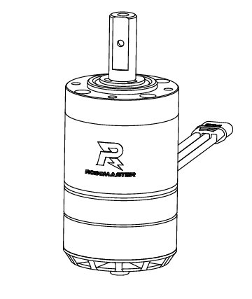
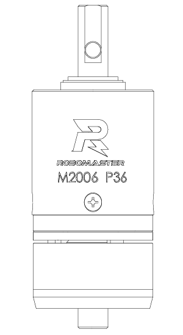
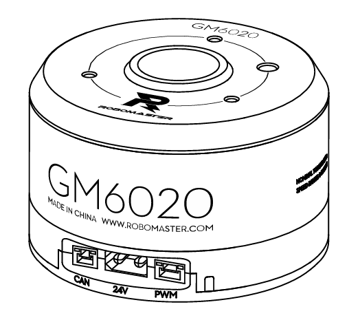
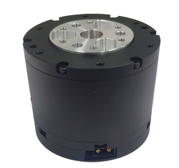
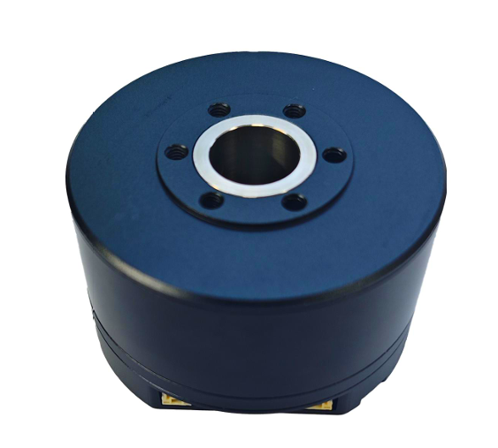
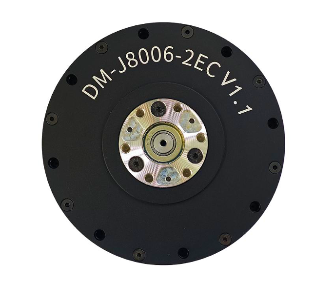
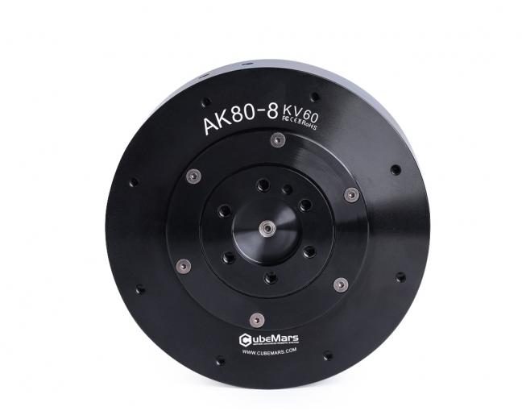
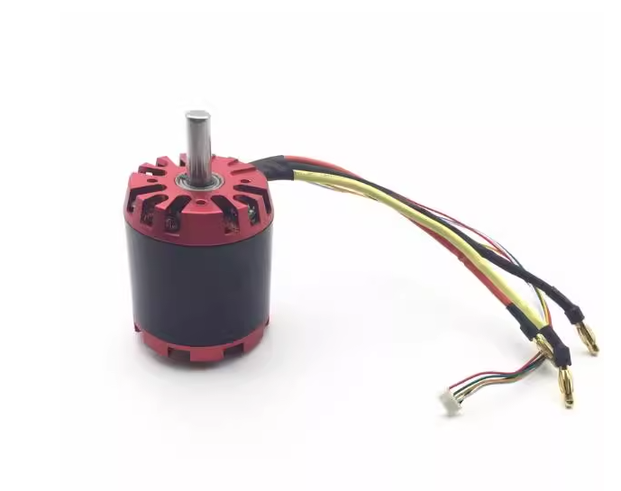
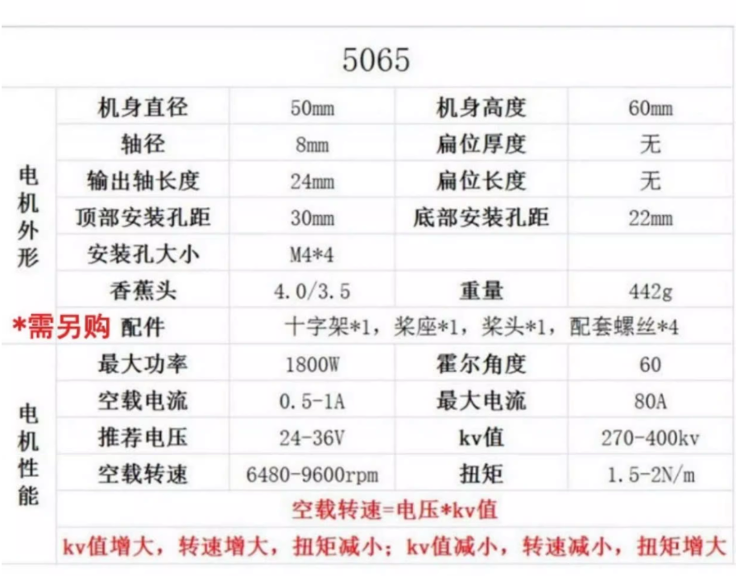

## 电机手册

简单介绍战队使用过的电机的基本参数，方便不同组队员快速了解方便设计。

**ps.直接点击链接无法访问请复制链接到浏览器地址栏访问**

### 大疆系列：

#### 3508：

{.img-scale-50}

简介：

3508为无刷电机自带19：1行星减速箱，通过7pin线与三相线与C620电调连接，使用时需要在电调上手动设置id(**组装前先进行id设置**)，内置单圈编码器上电位置即为零点，通过在单片机上编写速度/环位置环能够实现定速，指定位置转动。但是转动角速度实际值未知，位置环自行编写pid控制精度，稳定性不高，优点在于不容易坏，可使用于常见需要提供基础转动的机构。

主要参数：

| 空载最大转速度 | 482rpm |
| -------------- | ------ |
| 额定扭矩       | 3N*m   |
| 减速比         | 19：1  |
| 最大径向荷载   | 210N   |
| 电机质量       | 365g   |

文档：[RoboMaster M3508直流无刷减速电机使用说明V1.0（中英日）.pdf](https://rm-static.djicdn.com/tem/17348/RoboMaster M3508直流无刷减速电机使用说明V1.0（中英日）.pdf) 

#### 2006：

{.img-scale-25}

简介：

2006为无刷电机自带36：1行星减速箱，通过4pin线与三项线与**C610****电调**连接进行调速，使用时需要在电调上手动设置id(**组装前先进行id设置**)，内置单圈编码器上电位置即为零点，通过在单片机上编写速度/环位置环能够实现定速，指定位置转动。但是转动角速度实际值未知，位置环需自行编写pid控制精度，稳定性不高，优点在于尺寸小巧，高转速，可以用于空间受限的部位提供转动力。

主要参数：

| 空载最大转速度 | 500rpm |
| -------------- | ------ |
| 额定扭矩       | 1N*m   |
| 减速比         | 36：1  |
| 最大径向荷载   | 495N   |
| 电机质量       | 90g    |

文档：[RM M2006 P36直流无刷减速电机使用说明.pdf](https://rm-static.djicdn.com/tem/17348/RM M2006 P36直流无刷减速电机使用说明.pdf)

#### 6020：

{.img-scale-50}

简介：

GM6020电机为为直驱无刷电机，**使用前需要通过电机背部的拨码开关设置id**，内置电调但仍需执行编写速度/位置环pid进行控制，中空设计适合作为云台使用，能作为舵轮的舵向电机使用。

主要参数：

| 空载最大转速度     | 320rpm |
| ------------------ | ------ |
| 额定转矩下最大速度 | 132rmp |
| 额定扭矩           | 1.2N*m |
| 减速比             | 1：1   |
| 最大轴向荷载       | 3.5KN  |
| 电机质量           | 468g   |

文档：[RoboMaster GM6020直流无刷电机使用说明20231013.pdf](https://rm-static.djicdn.com/tem/17348/RoboMaster GM6020直流无刷电机使用说明20231013.pdf) 

### 达妙系列：

#### 4310：

简介：

无刷关节电机，内置电调，支持速度，位置，MIT三种控制模式，可自行设置零点，内置两个14位单圈磁编码器掉电也不会丢失零点，使用前需要在上位机上进行id与参数设置（**安装时需要注意将调试端口露出**），适用于对位置精度要求高，但转动速度无较高要求的部位。MIT模式下存在过零问题，转动范围最大在-4PI~4PI之间。

主要参数：

| 额定扭矩     | 3N*m  |
| ------------ | ----- |
| 峰值扭矩     | 7N*m  |
| 减速比       | 10：1 |
| 最大径向荷载 | 495N  |
| 电机质量     | 300g  |

文档：[DM-J4310-2EC V1.1减速电机说明书V1.0.pdf](https://gitee.com/kit-miao/DM-J4310-2EC/raw/master/说明书/DM-J4310-2EC V1.1减速电机说明书V1.0.pdf)

#### 6220：

{.img-scale-50}

简介：

无刷云台电机，内置电调，支持速度，位置，MIT三种控制模式，可自行设置零点，内置两个14位单圈磁编码器掉电也不会丢失零点，使用前需要在上位机上进行id与参数设置（**安装时需要注意将调试端口露出**），适用于对位置精度要求高，但转动速度无较高要求的部位。MIT模式下存在过零问题，转动范围最大在`-4PI~4PI`之间。

主要参数：

| 额定扭矩 | 1.3N*m |
| -------- | ------ |
| 额定转速 | 110rpm |
| 峰值扭矩 | 2.7N*m |
| 减速比   | 1：1   |
| 电机质量 | 493.5g |

文档：[DM-G6220中空云台电机说明书V1.0.pdf](https://gitee.com/kit-miao/DM-G6220/raw/master/DM-G6220中空云台电机说明书V1.0.pdf)

#### 8006：

{.img-scale-50}

简介：

无刷关节电机，内置电调，支持速度，位置，MIT三种控制模式，可自行设置零点，内置两个14位单圈磁编码器掉电也不会丢失零点，使用前需要在上位机上进行id与参数设置（**安装时需要注意将调试****端口****露出**），适用于对位置精度要求高，但转动速度无较高要求的部位。MIT模式下存在过零问题，转动范围最大在-4PI~4PI之间。

主要参数：

| 额定扭矩 | 8N*m   |
| -------- | ------ |
| 额定转速 | 120rpm |
| 峰值扭矩 | 20N*m  |
| 减速比   | 6：1   |
| 电机质量 | 559.5g |

文档：[DM-J8006-2EC V1.1减速电机说明书V1.0.pdf](https://gitee.com/kit-miao/DM-J8006-2EC/raw/master/说明书/DM-J8006-2EC V1.1减速电机说明书V1.0.pdf)

### CubuMars系列：

#### AK80:

{.img-scale-50}

简介：

  无刷关节电机，内置电调，支持伺服模式和运控模式（MIT）。内置双编码器，可通过上位机设置相对零点和绝对零点。转动角度精准，扭矩大。曾用于云台，篮球抛投电机。

| 额定电压 | 48V    |
| -------- | ------ |
| 额定扭矩 | 10N*m  |
| 额定转速 | 243rpm |
| 峰值扭矩 | 25N*m  |
| 减速比   | 8：1   |
| 电机质量 | 570g   |

文档：[AK 系列模组驱动使用说明](https://www.cubemars.com/images/file/20240611/1718084209493165.pdf)

### 其它类型：

#### 5065：

{.img-scale-50}

简介：

航模电机，转速高，扭矩较小。暂时不能实现角度方面的功能。适用于无需角度，高转速，小负载的场景。

曾用于舵轮底盘，篮球摩擦带发射电机。

参数：

| KV值 | 270  |
| ---- | ---- |
|      |      |

软件使用链接在左侧目录，也可以点击跳转：[VESC软件使用链接](https://hcn3bira80q1.feishu.cn/wiki/QH96wc2TriwqGWkRMm0cZ8sBnlg)

#### 步进电机：

简介：

通过脉冲信号，按步进角一步一步移动，如钟表指针。转速慢，扭矩小，角度控制较准确。适用于低转速，高精度，小负载的场景。

目前实验室步进电机均需一个较大的驱动盒，且电机易发热，在体积，重量，性能上不占优势，故使用较少。曾用于电赛三子棋吸盘移动。

#### 朗铭科技：

[ MLDS 3605-C 驱动器手册](http://www.mosvo.com/Data/mosvo/upload/file/20210823/MLDS3605-C使用手册_V2.0.pdf)