MCU Viewer目前**仅支持JLink，ST-Link**！正点原子的无线下载器DAP暂不支持。建议用JLink，JLink可以边在Keil调试边在MCU Viewer里看曲线，很方便。

从github上下载MCU Viewer：[地址](https://github.com/klonyyy/MCUViewer/releases/tag/v1.1.0)                               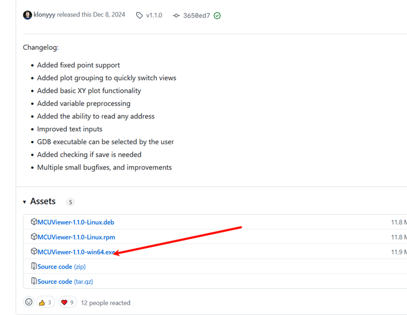

安装后打开，选择Option->Acquistion settings打开采样设置窗口

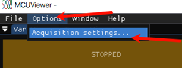

在第一个elf文件位置选择编译elf文件，在build/Debug下：

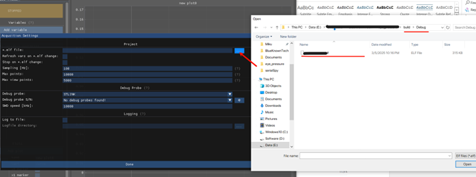

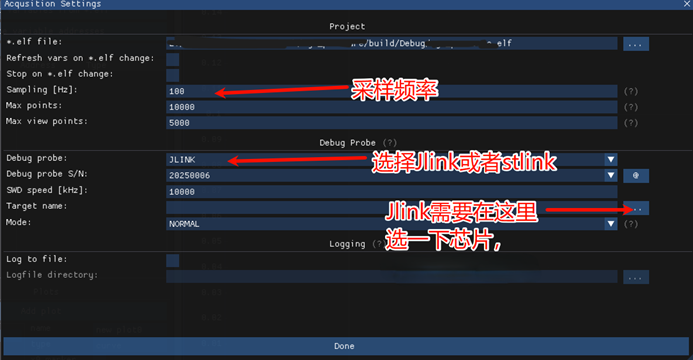

JLink需要选择芯片，点...后会弹出一个窗口，在Device里输入芯片型号，然后选图中的就可以了，完成后点OK

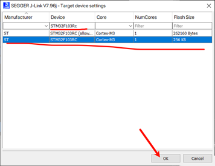

点Import variables from *elf，输入变量名搜索想要看的变量，仅支持全局变量，如果没有想要查看的变量需要在代码里加：

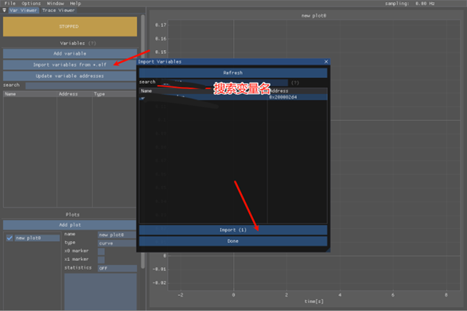

添加完变量后点Done，然后把要查看变量拖到图里：

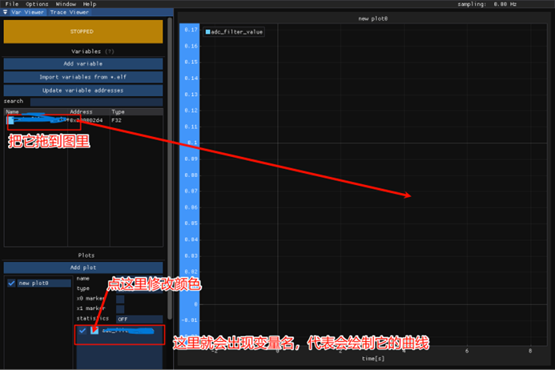

添加完毕后点STOPPED开始，变成Running，并出现曲线就OK，如果报错检查一下接线或者其他问题：

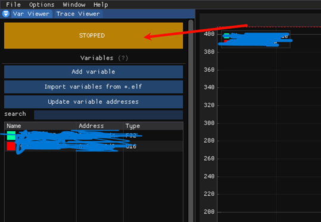

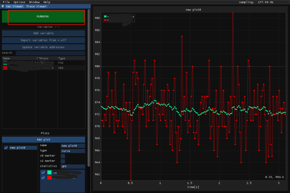

可以选择Export to csv保存为csv文件后导入matlab分析：

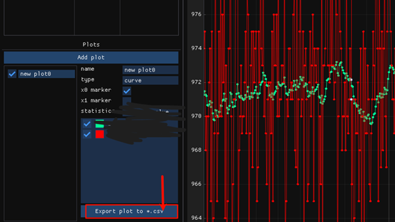

改代码重新编译以后需要更新一下变量地址，重新编译可能使变量地址变化，点Click to reload *.elf changes更新：

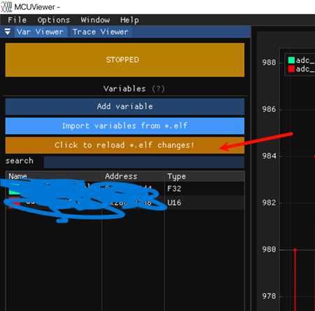

可以保存此绘图设置，文件后缀是cfg，方便下次打开使用，免得重新设置一遍变量：

可以点File->Open打开保存的配置文件：

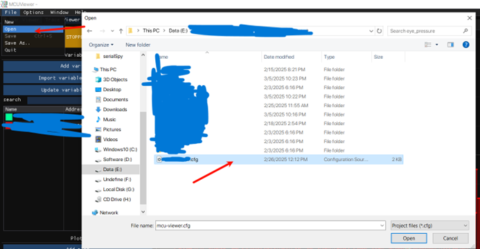