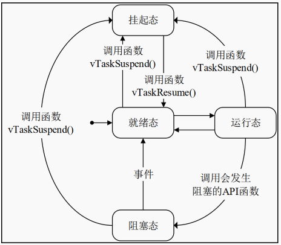

### 前言

FreeRTOS是一款开源的实时操作系统，小巧，稳定，移植性强可运行在资源有限的嵌入式设备上，因此成为单片机系统的选择。

官方文档：[FreeRTOS documentation - FreeRTOS™](https://www.freertos.org/Documentation/00-Overview)

实时性：Unix 操作系统给每个任务分配同样的运行时间，时间到了就切换到下一个任务。 RTOS 的任务调度器被设计为可预测的，优先级高的任务可以打断优先级低的任务得到及时执行。

### 系统文件

系统主要由内核和组件组成，而内核的源文件主要内容如下，`portable`文件夹下存放的是针对不同平台的移植文件和动态内存分配文件。

| 名称                | 描述                         |
| ------------------- | ---------------------------- |
| include （文件夹）  | 内包含了 FreeRTOS 的头文件   |
| portable （文件夹） | 内包含了 FreeRTOS 的移植文件 |
| croutine.c          | 协程相关文件                 |
| event_groups.c      | 事件相关文件                 |
| list.c              | 列表相关文件                 |
| queue.c             | 队列相关文件                 |
| stream_buffer.c     | 流式缓冲区相关文件           |
| tasks.c             | 任务相关文件                 |
| timers.c            | 软件定时器相关文件           |

### 系统移植

系统移植需要将上述文件添到工程目录，需要注意的是`portable`文件夹中移植文件的选择，针对不同的硬件平台需要选用不同的移植文件。

| 硬件平台                  | 移植文件          |
| ------------------------- | ----------------- |
| STM32F1（ARMCC）          | RVDS/ARM_CM3      |
| STM32F4/ STM32G4（ARMCC） | RVDS/ARM_CM4F     |
| STM32F7（ARMCC）          | RVDS/ARM_CM7/r0p1 |
| STM32H7（ARMCC）          | RVDS/ARM_CM7/r0p1 |
| STM32H5（ARMClang）       | GCC/ ARM_CM33_NTZ |

同时在`MemMang`文件夹下还存放着五个动态内存管理的文件，只需要选择一个使用即可。

| 文件    | 功能                                                  |
| ------- | ----------------------------------------------------- |
| heap1.c | 最简单的方法，不允许释放内存。                        |
| heap2.c | 允许释放内存，但不合并相邻的空闲块。                  |
| heap3.c | 简单包装标准 malloc（） 和 free（） 以确保线程安全。  |
| heap4.c | 合并相邻的空闲块以避免碎片化。包括绝对地址放置选项。  |
| heap5.c | 在heap4.c的基础上，能够将堆跨越多个不相邻的内存区域。 |

### 系统配置

FreeRTOS支持通过宏定义设置通过预处理来“裁剪”系统，进而满足不同项目对系统的不同需求，这些宏的定义位置在`FreeRTOSConfig.h`文件内。`FreeRTOSConfig.h`这个文件需要自行配置，可以参照官方demo中的配置文件和官方文档中宏的作用自行修改。

配置文件：[Customization - FreeRTOS™](https://www.freertos.org/Documentation/02-Kernel/03-Supported-devices/02-Customization)

### 中断管理

ARM Cortex-M系列的MPU都有如下三个用于屏蔽中断的寄存器：

| 寄存器名称 | 作用                                                         |
| ---------- | ------------------------------------------------------------ |
| PRIMASK    | 只有0位可读可写，设置为1能够屏蔽除 NMI 和 HardFault 外的所有异常和中断。 |
| FAULTMASK  | 只有0位可读可写，设置为 1 用于屏蔽除 NMI 外的所有异常和中断。 |
| BASEPRI    | 只有低 8 位[7:0]可读可写，屏蔽优先级低于其设置的值的中断。   |

FreeRTOS就是通过`BASEPRI`寄存器来管理受其管理的中断的（优先级高于`BASEPRI`寄存器设置的值的中断不受管理）

我们知道ARM Cortex-M系列有256个中断，其中16个为系统中断，240个为外部中断，有两个重要的系统中断`PendSV`和 `SysTick`，需要设置为最低优先级。

- SysTick：
  系统滴答定时器中断，这个中断每隔1ms就触发一次用于判断当前所执行的任务是否为最高优先级是否需要进行任务切换，调用PenSV进行上下问切换。
- PendSV：
  可挂起的系统调用中断，这个中断的服务函数主要进行执行任务的切换。

[SVC和PendSV异常有什么用途？](https://zhuanlan.zhihu.com/p/513133828)

临界区：

临界区是指那些必须完整运行的区域，在临界区中的代码必须完整运行不能被打断。在运行临界区的代码的时候就需要将Free RTOS管理的中断关闭，也就是向`BASEPRI`寄存器写入受FreeRTOS管理的最高优先级的值，进而将受管理的中断屏蔽。

  上述操作通过下列四个宏定义进行：

| 宏                            | 作用                     |
| ----------------------------- | ------------------------ |
| taskENTER_CRITICAL()          | 用于在非中断中进入临界区 |
| taskENTER_CRITICAL_FROM_ISR() | 用于从中断中进入临界区   |
| taskEXIT_CRITICAL()           | 用于从非中断中退出临界区 |
| taskEXIT_CRITICAL_FROM_ISR(x) | 用于从中断中退出临界区   |

PS.从中断中进入临界区的区别在于相关函数会先读取`BASEPRI`的值，并在函数的最后返回这个值，这是为了在后续从中断中退出临界区时恢复`BASEPRI`寄存器的值。  

### 列表与列表项

就是链表的应用

### 任务管理

创建任务分为静态创建和动态创建，静态创建堆栈大小固定编译前就已经确定，动态通过malloc函数创建任务堆栈。

动态创建任务的函数定义堆栈大小的参数单位为字

任务挂起函数并不支持嵌套，不论使用此函数重复挂起任务多少次，只需调用一次恢复任务的函数，那么任务就不再被挂起。  

### 启动流程