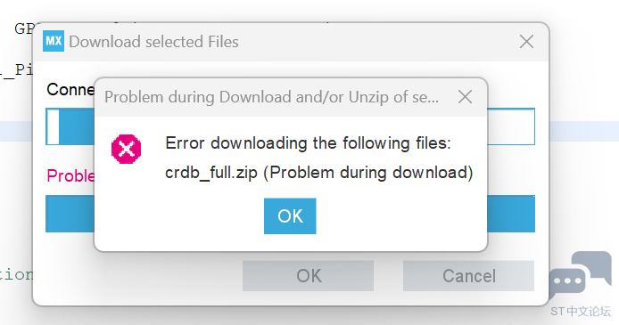

## 项目组成

### 前言

Stm32单片机通常有HAL库（LL库），标准库，寄存器三种开发方式，不同开发方式有着不同的工程结构。HAL库又称为硬件抽象层（ Hardware Abstraction Layer），Hal库为开发者提供了许多函数和模块，是开发者能够通过调用对应函数对外设进行操作，代码的可移植性好，但是由于层层封装性能开销较大；标准库直接访问寄存器运行效率高但是可移植性较差，同时意法半导体公司不再提供对标准库的支持。

### HAL库工程

Hal库版本的工程需要以下部分组成：

- CMSIS：启动文件，内核头文件，时钟初始化文件。
- HalDriver：Hal库函数文件。（片上外设驱动函数）
- Middlewares：中间层函数。（GUI，操作系统）
- USER：用户文件等。

#### 重要文件解释：

1.`startup_stm32fxxxx.s`

[见启动过程](.\启动过程.md)

2.`system_stm32f1xx.h`

这个文件中编写了两个函数和一个全局变量：

- `SystemInit()`：设置系统时钟（系统时钟源，PLL乘法器，AHB/APBx预分频器和Flash设置），这个函数在`startup_stm32f1xx_xx`中被调用来初始化系统的时钟。
- `SystemCoreClock`：包含核心时钟（HCLK），它可以被用户应用程序用来设置SysTick计时器或配置其他参数。
- `SystemCoreClockUpdate()`：更新变量SystemCoreClock，必须在程序执行期间更改核心时钟时调用。

3.`stm32f1xx.h`

官方的注释中说`main.c`中只需要包含这个头文件即可，这个头文件中包含了`stm32f1xx_hal.h`和`stm32f103xe.h`（对应芯片的头文件），以及一些对寄存器位操作的宏定义。

4.`stm32f1xx_hal`

构建Hal库项目需要预先定义USE_HAL_DRIVER 宏，这是为了让 `stm32f1xx.h` 包含 `stm32f1xx_hal.h` 这个头文件。这个文件中包含了所有的Hal库函数的声明（大部分都在`stm32fxxx_hal_conf.h`文件中只有有关滴答计时器和调试的函数在本文件中声明），引用了`stm32fxxx_hal_conf.h`文件，定义了一些对定时器操作和调试用的宏。

5.`stm32fxxx_hal_conf.h`

在 HAL 的头文件目录下有一个默认的配置文件 stm32f1xx_hal_conf_template.h 在编译 HAL代码前，要将这个文件拷贝为 stm32f1xx_hal_conf.h ，在这个文件当中你可以通过修改宏定义来选择哪些 HAL 模块被包含在项目中，比如 GPIO、USART、I2C 等，从而减小最终固件的大小。

6.`stm32f103xe.h`

这里以f103系列举例了，实际上每个芯片型号都有一个对应的头文件，这个文件中定义了该芯片所有外设的寄存器在MCU寻址空间内的地址映射。

>  This file contains:
>
>  \*      - Data structures and the address mapping for all peripherals
>
>  \*      - Peripheral's registers declarations and bits definition
>
>  \*      - Macros to access peripheral's registers hardware

7.`stm32fxxx_it.c`

这个文件中包含了一些异常处理中断服务函数，当运行发成异常时就会触发这些中断进而执行对应的中断服务函数，可以自行更改这些函数。

- **NMI（非屏蔽中断）**：通过 `NMI_Handler` 函数处理。
- **硬故障**：当发生硬故障时，`HardFault_Handler` 会进入无限循环，通常用于调试。
- **内存管理异常**：`MemManage_Handler` 也会进入无限循环。
- **总线故障**：`BusFault_Handler` 处理总线故障并进入无限循环。
- **使用故障**：`UsageFault_Handler` 处理使用故障并进入无限循环。
- **SVCall（Supervisor Call）**、**调试监视器**和**PendSV异常**等，当前函数体为空，表示未实现具体的处理逻辑

文件中还编写了系统滴答定时器中断的函数`SysTick_Handler`，每当发生 SysTick 中断时，它会调用 `HAL_IncTick()` 函数，这通常用于维护系统时钟或时间戳。

8.`cmsis_compiler.h`和`cmsis_xxxx.h`

CMSIS做了对不同编译器的兼容，`cmsis_compiler.h`文件会根据编译器的种类包含对应的编译器头文件

例如：

- `cmsis_armcc.h`
- `cmsis_armclang.h`
- `cmsis_gcc.h`
- `cmsis_irrarm.h`

ps.不同编译器使用的汇编语法不同，因此使用不同的编译器需要使用对应的头文件启动文件

只要工程目录下包含以上的必要部分就可以进行程序的编写，但是合理的工程结构有助于项目更好的开发。

工程结构可以参考使用：

1. Stm32CubMX生成的工程模板
2. 正点原子的工程
3. DDL的工程模板：[Deadline039/STM32-Template](https://github.com/Deadline039/STM32-Template)

## 开发环境

### STM32CubeMX

意法半导体公司推出的自动生成项目模板的软件。

 **Java 官网下载：** [下载地址](https://www.java.com/zh_CN/download/windows-64bit.jsp) 

**CubeMX 官网下载：** [下载地址](https://www.st.com/stm32cubemx)

请自行攻略下载教程。

下载完成后如果创建新文件出现如下错误：

请使用手机热点连接电脑重试。

**芯片支持包下载：**[下载地址](https://www.keil.arm.com/devices/?q=stm32G4&vendor-search=)

在使用CubMX构建工程模板之前需要先导入相应系列的固件库。

固件库是什么，是干嘛的？

> 这个库是一个固件包，它包含了一系列的例程、数据结构和宏，涵盖了STM32外设的功能，包括设备驱动程序的描述以及为每个外设配套的一组例子。该固件库允许在用户应用中使用任何设备，而不需要深入研究每个外设的规格。

固件库包含的文件：

- 启动文件
- 时钟配置文件
- 内核文件
- 片上外设相关文件
- 头文件配置文件：
- 存放中断服务函数的c文件：

详情可参考：[初识固件库，固件库应该是什么样子](https://www.cnblogs.com/yizhangyichi/p/16137716.html)

而我们使用`keil`构建项目时需要导入芯片支持包，它的作用是什么和这里使用的固件库又有什么区别？

芯片支持包的定义

>CMSIS-Pack defines a standardized way to deliver software components, device parameters and board support information and code. Adopted by leading semiconductor companies, embedded software and tools vendors across the Arm architecture, CMSIS-Packs increase productivity across the industry by encouraging code reuse and enabling proactive software component deployment with online updates and dependencies checking.

stm32 的 system View Description (SVD) 文件是一个专用于 STM32 微控制器的元数据文件，它包含了该芯片的所有外设、寄存器结构、地址映射以及详细的特性描述。这个文件对于开发工具如 Keil MDK 、 stm32cubeMX 等至关重要，因为它帮助软件开发者获取硬件设备的信息，以便在编写驱动程序、配置GPIO口、了解中断向量表等内容时能够准确地理解和操作硬件。SVD 文件使得软件能够在初始化阶段自动识别并配置 STM32 的硬件资源，简化了代码编写过程，并有助于提高代码的移植性和调试效率。通过导入 SVD 文件，IDE可以自动生成对应的驱动模板，极大地加快了嵌入式系统的开发速度。

简单来说固件库是搭建项目所必须的组成部分，而芯片支持包是给IDE看的“数据手册”包含了芯片的详细信息，使开发环境能够识别芯片。

