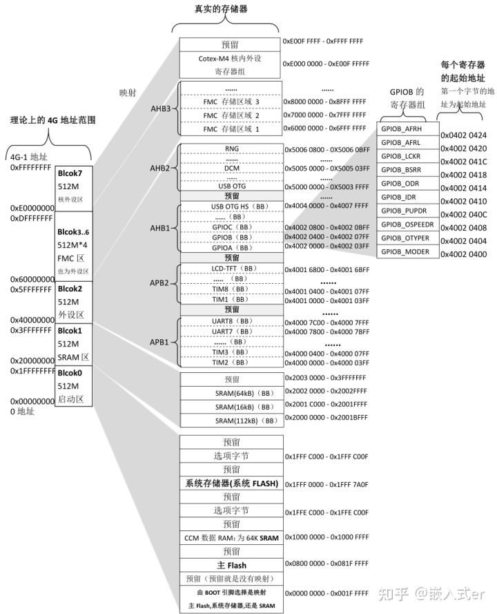
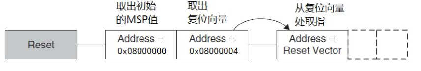

## Stm32单片机启动过程

### 前言

Stm32单片机的启动过程就是指单片机在上电后到开始执行用户程序这之间所进行的所有操作，简单来说就是唤醒整个单片机系统硬件配置为软件执行做准备的过程。想要弄清楚这个过程需要一定的背景知识，建议先了解一下计算机组成部分的知识。（MCU本身就是简易版的计算机）

### 启动模式

我们知道32位单片机理论上最大的逻辑寻址空间是2的32次幂也就是`4GB`，具体每一部分空间对应的实际存储器如下图所示：



而单片机在上电之后会默认去执行`0x00000000`地址开始执行程序，但是实际上它执行的指令并不存放在`0x0000000`而是存放在其它地址的指令。这个过程涉及到地址"重映射"，地址的映射是指为实际存储器分配逻辑地址的过程，而重映射指的是已经有了逻辑地址的存储空间被再次分配逻辑地址，通过这两个逻辑地址都可以访问该存储空间（类似函数的映射的概念）。Boot引脚的不同组合方式决定哪个部分的实际存储器的逻辑地址被重新映射到`0x00000000`，从而决定了单片机的实际启动位置。

启动时，单片机在 SYSCLK 的第四个上升沿锁存 BOOT 引脚的值。（注意这个时候单片机的时钟系统还未初始化，使用的是默认的时钟配置，时钟源为HSI）BOOT0 为专用引脚，而 BOOT1 则与 GPIO 引脚共用。一旦完成对 BOOT1 的采样，相应 GPIO 引脚即进入空闲状态，可用于其它用途。BOOT0与BOOT1引脚的不同值指向了三种启动方式：


- 从主Flash启动：

  主Flash指的是STM32的内置Flash。选择该启动模式后，内置Flash的起始地址`0x08000000`将被重映射到`0x00000000`地址，代码将在该处开始执行。一般我们使用JTAG或者SWD模式下载调试程序时，就是下载到这里面，重启后也直接从这启动。

  

- 从系统存储器启动：

  系统储存器指的是STM32的内置ROM，选择该启动模式后，内置ROM的起始地址将被重映射到`0x00000000`地址，代码在此处开始运行。ROM中有一段出厂预置的代码，这段代码起到一个桥的作用，允许外部通过UART/CAN或USB等将代码写入STM32的内置Flash中。这段代码也被称为ISP(In System Programing)代码，这种烧录代码的方式也被称为ISP烧录。

  

- 内置的SRAM中启动：
  显然，该方法是在STM32的内置SRAM中启动，选择该启动模式后，内置SRAM的起始地址将被重映射到0x00000000地址，代码在此处开始运行。这种模式由于烧录程序过程中不需要擦写Flash，因此速度较快，适合调试，但是掉电丢失。

  

经过重映射后单片机访问`0x00000000`地址得到的就是将栈顶位置存放到MSP（主栈指针寄存器）的命令，接着执行存放在`0x00000004`的指令就会跳转到是复位函数的位置去执行复位函数。



上图就是从主Flash启动的过程时，单片机在上电时执行前两条指令的过程，这个过程中单片机访问的是`0x0000000`由于重映射它实际访问的地址却是Flash的起始地址`0x08000000`。这里的栈顶位置一般为SRAM的最高地址（栈向下生长），而复位函数则定义在启动文件当中。

PS.arm架构的处理器使用精简指令集所有指令都是32位。

### 启动文件

我们通常使用C语言编写在单片机上运行的程序，我们知道C语言编写的程序的运行需要依赖于栈和堆，但是在单片机上电之初堆栈都还没有初始化，这时用C编写的程序无法运行，因此C语言无法完成初始化单片机的任务，这就是为是什么启动文件使用汇编语言编写。

不同的编译器使用不同的启动文件（因为不同的编译器的汇编语法不同），但是它们做的事大致相同，分为一下几个部分：

1. 定义栈和堆的大小

   这一部分的代码定义了堆栈的大小，当程序需要较大的堆栈空间时可以在这里修改堆栈大小，但是两者的大小之和应当小于SRAM的的大小，因为堆和栈都是存放在RAM中的，RAM的起始地址为`0x200000000`。

   ```assembly
   Stack_Size      EQU     0x00001000
   
                   AREA    STACK, NOINIT, READWRITE, ALIGN=3
   Stack_Mem       SPACE   Stack_Size
   __initial_sp
   
   Heap_Size       EQU     0x00001000
   
                   AREA    HEAP, NOINIT, READWRITE, ALIGN=3
   __heap_base
   Heap_Mem        SPACE   Heap_Size
   __heap_limit
   
                   PRESERVE8
                   THUMB
   ```

   

2. 定义中断向量表

   这部分代码定义了中断向量表，所谓的向量表实际上就是指针表（向量和指针都是带有指向性的数值有些相似的味道），这里每一个中断向量都申请四字节的存储空间（刚好就是32位单片机的字长，而指针所占存储空间的大小就是处理器的字长），它们都是是指向对应中断服务函数的函数指针。当中断发生的时会产生中断信号，单片机会跳转到中断向量表的起始位置，开始根据中断信号查表直到找到对应的中断向量，然后跳转到中断向量指向的中断服务函数当中去完成中断处理。

   

   ```assembly
                   AREA    RESET, DATA, READONLY
                   EXPORT  __Vectors
                   EXPORT  __Vectors_End
                   EXPORT  __Vectors_Size
   
   __Vectors       DCD     __initial_sp               ; Top of Stack
                   DCD     Reset_Handler              ; Reset Handler
                   DCD     NMI_Handler                ; NMI Handler
                   DCD     HardFault_Handler          ; Hard Fault Handler
                   DCD     MemManage_Handler          ; MPU Fault Handler
                   DCD     BusFault_Handler           ; Bus Fault Handler
                   DCD     UsageFault_Handler         ; Usage Fault Handler
                   DCD     0                          ; Reserved
                   DCD     0                          ; Reserved
                   DCD     0                          ; Reserved
                   DCD     0                          ; Reserved
                   DCD     SVC_Handler                ; SVCall Handler
                   DCD     DebugMon_Handler           ; Debug Monitor Handler
                   DCD     0                          ; Reserved
                   DCD     PendSV_Handler             ; PendSV Handler
                   DCD     SysTick_Handler            ; SysTick Handler
   
                   ; External Interrupts
                   DCD     WWDG_IRQHandler                   ; Window WatchDog                                        
                   DCD     PVD_IRQHandler                    ; PVD through EXTI Line detection                        
                   DCD     TAMP_STAMP_IRQHandler             ; Tamper and TimeStamps through the EXTI line            
                   DCD     RTC_WKUP_IRQHandler               ; RTC Wakeup through the EXTI line                       
                   DCD     FLASH_IRQHandler                  ; FLASH                                           
                   DCD     RCC_IRQHandler                    ; RCC                                             
                   DCD     EXTI0_IRQHandler                  ; EXTI Line0                                             
                   DCD     EXTI1_IRQHandler                  ; EXTI Line1  
                   .......
                   __Vectors_End
   
   __Vectors_Size  EQU  __Vectors_End - __Vectors
   ```

3. 定义代码块

   这一行代码定义了一个只读数据段`.text`这个数据段用来存放编译后产生的机器码，它的大小在链接时由链接器根据编译的结果确定。

   ```assembly
      AREA    |.text|, CODE, READONLY
   ```

   

4. 定义复位函数

   这段代码定义了中断复位函数，中断复位函数从外部导入了两个函数`SystemInit`和`__main`。`SystemInit`函数定义在`system_stm32f1xx.h`文件当中，`__main`是C库函数。复位函数首先执行`SystemInit`进行单片机时钟系统的初始化，将时钟源从默认的HSI该为用户配置的HSE（外部时钟源具有更好的精度这在进行高速通讯时十分重要），然后`__main`函数被执行，这个函数会设置堆的起始位置和状态。然后进行全局和静态变量的初始化，这个过程会将全局和静态变量搬运到RAM中，并将未初始化的变量在内存中的位置（`.bss` 段）清零，将已初始化的变量的值复制到相应的内存位置（`.data` 段）。然后`__main`会找到用户`main`函数的入口执行用户函数。

   ```assembly
   Reset_Handler    PROC
                    EXPORT  Reset_Handler             [WEAK]
           IMPORT  SystemInit
           IMPORT  __main
   
                    LDR     R0, =SystemInit
                    BLX     R0
                    LDR     R0, =__main
                    BX      R0
                    ENDP
   ```

   

5. 定义中断服务函数

   这段代码定义了中断服务函数，当然这些都是弱定义（处理方式基本都是死循环），允许用户在外面进行重复定义中断服务函数。

   ```assembly
   NMI_Handler     PROC
                   EXPORT  NMI_Handler                [WEAK]
                   B       .
                   ENDP
   HardFault_Handler\
                   PROC
                   EXPORT  HardFault_Handler          [WEAK]
                   B       .
                   ENDP
                   ......
   SPI6_IRQHandler                   
   SAI1_IRQHandler                   
   LTDC_IRQHandler                   
   LTDC_ER_IRQHandler                 
   DMA2D_IRQHandler                  
                   B       .
   
                   ENDP
   
                   ALIGN
   ```

   

6. 完善堆栈初始化

   这段代码用于完善堆栈初始化，通过判断是否使用了微库来采取不同的不同的方式，将堆栈的起止位置分别存储到寄存器中

   ```assembly
                   IF      :DEF:__MICROLIB
                   
                    EXPORT  __initial_sp
                    EXPORT  __heap_base
                    EXPORT  __heap_limit
                   
                    ELSE
                   
                    IMPORT  __use_two_region_memory
                    EXPORT  __user_initial_stackheap
                    
   __user_initial_stackheap
   
                    LDR     R0, =  Heap_Mem
                    LDR     R1, =(Stack_Mem + Stack_Size)
                    LDR     R2, = (Heap_Mem +  Heap_Size)
                    LDR     R3, = Stack_Mem
                    BX      LR
                    
                    ALIGN #设置对齐
   ```

   

至此启动过程就完成了，单片机正式进入到用户程序的运行。

