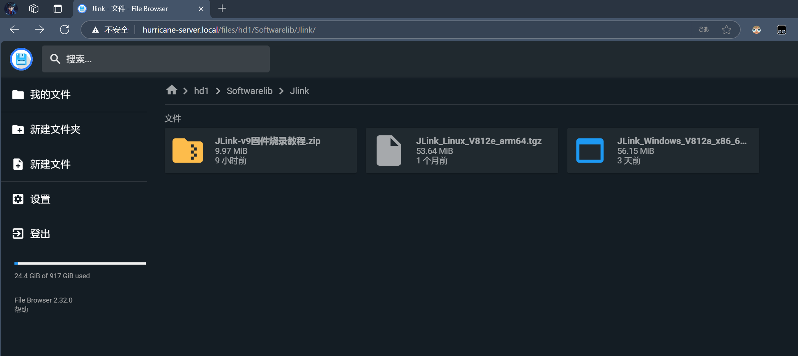
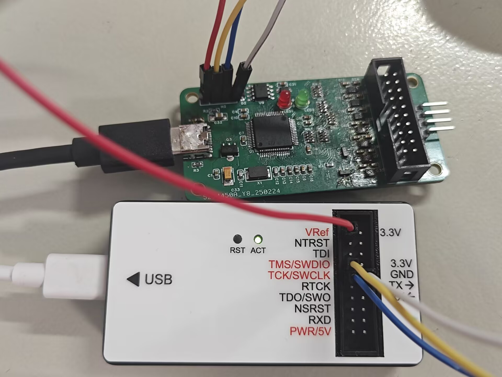
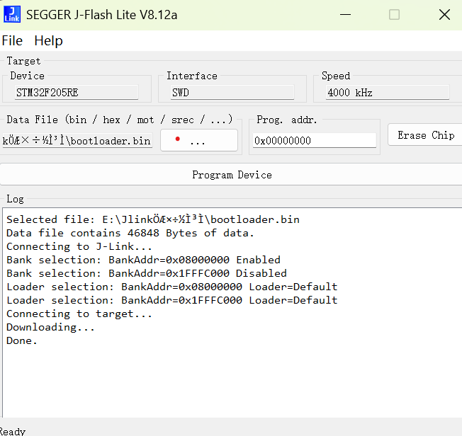
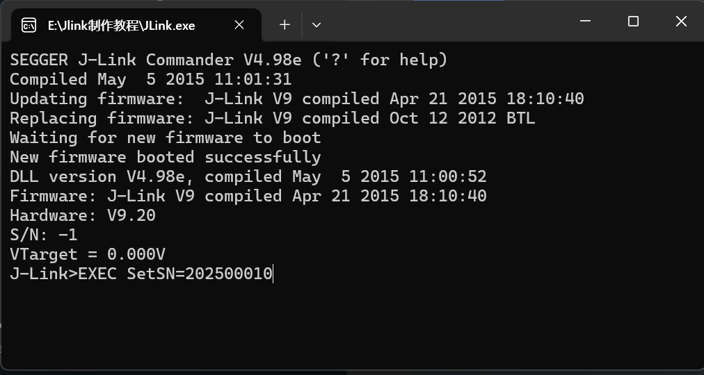
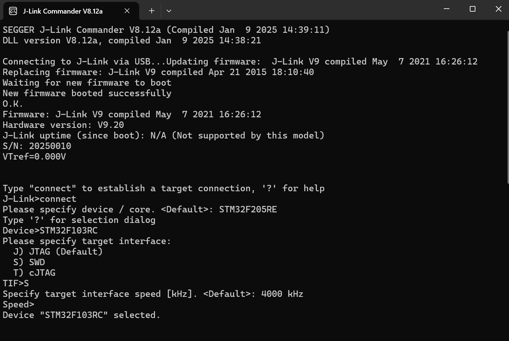

### 第一步：烧录Jlink的`bootloader`

在战队共享文件夹下下载所需程序。



将Jlink与待烧录的Jlink按照下图方式连接：



打开Jlink工具`J-Flash Lite `目标设备选择`STM32F205RE`，如下图所示：


点击OK，在接下来弹出的页面中点击`...`选择事先下载好的引导文件`bootloader.bin`，然后点击`Program Device`，如下图所示即为烧录成功然后拔下带烧录Jlink电源重新插上。




PS.如果没有能用的Jlink可以使用使用Stlink用`STM32 ST-LINK Utility`进行烧录

### 第二步：烧录老版固件

电脑连接未完成的Jlink打开`Jlink.exe`程序，弹出的画面点击OK会自动下载老版固件，然后输入下列命令修改序列号：

```bash
EXEC SetSN=xxxxxxxx				#XXXX部分为自行设置的序列号长度为8或9位
```

如图所示：



完成后重新插拔数据线。

### 第三步：烧录新固件

打开`J-Link Commander`，点击弹出的页面中的yes选项，会自动下载新版固件。

然后连接开发板进行测试，无误后证明烧录成功。

