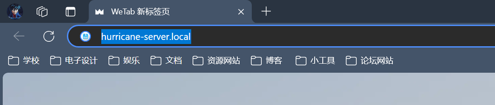
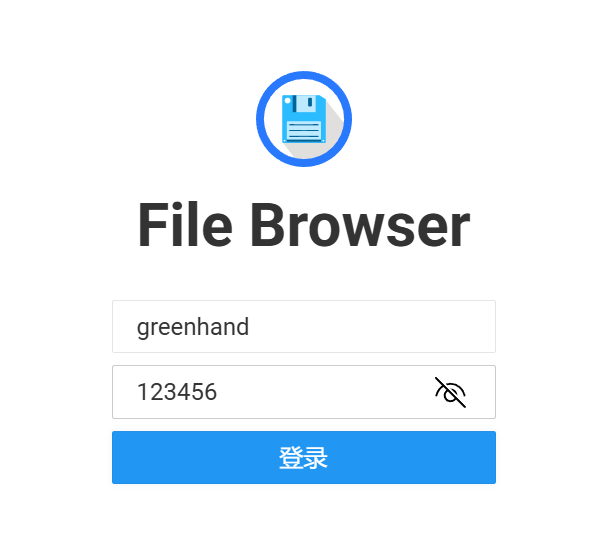
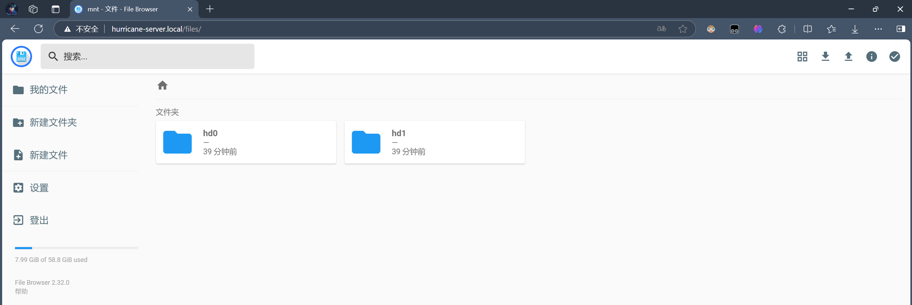
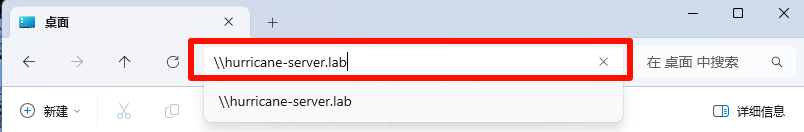

### 连接实验室WIFI

网络名称：`ROBOCON_408_5G`和`ROBOCON_408`

密码：jiqiren123

### 浏览器访问

复制或者直接点击打开：[http://hurricane-server.local/](http://hurricane-server.local/)

在下面的页面输入用户名和密码

即可访问服务器共享的文件夹

### 文件资源管理器访问

连接实验室`WIFI`

打开文件资源管理器，在搜索框填入战队服务器域名`\\hurricane-server.lab`

在弹出对话框输入用户名与密码即可访问（同上方法）。