# 网络共享打印机使用

放在408的两台打印机都连接到了一个服务器（其实是机顶盒），支持网络打印。

由于处理性能有限，加上打印机是老古董（一个2004年出厂，一个2007年出厂），当打印大量文档时建议把电脑搬过来连接USB有线打印（有线推荐用小的那个HP1018），打印完记得把USB插回机顶盒。

## 连接实验室WIFI

**首先需要连接实验室WIFI**：

网络名称：`ROBOCON_408_5G`和`ROBOCON_408`

密码：jiqiren123

## 下载驱动

下载驱动，并解压在你能找到的地方：

HP1320，比较大的那个，支持自动双面：[https://esoft.lanzn.com/iiqen2qjhyji](https://esoft.lanzn.com/iiqen2qjhyji)

HP1018，最小的那个：[https://esoft.lanzn.com/iBDih2qjhthg](https://esoft.lanzn.com/iBDih2qjhthg)

## 打开连接打印机设置

### Windows 10

1. 打开控制面板 (Win+S直接搜索控制面板)

    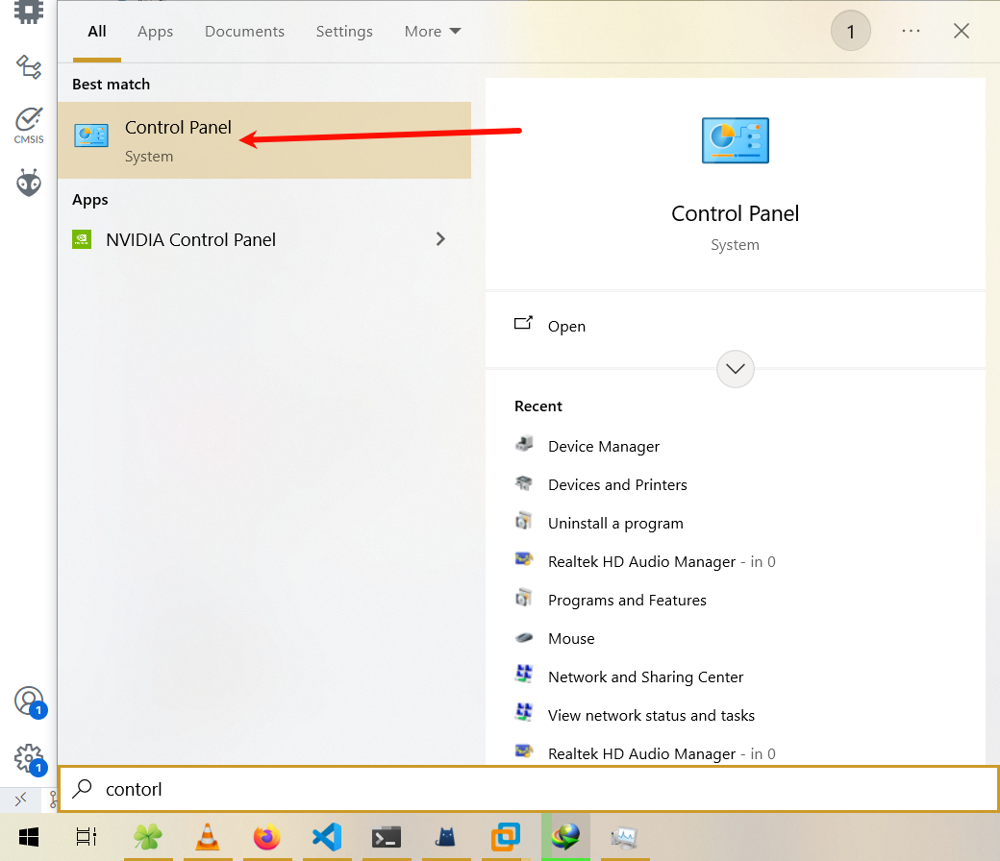

2. 找到硬件和声音->设备和打印机

    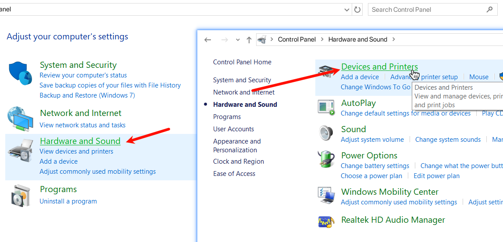

3. 选择添加打印机

    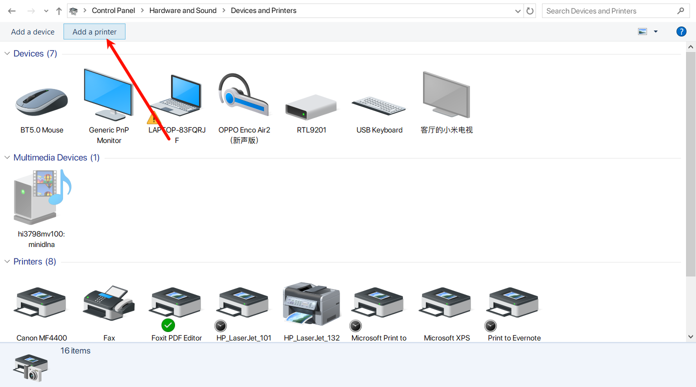

    然后点「我想要的打印机未列出」，打开如下窗口：

    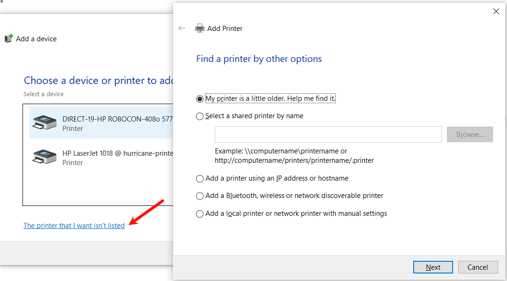

### Windows 11

1. 打开设置，找到蓝牙和设备，点击打印机和扫描仪：

   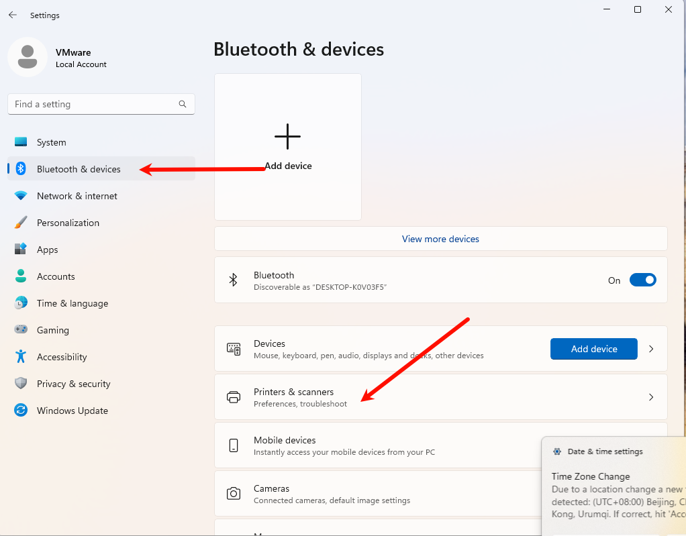

2. 点击添加设备，转一会圈会出来手动添加打印机：

   

3. 然后会弹出与Windows10一样的窗口：

   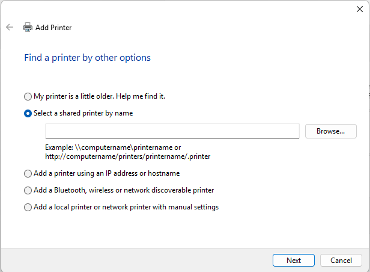

## 添加打印机

1. 选择按名称选择共享打印机，然后输入地址：

    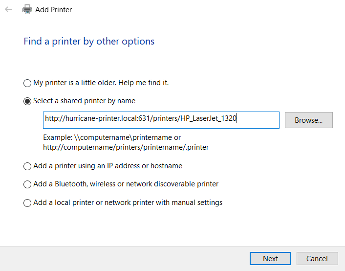

   - 要连接HP1018打印机，输入`http://hurricane-printer.local:631/printers/HP_LaserJet_1018_series`

   - 要连接HP1320打印机，输入`http://hurricane-printer.local:631/printers/HP_LaserJet_1320_series`

2. 弹出驱动选择窗口，选择从磁盘查找：

    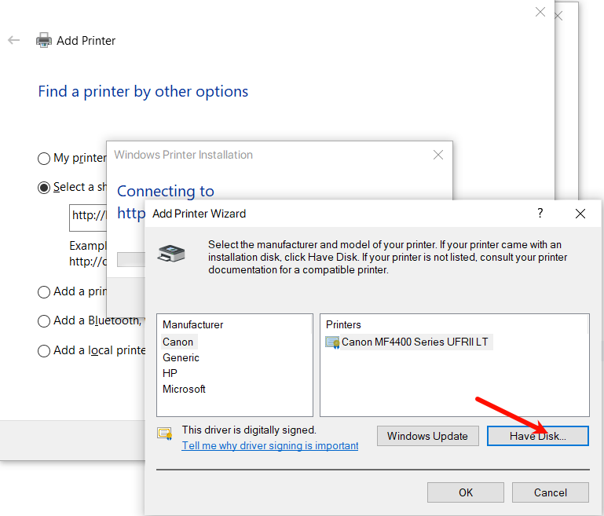

3. 找到刚解压的驱动，选择inf文件，然后弹出设备列表，选择对应型号即可（HP LaserJet 1320或者HP LaserJet 1018，前面填的那个打印机的地址就选择那个驱动，不要选错）

    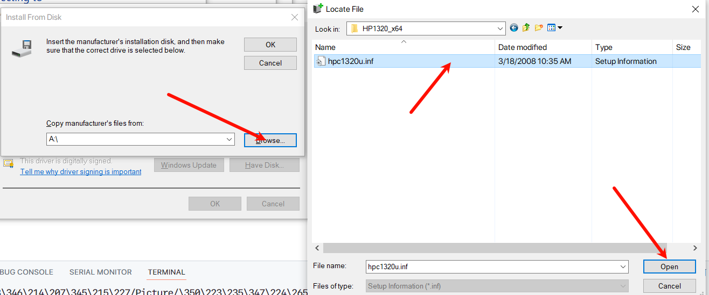

    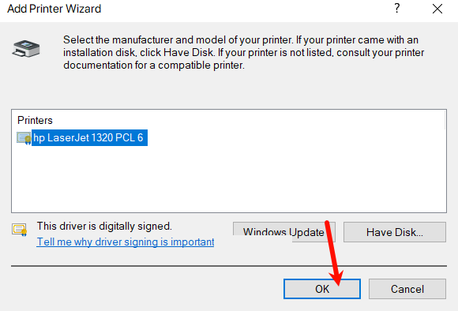

4. 弹出此窗口就OK，点下一步可以打印测试页看看有没有正常工作

    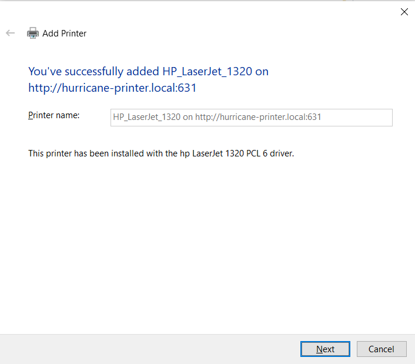