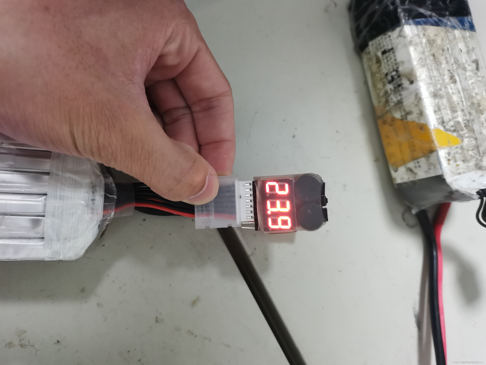
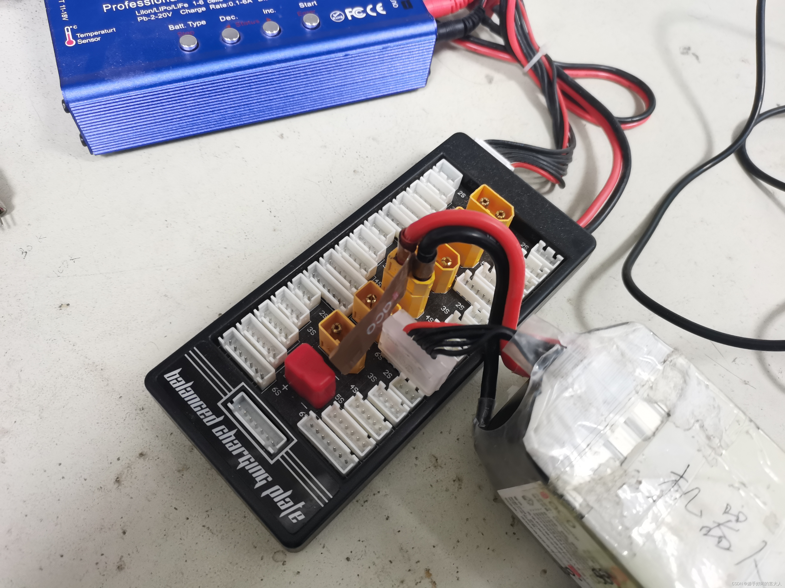
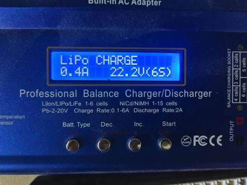
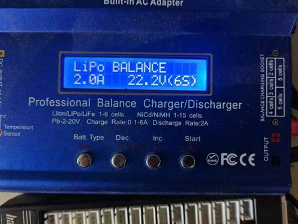
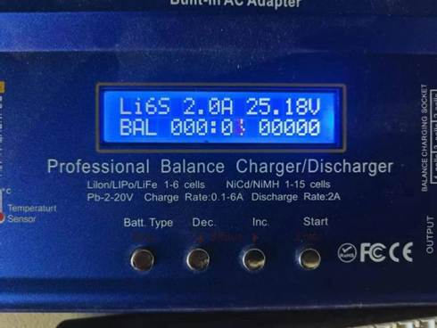
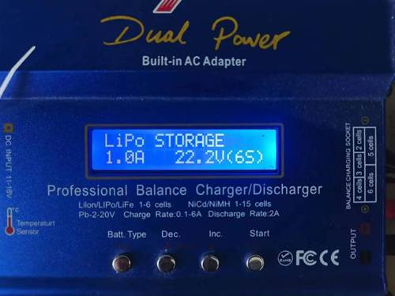
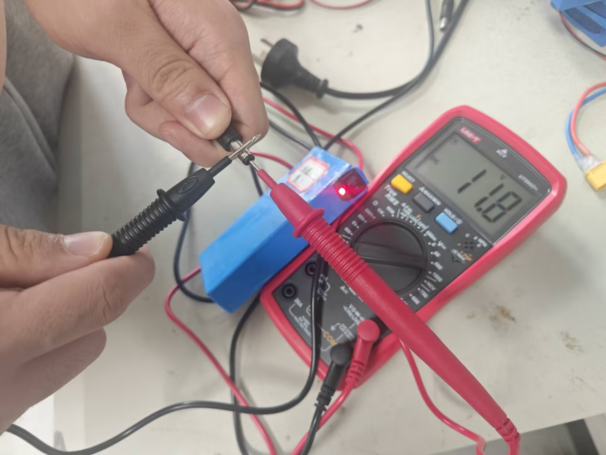
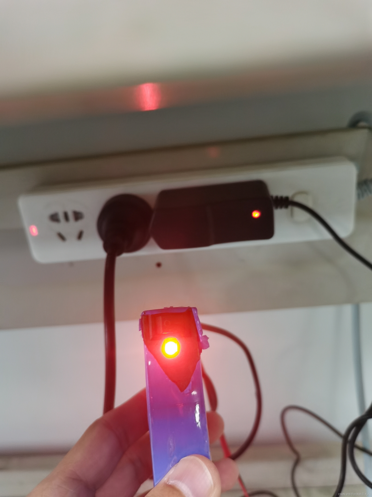

### 格氏6s 5300mAh 30c锂电池充电规范（大电池）

#### 测量方法：

​	将电池外接的充电口有锡的一面对准人（另一面是纯白色），随后将“哔哔响”**左侧对齐**插入，如果插入正确位置，则“哔哔响”会发出哔哔的响声（你猜猜为什么叫哔哔响）。等哔哔响显示出ALL字样后，显示出的数字即为当前锂电池电量。

​    **当锂电池电量低于24.0时，就需要对其进行充电，当充到大于等于24.8V后即可停止。最高不超过25.3V**

#### 充电方法：

锂电池有两个外接口，充电时两个外接口都要对准充电槽。充电槽一次充一个锂电池，按下图方式将电池与充电器连接。

连接上去之后充电器画面如图所示：

  此时充电器显示界面在LiPo后边是CHARGE，按下Inc键，当LiPo右边从CHARGE变成BALANCE后，底下电流与电压应为2.0A与22.2V（6S）字样：

确认无误后，按两下Start后再长按Start键，直到听到“滴滴”的提示音。当听到提示音后，再按下Start键，显示如下图时则表示正在充电中。

#### 注意事项：

1. 电池电压不要低于22.2V，如果19.8V以下平衡充将识别不到电芯，导致电池无法用平衡模式充电。同时过放也会加速电池鼓包。

2. 使用BALANCE模式充电时XT60头和平衡头都要插在并充板上，按第三个按键切换模式，显示屏上侧显示LiPo BALANCE即为锂电池平衡充模式，我们一般都使用这个模式充电。注意左上角时LiPo即充电电池为锂电池，充电电流一般为0.5C（如5300mAh的充电电流应为5300X0.5=2.6A左右，我们用2A就可以）。然后长按第四个按键识别电芯，识别完成之后听到响声，再按一下第四个按键，然后开始充电。

3. 新电池在充满电后一般会有响铃提示，但是在电池使用一段时间后电池就充不到25.20V了，这时候充电器充满也不会再响铃，所以我们要时刻观察充电器状态，当充电电流下降到0.1A左右的时候电池就已经充满了，这个时候就可以拔掉了。充电器内部也是有保护时间的，如果充了120分钟还没充满充电器会响铃并且退出充电模式。

4. 关于BB响，电池平衡头的金属面朝自己，用BB响的最左端去插电池的最左端，这时候才能正确的测出电压。另外BB响可以设置单片最低电压报警，在电池使用的时候可以一直插着BB响，设置方法如下，BB响插到电池上之后，按BB响顶上的按键（不同的BB响按键基本都在这个位置），如果之前没有设置过，按下之后会显示OFF，这个时候再按一下，会显示2.70，意思就是6片电池中如果有一片电池低于2.7V就会报警，每按一下按键这个阈值电压会增加0.1V，但是要注意的是BB响最高的低电压报警是3.8V，这时候再按按键将会关闭电压报警模式。

5. 关于并充板，如果时间不是很紧急，尽量一个充电器充一块电池，如果要使用并充板，务必要保证在并充板上充电的电池所有参数都一样，包括电池片数（6s）、电池容量（5300mAh）、电池放电倍率（30C），然后充电器这边要把电流设置成原充电电流（2.0A）X充电电池个数，目前实测最多一起充过两块，电流设置的4.0A，但实际电流只能达到3.3A，充电器巨烫，所以时间充足的情况下还是一块一块充吧。

6. 关于充电器，充电器参数一定要设置正确，LiPo，2.0A，22.2V，BAL这几个参数，不然极有可能引发电池爆炸起火。

7. 关于过放抢救，如果电池过放到十几伏，这时候不要着急去充电，让电池缓一缓可能可以恢复一些电压，如果用BALANCE模式还是识别不到电芯充不了的话，将充电模式切换为Charge模式，要注意使用Charge模式不可用大电流！切换为Charge模式，电流设成0.5A，只需要把XT60头插上去，不用插平衡头，开始充电，充到21V左右，换成BALANCE模式和平时一样继续充。平时不要用Charge模式！

8. 关于假期不用电池做好储存，B6AC平衡充是自带储存模式的，就是用这个模式给电池充电，电池可以长期存储45-60天，电池电压过高或者过低储存都会导致鼓包。储存模式方法如下，按第三个按键将模式切换至STORAGE,电流1.0A，电压22.2V（6S），充电器会把每片电芯充到3.85V左右，利于电池保存。

### **蓝电池** **3s 12.6V**

#### 测量方法：

将连蓝电池背部的开关打开，然后使用万用表的**直流电压挡位**将表笔的一端插入电池的圆柱形接口，另一表笔接触接口外部，观察万用表示数，当**蓝电池电压少于等于11.1V时则需要进行充电**。

#### 充电方式：

使用蓝电池充电器进行充电，  充电时开关需要打开，随后将蓝电池的外接口与充电线相连接，当看到充电器指示灯显示红色时，表示正在充电。当充电器指示灯变成绿色则表示电池电量充满。如图所示：

#### 注意事项：

- 充电时一定要把电池上的开关打开，不然相当于没充！
- 充电器到绿灯即为充满
- 蓝电池过放只能是硬充，充不进去就喜提报废。所以多测测看电池电压，勤换。
- 蓝电池内置的12V转5V模块相当垃圾，输出电流非常小，并且里面焊的线很容易断，所以5V没输出的时候先别急着报废，把上面蓝色的塑料纸划开把模块取出来检查一下。

另外锂电池价格都比较高，上面提到的格氏6s 5300mAh 30c锂电池一块就要568！蓝电池一块也要100！保护电池，规范使用非常有必要！以后减少出现电池鼓包的事情，可以节约非常大的一笔经费。希望可以将此规范文档传承下去，每届大一都要认真读该文档，也希望文中的错误及不足可以加以修改和完善。
