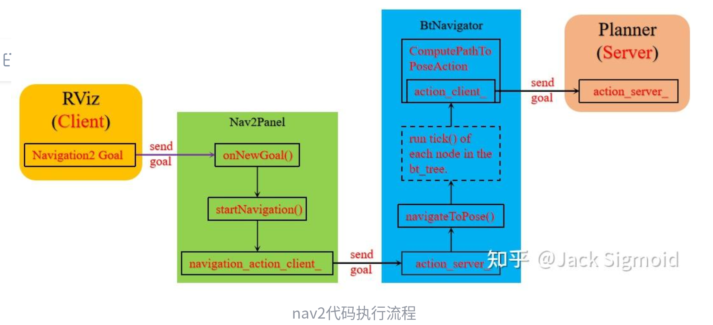

**修改时间:2026.1.26**

**参与者:刘志钰**

# Navigation2 导航框架

> **Navigation 工程的核心**：让机器人从 A 点安全地移动到 B 点。
> 涵盖功能：定位、全局路径规划、局部路径规划与避障、多点导航、插件式地图管理。

## Nav2 行为树运行框架


**启动仿真命令：**

```bash
ros2 launch nav2_bringup tb3_simulation_launch.py
```

> **注意：Gazebo 可能启动失败** 如果遇到缺少 TurtleBot3 相关功能包的问题（`sudo apt install ros-humble-turtlebot3*`），请尝试退出 conda 环境后重试。

**运行机制：** Navigation2 Goal 由 `GoalUpdater` 管理。当点击 Navigation2 Goal 时，`onPoseSet()` 函数会被调用，并将其值 (x,y,θ) 传递给 `GoalUpdater` 对象。整个 Nav2 工程的行为管理都是由 **行为树 (Behavior Tree)** 管理。

### 行为树节点对应的 XML 文件

以下是行为树配置的示例结构：

```
<root main_tree_to_execute="MainTree">
  <BehaviorTree ID="MainTree">
    <RecoveryNode number_of_retries="6" name="NavigateRecovery">
    
      <PipelineSequence name="NavigateWithReplanning">
        <RateController hz="1.0">
          <RecoveryNode number_of_retries="1" name="ComputePathToPose">
            <ComputePathToPose goal="{goal}" path="{path}" planner_id="GridBased"/>
            <ClearEntireCostmap name="ClearGlobalCostmap-Context" service_name="global_costmap/clear_entirely_global_costmap"/>
          </RecoveryNode>
        </RateController>
        
        <RecoveryNode number_of_retries="1" name="FollowPath">
          <FollowPath path="{path}" controller_id="FollowPath"/>
          <ClearEntireCostmap name="ClearLocalCostmap-Context" service_name="local_costmap/clear_entirely_local_costmap"/>
        </RecoveryNode>
      </PipelineSequence>
      
      <ReactiveFallback name="RecoveryFallback">
        <GoalUpdated/>
        <SequenceStar name="RecoveryActions">
          <ClearEntireCostmap name="ClearLocalCostmap-Subtree" service_name="local_costmap/clear_entirely_local_costmap"/>
          <ClearEntireCostmap name="ClearGlobalCostmap-Subtree" service_name="global_costmap/clear_entirely_global_costmap"/>
          <Spin spin_dist="1.57"/>
          <Wait wait_duration="5"/>
        </SequenceStar>
      </ReactiveFallback>
      
    </RecoveryNode>
  </BehaviorTree>
</root>
```



------

## 两大代价地图 (Costmaps)

### 全局代价地图

主要包含的图层有：

- **Static Map Layer**：静态地图层，通常都是 SLAM 建立完成的静态地图。
- **Obstacle Map Layer**：障碍地图层，用于动态的记录传感器感知到的障碍物信息。
- **Inflation Layer**：膨胀层，在以上两层地图上进行膨胀。

### 局部代价地图

通常包含的图层有：

- **Obstacle Map Layer**：障碍地图层，用于动态的记录传感器感知到的障碍物信息。
- **Inflation Layer**：膨胀层，在障碍地图层上进行膨胀。

------

## 三个 Action Server

### 1. 规划器 (Planner)

规划器可以被编写为具有以下功能的工具：

- 计算最短路径
- 计算完整覆盖路径
- 沿稀疏或预定义路线计算路径

### 2. 控制器 (Controller)

控制器可以被编写为具有以下功能的工具：

- 跟随路径
- 使用里程计坐标系中的检测器与充电站对接
- 登上电梯
- 与某个工具的接口

### 3. 恢复器 (Recoveries)

(此处文档隐含，通常包括旋转、清除代价地图、后退等操作)

------

## 状态估计（重要组件）

Nav2 中，默认进行状态估计的组件是 **AMCL（自适应蒙特卡洛定位）**。

在导航项目中，需要提供两个主要的坐标转换：

1. **map 到 odom** 的坐标变换由定位系统（定位，简图，SLAM）提供。
2. **odom 到 base_link** 的坐标转换由里程计系统提供。

> **REP-105 标准** 在选择具体实现方式时遵循 REP-105 标准：至少必须为机器人构造一个包含 `map` -> `odom` -> `base_link` -> `[sensor frames]` 的完整的 TF 树。
>
> - TF2 是 ROS2 中的时变坐标变换库，Nav2 使用 TF2 来表达和获取时间同步的坐标变换。
> - 关于 `base_link` 的其余坐标转换应该是静态的。

**关于里程计：** 里程计可以来自许多数据源，包括激光雷达、车轮编码器、VIO 和 IMU。里程计的目标是提供基于机器人运动的平滑和连续的局部坐标系。全局定位系统会相对全局坐标的坐标变换进行更新，以解决里程计的漂移问题。

------

## 代价地图过滤器

使用代价地图过滤器可以实现以下功能：

- 机器人永远不会进入禁区/安全区。
- 限速区，机器人进入这些区域的最大速度将受到限制。
- 机器人在工业环境和仓库中移动的首选通道。

------

## Nav2 源码功能包拆解

### 控制器及其实现相关功能包

| 功能包名称                               | 描述                                |
| ---------------------------------------- | ----------------------------------- |
| `nav2_controller`                        | 控制器                              |
| `nav2_dwb_controller`                    | DWB 控制器，Nav2 控制器的一个实现   |
| `nav2_regulated_pure_pursuit_controller` | 纯追踪控制器，Nav2 控制器的一个实现 |

### 规划器及其实现相关功能包

| 功能包名称           | 描述                                |
| -------------------- | ----------------------------------- |
| `nav2_planner`       | Nav2 规划器                         |
| `nav2_navfn_planner` | navfn 规划器，Nav2 规划器的一个实现 |
| `smac_planner`       | smac 规划器，Nav2 规划器的一个实现  |

### 恢复器

| 功能包名称        | 描述        |
| ----------------- | ----------- |
| `nav2_recoveries` | Nav2 恢复器 |

### 行为树节点及其定义

| 功能包名称           | 描述               |
| -------------------- | ------------------ |
| `nav2_bt_navigator`  | 导航行为树         |
| `nav2_behavior_tree` | 行为树节点插件定义 |

### 地图和定位

| 功能包名称        | 描述                                                         |
| ----------------- | ------------------------------------------------------------ |
| `nav2_map_server` | 地图服务器                                                   |
| `nav2_costmap_2d` | 2D 代价地图                                                  |
| `nav2_voxel_grid` | 体素栅格                                                     |
| `nav2_amcl`       | 自适应蒙特卡洛定位。状态估计，输入地图、激光、里程计数据，输出机器人 map 和 odom 之间的位姿关系。 |

### 通用插件系统管理等

| 功能包名称               | 描述               |
| ------------------------ | ------------------ |
| `nav2_bringup`           | 启动入口           |
| `nav2_common`            | 公共功能包         |
| `nav2_msgs`              | 通信相关消息定义   |
| `nav2_util`              | 常用工具           |
| `nav2_lifecycle_manager` | 节点生命周期管理器 |
| `nav2_rviz_plugins`      | RVIZ 插件          |

### 核心定义

| 功能包名称    | 描述              |
| ------------- | ----------------- |
| `nav2_core`   | Nav2 核心包       |
| `navigation2` | nav2 导航汇总配置 |

### 应用

| 功能包名称               | 描述     |
| ------------------------ | -------- |
| `nav2_waypoint_follower` | 路点跟踪 |

### 测试

| 功能包名称          | 描述     |
| ------------------- | -------- |
| `nav2_system_tests` | 系统测试 |

------

## nav2_params.yaml 参数修改

参考链接：https://blog.csdn.net/m0_63671696/article/details/130022551
