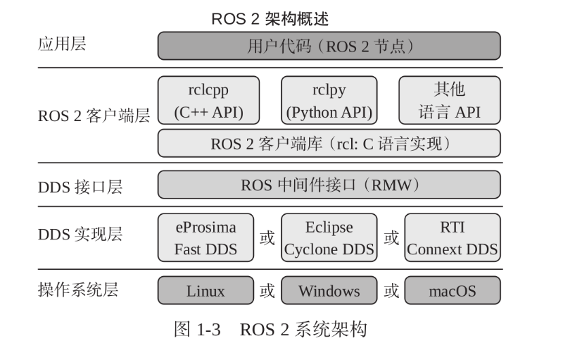

**修改该时间:2026.1.26**

**参与者:刘志钰**

# ROS2 主流程


## 一. ROS 2 基础介绍

### 1. ros2系统架构


ros2的系统架构可以分为5层：操作系统层、DDS实现层、DDS接口层、ROS2客户端层和应用层

* **（1）操作系统层**
    提供各种硬件的驱动，比如网卡驱动、常用USB驱动和常用摄像头驱动等
* **（2）DDS实现层**
    通信组件，实现数据分发服务
* **（3）DDS接口层**
    类似于USB接口的标准，为ROS2客户端层提供统一的调用接口
* **（4）ROS2客户端层**
    提供了不同编程语言的ROS客户端库，可以完成对ROS2核心功能的调用，如话题、服务、参数和动作通信机制
* **（5）应用层**
    所有基于RCL（ROS2客户端库）开发的程序都属于应用层，比如海龟模拟器和ROSQT(rqt)工具就都是基于这一层的。

### 2. 四大核心通信机制
话题通信、服务通信、参数通信和动作通信

* **（1）话题通信**
    是一种发布-订阅通信模式。即发布者将消息发布到某个话题上，订阅者订阅话题即可获取数据，数据是单向传递的
* **（2）服务通信**
    是双向的，可以分为服务端和客户端，客户端可以发送请求到服务端，由服务端处理并返回结果
* **（3）参数通信**
    用于机器人参数设置和读取（基于服务通信使用的）
* **（4）动作通信**
    分为动作客户端和动作服务端。动作服务端在处理客户端请求时可以反馈处理进度并随时取消，动作通信往往用于复杂的机器人行为。

### 3. 工具和框架
* **（1）丰富的可视化调试工具**
    可用于三维可视化的RViz，用于可视化图表、图标等数据的rqt系列工具，以及用于数据记录和回放的ros2 bag工具等
* **（2）建模与运动学工具**
    常用于运动学坐标转换与管理的TF工具，同时定义了描述机器人的结构、关节、传感器等信息的文件格式URDF
* **（3）开源社区及应用框架**
    仿真工具Gazebo、用于移动机器人导航的Navigation 2应用框架和用于机械臂规划的Moveit2应用框架

### 4. 发行版
常用的有三种：
1.  humble
2.  iron
3.  rolling

---

## 二. 从第一个节点开始

节点除了可以订阅和发布话题外，还可以使用服务、配置参数和执行动作等

### 1. C++示例

**（1）代码**
```cpp
#include "rclcpp/rclcpp.hpp"

int main(int argc, char **argv)
{
    rclcpp::init(argc,argv);
    auto node = std::make_shared<rclcpp::Node>("cpp_node");
    RCLCPP_INFO(node->get_logger(),"你好C++节点！");
    rclcpp::spin(node);
    rclcpp::shutdown();
    return 0;
}
```

**解释：**
* `std::make_shared`是C++标准库中的一个函数模板，用于创建一个`std::shared_ptr`智能指针，该指针指向一个动态分配的`rclcpp::Node`对象
* `RCLCPP_INFO`是rclcpp库提供的一个宏，用于输出信息级别的日志
* `node->get_logger()`会返回该节点的日志记录器对象，通过这个日志记录器可以输出不同级别的日志信息

**（2）流程解析**
首先包含了rclcpp下的`rclcpp.hpp`这个头文件。然后在主函数里调用`Init`函数进行初始化并分配资源。接着调用`std::make_shared`传入节点名来构造一个`rclcpp::Node`的对象，并返回该对象的智能指针。其中`auto`是类型推导，会根据返回值推导node的类型。之后再通过宏定义`RCLCPP_INFO`调用节点的日志记录器输出日志

**（3）命名空间**
`::` 是作用域解析运算符，用于访问命名空间或类中的元素，比如init、spin和shutdown函数都在rclcpp这个命名空间下

自己先建一个 `CMakeLists.txt` 文件：
```cmake
cmake_minimum_required(VERSION 3.8)
project (ros2_cpp)
add_executable(ros2_cpp_node ros2_cpp_node.cpp)
```

**（4）编译配置**
使用make命令进行编译时会报错（因为代码中包含了rclcpp.hpp头文件，但是这个头文件并不在系统默认头文件目录，而是在ROS2的安装目录下），可以通过 CMakeLists中编写代码来为ros2_cpp_node查找添加依赖

* 查找 rclcpp 头文件和库文件的路径
    ```cmake
    find_package(rclcpp REQUIRED)
    ```
    REQUIRED意味着这个包是构建项目所必须的，如果没有找到该包，或者无法满足该包的依赖项，CMake就会立即报错并停止构建过程

* 给可执行文件包含头文件
    ```cmake
    target_include_directories(ros2_cpp_node PUBLIC ${rclcpp_INCLUDE_DIRS})
    ```
    target_include_directories会让编译器在指定的目录中查找头文件 PUBILC是一个作用域选项，`${rclcpp_INCLUDE_DIRS}`是一个CMake变量

* 给可执行文件链接库文件
    ```cmake
    target_link_libraries(ros2_cpp_node ${rclcpp_LIBRARIES})
    ```

**（5）运行问题**
运行make后生成ros2_cpp_node文件，然后使用 `./ros2_cpp_node`运行还是报错，可能是没有加载正确的`libstdc++.so.6`（注意需要先使用cmake再使用make）

使用这两行代码，对其进行路径的永久性更改：
```bash
echo 'export LD_PRELOAD=/lib/x86_64-linux-gnu/libstdc++.so.6' >> ~/.bashrc
source ~/.bashrc
```
但是在终端中修改的效果不会作用到VScode的集成终端上（就是修改后只能作用在其中一个终端上，想要在另一个终端上使用还需要修改）

**（6）查看节点信息**
```bash
ros2 node info
```
是ROS2命令行工具节点下的另一个命令，用于查看指定节点信息，运行之后可以看到其返回了节点的订阅者、发布者和服务等相关信息

**（7）插件提示**
下载C++Extension插件可以提供代码提示

### 2. 使用功能包组织C++节点

**（1）创建功能包**
功能包（Package）是ROS2中用于组织和管理节点的工具，在功能包内编写代码后，只需要配置几句指令，就可以使用ROS2提供的构建指令对节点进行编译和安装
```bash
ros2 pkg create demo_cpp_pkg --build-type ament_cmake --license Apache-2.0
```

**（2）命令详解**
`ros2 pkg create` 是用于创建功能包的命令，其中 `demo_cpp_pkg` 是功能包的名字，后面的 `--build-type ament_cmake` 表示指定功能包的构建类型为ament_cmake，最后的 `--license Apache-2.0` 用于声明功能包的开源协议。从日志不难看出，该命令在当前文件夹下创建了demo_cpp_pkg 文件夹，并在其下创建了一些默认的文件和文件夹

在 `demo_cpp_pkg/src` 下添加 `cpp_node.cpp`，在文件中输入代码：
```cpp
#include "rclcpp/rclcpp.hpp"

int main(int argc, char **argv)
{
    rclcpp::init(argc, argv);
    auto node = std::make_shared<rclcpp::Node>("cpp_node");
    RCLCPP_INFO(node->get_logger(), " 你好 C++ 节点！ ");
    rclcpp::spin(node);
    rclcpp::shutdown();
    return 0;
}
```
* 在 ROS 2 里，每个节点都要有一个唯一的名称，该名称在 ROS 2 系统中用于标识和区分不同的节点。所以，rclcpp::Node 类的构造函数就设计成允许你传入一个字符串作为节点名称。
* `**`表示指向指针的指针,C语言和C++要注意双引号和单引号的使用

编写完后，还需要注册节点以及添加依赖，编辑 `CMakeLists.txt`：
```cmake
cmake_minimum_required(VERSION 3.8)
# ...
find_package(ament_cmake REQUIRED)
# uncomment the following section in order to fill in
# further dependencies manually.

# 1. 查找 rclcpp 头文件和库
find_package(rclcpp REQUIRED)

# 2. 添加可执行文件 cpp_node
add_executable(cpp_node src/cpp_node.cpp)

# 3. 为 cpp_node 添加依赖
ament_target_dependencies(cpp_node rclcpp)

# 4. 将 cpp_node 复制到 install 目录
install(TARGETS
  cpp_node
  DESTINATION lib/${PROJECT_NAME}
)
# ...
ament_package()
```

* 首先添加了 `find_package` 和 `add_executable` 用于查找依赖以及添加可执行文件，然后采用 `ament_cmake` 提供的`ament_target_dependencies` 指令来添加依赖，最后添加的是 `install` 指令，该指令将编译好的可执行文件复制到`install/demo_cpp_pkg/lib/demo_cpp_pkg` 目录下，这样使用 `ros2 run` 才能找到该节点。
* 在创建 C++ 功能包时，选定的构建类型是 `ament_cmake`，ament_cmake 其实是 CMake 的超集。ament_cmake 在 CMake 的指令集之上，又添加了一些更加方便的指令。
* `ament_package()`，该指令会从 CMakeLists.txt 收集信息，生成索引和进行相关配置，所以该指令需要在每个 ament_cmake 类型的功能包的 CMakeLists.txt 的最后一行进行构建功能包前还需要在清单文件 `package.xml` 中添加对 rclcpp 的依赖声明：

```xml
<?xml version="1.0"?>
...
<license>Apache-2.0</license>

<depend>rclcpp</depend>

<test_depend>ament_copyright</test_depend>
...
</package>
```
* `<depend>rclcpp</depend>` 用于声明当前功能包依赖 rclcpp 库。
* `ament_copyright` 是 ROS 2 构建系统 ament 提供的一个工具，主要用于检查软件包源文件中的版权声明。它可以帮助开发者确保软件包中的所有源文件都包含正确的版权信息，这对于开源项目的合规性非常重要。

**编译与运行**
完成后就可以使用`colcon build`来构建功能包。
colcon 是 ROS 2 中用于构建功能包的工具，这里使用 `colcon build` 可以构建当前及子目录下所有的功能包。若构建时当前目录下不存在 build、install 和 log 这三个目录，则会自动创建，并将构建中间文件、结果和日志放入对应目录中。构建完成后，再查看 `install/demo_cpp_pkg/lib/demo_cpp_pkg/` 目录就可以看到 cpp_node 可执行文件了

最后使用：
```bash
source install/setup.bash
ros2 run demo_cpp_pkg cpp_node
```
`source`指令的作用是让ros2能过找到demo_cpp_pkg和其下的节点。colcon build 其实也是调用 cmake和 make 完成对代码的编译的

**总结：编写ROS2节点的一般步骤**
1.  导入库文件
2.  初始化客户端库
3.  新建节点对象
4.  spin循环节点
5.  关闭客户端库

**注意点：**
1.  可能会少下载某个模块，到终端中下载一下就行
2.  `source install/setup.bash`要先写，然后再写ros2 run才能够找到文件

**功能包结构分析**
* **（1）include**
    该目录用于存放 C++ 的头文件，如果要编写头文件，一般都放置在这个目录下。
* **（2）src**
    代码资源目录，可以放置节点或其他相关代码。
* **（3）CMakeLists.txt**
    该文件是 C/C++ 构建系统 CMake 的配置文件，在该文件中添加指令，即可完成依赖查找、可执行文件添加、安装等工作。
* **（4）LICENSE**
    该文件是功能包的许可证。创建该功能包时使用了 `--license Apache-2.0` 参数，这个文件内容就是 Apache-2.0 的协议内容，在 2.2.2 节中有关于这个协议的简单介绍。
* **（5）package.xml**
    该文件是功能包的清单文件，每个 ROS 2 的功能包都会包含这个文件

---

## 三. 话题通信

### 1. 话题通信介绍
* **（1）** ROS 2 的话题机制有四个关键点，分别是发布者、订阅者、话题名称和话题类型。发布者相当于公众号的作者，订阅者则是读者，话题名称相当于公众号名字，消息接口则相当于公众号的内容类型。节点之间通过订阅和发布同名的话题来传输控制指令
* **（2）** `ros2 node info` 指令用于查看节点的详细信息，其中 Subscribers 部分是 `/turtlesim` 节点订阅的所有话题，可以看出该节点订阅了名为 `/turtle1/cmd_vel` 的话题，用于接收控制指令，它的消息接口是 `geometry_msgs/msg/Twist`
    Publishers 部分下是该节点发布的所有话题，需要关注的话题是 `/turtle1/pose`，该话题用于发布当前海龟的位置和速度，它的消息接口是 `turtlesim/msg/Pose`
* **（3）** `ros2 topic echo` 是 topic 模块下用于输出话题数据的命令，该命令运行后会输出收到的话题数据，其中，x 和 y 是海龟的位置；theta 是海龟的朝向；linear_velocity 是海龟的线速度，也就是海龟前进的速度，前进为正，后退为负；angular_velocity 是角速度，是海龟绕自身旋转的速度，逆时针为正，顺时针为负
    通过命令行工具可以很方便地查看话题数据，同样可以发布数据，但对某个话题发布数据前需要确定其消息接口
* **（4）**
    ```bash
    ros2 topic info /turtle1/cmd_vel -v
    ```
    (需要先启动乌龟节点) 可以查看某个话题的具体信息。查看到消息接口为 `Topic type:geometry_msgs/msg/Twist`
    ```bash
    ros2 interface show geometry_msgs/msg/Twist
    ```
    （使用`/turtle1/cmd_vel`不行）`ros2 interface show` 命令用于输出接口的定义内容
* **（5）**
    ```bash
    ros2 topic pub /turtle1/cmd_vel geometry_msgs/msg/Twist "{linear: {x: 1.0}}"
    ```
    解释：`ros2 topic pub`是向指定话题发布消息。`ros2 topic`是用来管理和操作话题的命令组，pub是publish的缩写
* **（6）**
    ```bash
    ros2 topic echo /novel
    ```
    可以实时输出话题内容
    运行（5）代码中的命令时，需要注意格式。大括号用于区分消息结构层级，冒号后需要添加空格用于区分。命令运行后，就会看到不断输出的发布结果

### 2. 话题订阅与发布
* **（1）发布速度控制海龟画圆**
    为了能够在代码中订阅和发布对应的话题，在创建功能包时需要加入对 geometry_msgs 和 turtlesim 的依赖
    ```bash
    ros2 pkg create demo_cpp_topic --build-type ament_cmake --dependencies rclcpp geometry_msgs turtlesim --license Apache-2.0
    ```
    * 字面量是 C++14 中的新特性，引入后可以直接使用数字加单位（s 或 ms 等）来表示时间。`<>` 是 C++ 的模板语法
    * `std::chrono`：这是C++标准库中的一个时间处理库，涵盖了时间点、时间段以及时钟等多种功能
    * 使用`using namespace`可以把命名空间里的所有名称引入到当前作用域
    * `_literals`代表字面量命名空间。这些命名空间的作用是提供自定义字面量运算符
    * `explicit`主要用于修饰构造函数，作用是防止隐式类型转换

### 3. 订阅Pose实现闭环控制
通过发布速度控制命令到话题 `/turtle1/cmd_vel` 便可以控制海龟移动，通过订阅 `/turtle1/pose` 可以获取海龟的实时位置。闭环控制是指通过对输出进行测量和反馈来调节系统的输入，使系统的输出更加接近期望值

**std::bind**
```cpp
pose_subscription_ = this->create_subscription<turtlesim::msg::Pose>(
    "/turtle1/pose", 
    10, 
    std::bind(&TurtleController::on_pose_received, this, std::placeholders::_1)
);
```
* `&TurtleController::on_pose_received`：这是 TurtleController 类的成员函数指针。在 C++ 里，成员函数不能像普通函数那样直接调用，必须通过类的对象来调用。所以，在使用 std::bind 绑定时，需要传递成员函数的指针。
* `this`：它代表当前 TurtleController 对象的指针。由于成员函数需要依附于具体的对象，因此要把当前对象的指针传递给 std::bind，这样绑定后的可调用对象在调用时就知道该在哪个对象上执行成员函数。

**1. 绑定普通函数**
```cpp
#include <iostream>
#include <functional>

// 定义一个简单的普通函数，实现两数相加
int add(int a, int b) {
    return a + b;
}

int main() {
    // 用 std::bind 绑定 add 函数，把第一个参数固定为 10
    auto addTen = std::bind(add, 10, std::placeholders::_1);
    // 调用绑定后的可调用对象，传入第二个参数 5
    int result = addTen(5);
    std::cout << "10 + 5 = " << result << std::endl;
    return 0;
}
```
**代码解释：**
`std::bind(add, 10, std::placeholders::_1)`：构建了一个新的可调用对象 addTen。它把 add 函数的第一个参数固定成 10，`std::placeholders::_1` 作为占位符，意味着调用 addTen 时传入的首个参数会充当 add 函数的第二个参数。
`addTen(5)`：调用这个绑定后的可调用对象，传入参数 5，实际上就是调用 add(10, 5)。

**2. 绑定成员函数**
```cpp
#include <iostream>
#include <functional>

class MyClass {
public:
    // 类的成员函数，用于打印传入的整数
    void printNumber(int num) {
        std::cout << "The number is: " << num << std::endl;
    }
};

int main() {
    MyClass obj;
    // 使用 std::bind 绑定 MyClass 的成员函数 printNumber
    auto boundFunc = std::bind(&MyClass::printNumber, &obj, std::placeholders::_1);
    // 调用绑定后的可调用对象
    boundFunc(20);
    return 0;
}
```
**代码解释：**
`std::bind(&MyClass::printNumber, &obj, std::placeholders::_1)`：创建了一个新的可调用对象 boundFunc，将 MyClass 的成员函数 printNumber 和对象 obj 绑定在一起。`std::placeholders::_1` 表示调用 boundFunc 时传入的第一个参数会作为 printNumber 函数的参数。
`boundFunc(20)`：调用绑定后的可调用对象，实际上调用的是 `obj.printNumber(20)`。

**3. 改变参数顺序**
```cpp
#include <iostream>
#include <functional>

// 定义一个简单的减法函数
int subtract(int a, int b) {
    return a - b;
}

int main() {
    // 使用 std::bind 交换 subtract 函数参数的顺序
    auto reversedSubtract = std::bind(subtract, std::placeholders::_2, std::placeholders::_1);
    // 调用绑定后的可调用对象
    int result = reversedSubtract(3, 8);
    std::cout << "8 - 3 = " << result << std::endl;
    return 0;
}
```
**代码解释：**
`std::bind(subtract, std::placeholders::_2, std::placeholders::_1)`：创建了一个新的可调用对象 reversedSubtract，它把 subtract 函数的参数顺序进行了交换。`std::placeholders::_2` 表示调用 reversedSubtract 时传入的第二个参数会作为 subtract 函数的第一个参数，`std::placeholders::_1` 表示调用 reversedSubtract 时传入的第一个参数会作为 subtract 函数的第二个参数。
`reversedSubtract(3, 8)`：调用绑定后的可调用对象，实际上调用的是 `subtract(8, 3)`。

**花括号初始化**
`double target_x_{1.0};` 等价于 `double target_x_ =1.0;`

**设置为 0 仍能接收消息的原因**
在 ROS 2 里，当你把队列大小设置为 0 时，实际上它会采用一个默认的队列大小值，而非真的创建一个大小为 0 的队列。这是因为大小为 0 的队列没有实际意义，无法缓存任何消息。

**注意**：这个功能包实现了发布和订阅两个功能。在VScode里面要了解某个函数参数，直接复制粘贴到百度里面搜索（很多都没办法直接查看了）

---

## 四. 服务和参数通信

除了需要用话题通信进行单向的数据传递，有时还需要进行双向的数据传递，比如一个节点发送图片请求另一节点进行识别，另一个节点识别完成后将结果返回给请求节点

### （1）服务通信介绍

（需要先启动海龟模拟器的服务才在终端中看到）
```bash
ros2 service list -t
```
用于查看服务列表，`-t` 参数表示显示服务的接口类型。在返回的结果内，每一行代表一个服务，每一行的前面是服务的名称，[] 内则是服务的接口类型。所以服务和话题一样，都是有名字和接口的；但服务的接口与话题不同，分为请求接口和响应接口两部分

```bash
ros2 interface show turtlesim/srv/Spawn
```
可以查看该接口的定义

```bash
ros2 service call /spawn turtlesim/srv/Spawn "{x: 1, y: 1}"
```
（`:`后面有一个空格，`,`后面也有一个空格，每次执行会新增加一个乌龟）
service call 命令用于调用指定的服务，其第一个参数是服务的名字，第二个参数是服务的接口类型，第三个参数是 Request 数据。

除了使用命令行工具来调用服务，ROS2海提供了一个可视化工具rqt，在终端中输入`rqt`。
在打开的界面中选择 Plugins → Services → Service Caller 选项。
在列表框中选择 `/spawn` 服务，修改 Request 中 x 和 y 的值，然后单击 Call 按钮，即可完成请求

### （2）基于服务的参数通信

在 ROS 2 中，参数被视为节点的设置，而参数通信机制是基于服务通信实现的。

```bash
ros2 service list -t | grep parameter
```
查看名字包含parameter的服务

ROS 2 有一套关于参数的工具和库可供我们使用
```bash
ros2 param list
```
用于查看当前所有节点的参数列表
以 background 开头的参数是在海龟模拟器中显式声明的，而后面的 use_sim_time以及以 qos 开头的部分则是节点的默认参数

```bash
ros2 param describe /turtlesim background_r
```
了解某个参数的具体描述，返回值包括参数的名字、类型、用途以及对其值的约束

```bash
ros2 param get /turtlesim background_r
```
（更改整个背景色）查看该参数的具体值

```bash
ros2 param set /turtlesim background_r 255
```
修改参数的值

当系统中有多个节点和较多参数需要配置时，逐一使用命令行配置非常麻烦，ROS 2 提供了使用文件来配置参数的方式。首先可以将某个节点的配置导出为一个 yaml 格式的文件

```bash
ros2 param dump /turtlesim > turtlesim_param.yaml
```
将某个节点的配置导出为一个 yaml 格式的文件

```bash
cat turtlesim_param.yaml
```
查看文件内容

```bash
ros2 run turtlesim turtlesim_node --ros-args --params-file turtlesim_param.yaml
```
将参数保存到文件后,可以直接通过命令来指定参数文件，实现参数的自动配置

```bash
ros2 param --help
```
可以查看参数命令行工具的更多使用方法

在 rqt 工具中，插件 Configuration → DynamicReconfigure 提供了一个可视化的参数配置工具


# ROS2学习代码跑通的版本

https://github.com/XJU-Hurricane-Team/Vision_coding
