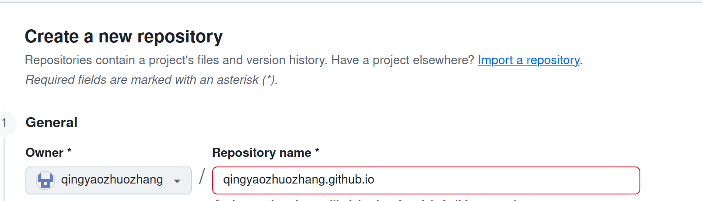
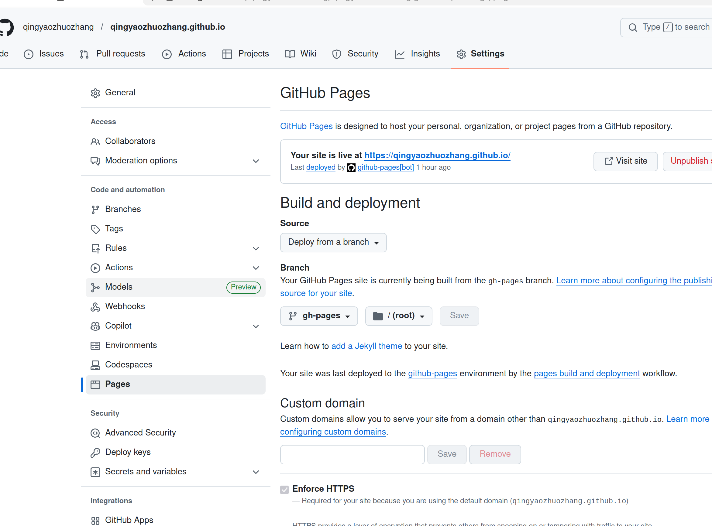

### 创建一个新的Github Page完整流程

**使用MkDocs + Material Theme静态文档方案**

（1）正常流程

1.初始化项目结构

`mkdocs new .`

实现结果：

```
MyKnowledge/
  ├── mkdocs.yml    # 核心配置文件
  └── docs/         # 存放你所有 markdown 文档的地方
      └── index.md  # 首页
```

2.编辑mkdocs.yaml文件（美化外观）

https://github.com/qingyaozhuozhang/jingshen/tree/main/Github_Page

（需要下载requirements.txt里面的依赖）

3.本地预览

`mkdocs serve`

然后浏览器打开http://127.0.0.1:8000

4.在Github上新建一个链接仓库（`.github.io`）

在Github上新建一个名称跟Github名字一样+`.github.io`的仓库



5.上传仓库后部署配置

在根目录中创建目录和文件：`.github/workflows/deploy.yml`

```
你的项目文件夹/
├── mkdocs.yml
├── requirements.txt      <-- 刚才建的
└── .github/
    └── workflows/
        └── deploy.yml    <-- 现在要建的
```

https://github.com/qingyaozhuozhang/jingshen/tree/main/Github_Page

6.切换Pages分支



- Source：保持选`Deploy from a branch`
- Branch：选择`gh-pages`分支
  - 文件夹保持`/(root)`

7.验证

直接访问https://qingyaozhuozhang.github.io/


**可能遇到的问题分析处理**

- 编辑mkdocs.yaml
  - 部署地址需要对应
  - `site_url: https://qingyaozhuozhang.github.io/`
  - 编辑内容在`nav`模块中
  
    - （冒号后面不能放空白）
    - ```
      编程常用例程:    （不行）
      编程常用例程:    （行）
        待更新：常用例程/编程常用例程/index.md
      ```
  - 路径从`docs/`之后开始`docs/`不需要
- 上传遇到语法错误而无法显示
  - 到`Actions`选项中查看具体报错


8.创建自动化工作流

- 新建一个隐藏文件夹`.github`

  - 在`.github`里面新建一个文件夹`workflows`

    - 在`workflows`里面新建一个文件，命名为`deploy.yml`

    - ```
      name: deploy-mkdocs
      on:
        push:
          branches:
            - main  # 当推送到 main 分支时触发
      
      # 赋予 GitHub Actions 推送代码到 gh-pages 分支的权限
      permissions:
        contents: write
      
      jobs:
        deploy:
          runs-on: ubuntu-latest
          steps:
            - uses: actions/checkout@v4
              with:
                # fetch-depth: 0 非常重要！
                # 因为你使用了 git-revision-date-localized 插件，必须拉取完整历史记录才能获取时间，否则打包会报错
                fetch-depth: 0
                
            - name: 配置 Git 用户信息
              run: |
                git config user.name github-actions[bot]
                git config user.email 41898282+github-actions[bot]@users.noreply.github.com
      
            - name: 设置 Python 环境
              uses: actions/setup-python@v5
              with:
                python-version: 3.x
      
            - name: 设置缓存加快后续构建速度
              uses: actions/cache@v4
              with:
                key: ${{ runner.os }}-mkdocs-material-${{ hashFiles('requirements.txt') }}
                path: .cache
                restore-keys: |
                  ${{ runner.os }}-mkdocs-material-
      
            - name: 安装依赖包
              run: |
                # 如果你有 requirements.txt，优先使用它
                if [ -f requirements.txt ]; then pip install -r requirements.txt; fi
                # 确保关键依赖被安装 (MkDocs, Material 主题，以及你使用的两个插件)
                pip install mkdocs-material mkdocs-git-revision-date-localized-plugin mkdocs-minify-plugin
      
            - name: 执行 MkDocs 编译并部署到 gh-pages 分支
              run: mkdocs gh-deploy --force
      ```

      
