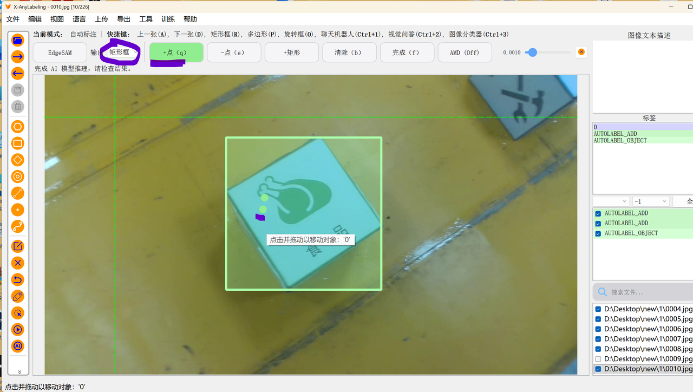

# yolo数据集标注

- 工具：`Labeelimg`和`X-Anylabeling`

### X-Anylabeling

[GitHub - CVHub520/X-AnyLabeling: Effortless data labeling with AI support from Segment Anything and other awesome models. · GitHub](https://github.com/CVHub520/X-AnyLabeling)

**X-AnyLabeling**是一个视觉数据集标注工具，其中可以下载ai工具用于辅助数据集标注。*传统工具*进行标注难免遇到标注不精确、效率较低的缺陷，而这个开源工具则**很好地解决**了这一点

> 本教程仅仅针对于**作为基础的**使用方法，相关的深入功能请自行探索

## 使用步骤

- [安装教程](https://github.com/CVHub520/X-AnyLabeling/blob/main/docs/zh_cn/get_started.md)

  - 1.安装完成后，可执行以下命令进行验证：

  - ```
    conda activate x-anylabeling-cu12  #取决于你的conda环境  
    xanylabeling checks   # 显示系统及版本信息
    ```

  - 2.验证无误后，可直接运行应用程序：

  - `xanylabeling`

  - 3.建立文件树（实际过程中，将1改变为你的序号（包括其中的子文件夹））

  - ```
    D:\dateset\new>
    ├─1         #放置图片集
    │      0001.jpg
    │      0002.jpg
    │
    ├─1_labels  #存放标注的源数据，刚开始这些json文件还没有
    │      0001.json
    │      0002.json
    │      0152.json
    │
    ├─1_txt      #放置classes.txt
    │      classes.txt
    │
    └─labels     #标注完成之后上传这个，刚开始这些txt文件也还没有
            0001.txt
            0002.txt
    ```

  - 创建刚刚文件树中的classes.txt，在里头写入：

  - ```
    0
    1
    2
    3
    ```

  - 4.打开软件
    - 初次打开可能有所*卡顿*，耐心打开即可

  - 5.语言设置
    - 

  - 6.打开文件夹
    - 

  - 7.食用之前的准备

    - 点击菜单栏的“文件”选项，把“自动保存”给打开，（勾选上）

    - 点击菜单栏的“文件”选项，更改输出目录，调到`序号_labels`文件夹（你的序号）
    - 

  - 8.使用快捷键相关

    - 在“菜单”和“文件”中，有相关的快捷键

    - 

  - 9.使用AI功能

> 1. 本次下载EdgeSAM模型
>    1. 
>    2. 下完即可使用。后面就不用重新下
>    3. 点击加点（q），即可开始
>       - 标注建议使用快捷按键
>       - 标完一种再标另外一种
>       - 倘若遇到不小心选多了
>         - 一种是切换到其他图片，然后切回来，标注会消失
>         - 另一种是通过**减点**
>       - ai辅助完之后，必须f，输入标签以后save一下
>       - 倘若***错标***
>         - 右侧的标签栏中全选，然后右键删除即可
>       - 
>    4. 
>    5. 然后，上面还有finish，这个务必得点（按键f），就可以保存模型帮你标注的框了。当然觉得不合理，可以添加点（q）或者减少点（e），进行调整
>    6. finish（按键f）之后就可以输入标签名称，然后点ok，即可保存
>    7. 当然如果细心的话还能看到右上角那个精度调节，这个就按需好了。默认的话正常就够了

- 10.标注完成之后，在软件中导出

  - 选用的即为“导出YOLO-Hbb”这一选项。

  - 

  - 然后，找到先前存有classes.txt的目录中，选择这个文件

  - 

  - 这时会弹出导出提示。按照图片上的要求，导出目录改为labels

  - 
