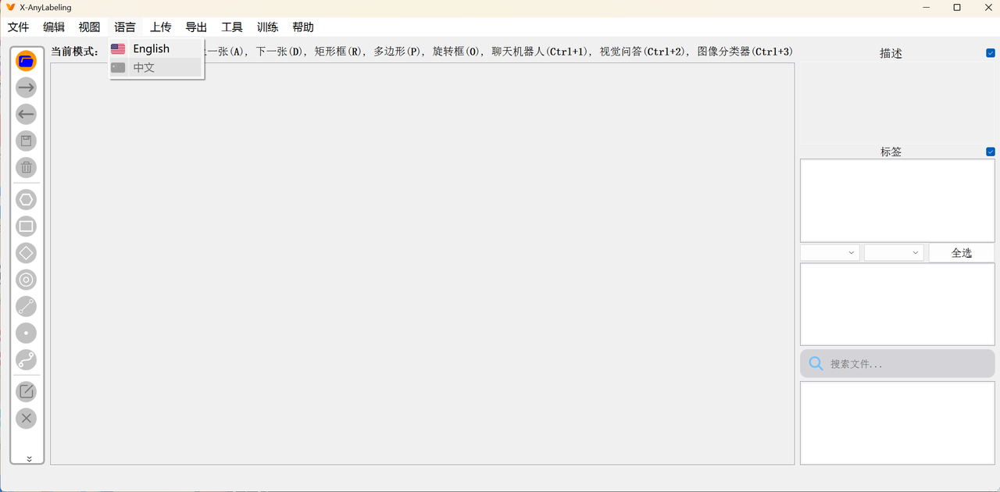
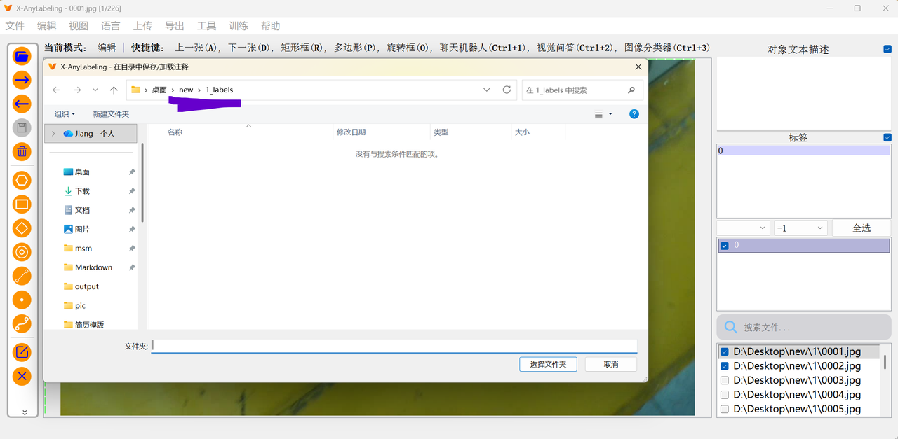
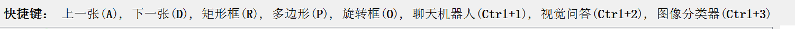
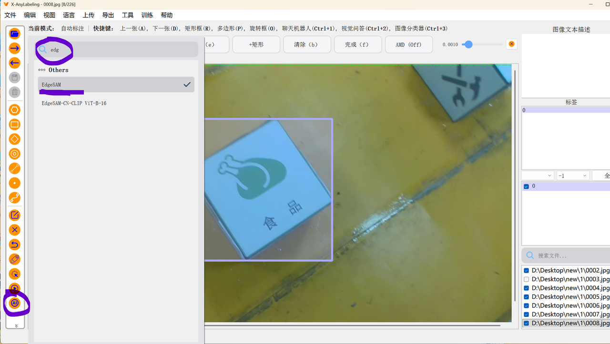
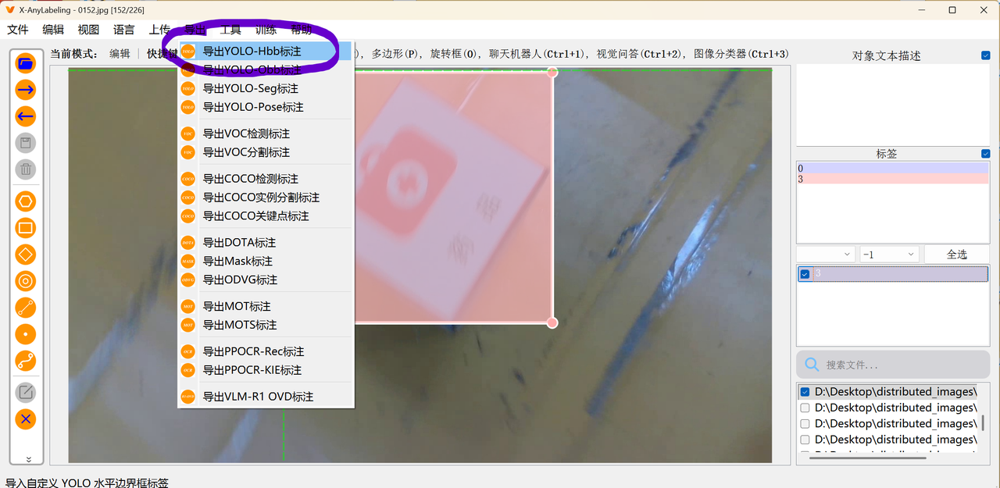
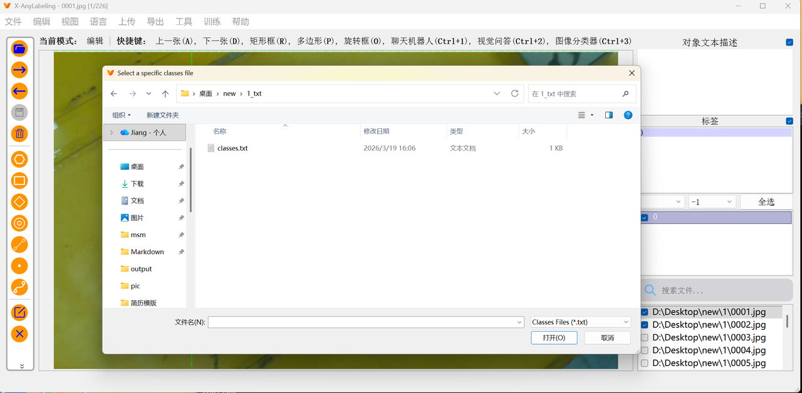
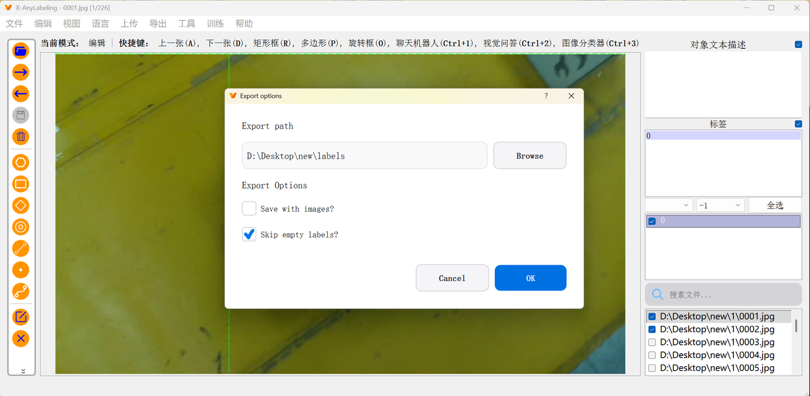

# yolo数据集标注

- 工具：`Labeelimg`和`X-Anylabeling`

### X-Anylabeling

[GitHub - CVHub520/X-AnyLabeling: Effortless data labeling with AI support from Segment Anything and other awesome models. · GitHub](https://github.com/CVHub520/X-AnyLabeling)

**X-AnyLabeling**是一个视觉数据集标注工具，其中可以下载ai工具用于辅助数据集标注。*传统工具*进行标注难免遇到标注不精确、效率较低的缺陷，而这个开源工具则**很好地解决**了这一点

## 使用步骤

- [安装教程](https://github.com/CVHub520/X-AnyLabeling/blob/main/docs/zh_cn/get_started.md)

  - 1.安装完成后，可执行以下命令进行验证：

  - ```
    conda activate x-anylabeling-cu12  #取决于你的conda环境  
    xanylabeling checks   # 显示系统及版本信息
    ```

  - 2.验证无误后，可直接运行应用程序：

  - `xanylabeling`

  - 3.建立文件树（实际过程中，将1改变为你的序号（包括其中的子文件夹））

  - ```
    D:\dateset\new>
    ├─1         #放置图片集
    │      0001.jpg
    │      0002.jpg
    │
    ├─1_labels  #存放标注的源数据，刚开始这些json文件还没有（更换输出目录）
    │      0001.json
    │      0002.json
    │      0152.json
    │
    ├─1_txt      #放置classes.txt
    │      classes.txt
    │
    └─labels     #标注完成之后上传这个，刚开始这些txt文件也还没有
            0001.txt
            0002.txt
    ```

  - 创建刚刚文件树中的classes.txt，在里头写入：（0，1，2，3换成自己标注的名称）

  - ```
    0
    1
    2
    3
    ```

    - 如果标签中有新的标注的名称（不小心加上的，将相应标签框删掉，重新打开）（如果相应标签框没有删掉，classes.txt也没有加上对应的标签名称会报错）
    
  - 4.打开软件
  
    - 初次打开可能有所*卡顿*，耐心打开即可

  - 5.语言设置
    - 

  - 6.打开文件夹
    - 
  
  - 7.食用之前的准备
  
    - 点击菜单栏的“文件”选项，把“自动保存”给打开，（勾选上）

    - 点击菜单栏的“文件”选项，更改输出目录
    - 
  
  - 8.使用快捷键相关
  
    - 在“菜单”和“文件”中，有相关的快捷键
  
    - 
  
  - 9.使用AI功能

> 
>
> - 可以下载`GroundingDINO`矩形框预标注
>
>   - 它可以通过输入标注名称自动识别普通物品
>   - 文本框输入示例（`crack.hole.`）
>
> - 导入自己的模型需要先写一个配置文件（`classes.txt`）
>
>   - ```
>     type: yolov8_obb
>     name: yolov5s-r20230520
>     provider: Ultralytics
>     display_name: YOLOv5s
>     model_path: /home/chairman/test_dachuang/app.onnx
>     iou_threshold: 0.45
>     conf_threshold: 0.25
>     max_det: 300
>     classes:
>     
>     - Hole
>     - Crack
>     ```
>
>   - 需要修改三个位置（`type`，`model_path`，`classes`）
>
>   - 命名的注意事项：
>
>     - 正常`yolov8`标注是`yolov8`
>     - 斜框标注的`yolov8`是`yolov8_obb`
>
> - 有一键用模型运行整个文件夹的的按键

- 10.标注完成之后，在软件中导出
- 选用的即为“导出YOLO-Hbb”这一选项。（正常举行框）（标注斜框的选择`YOLO-Obb`标注）
  
- 
  
- 然后，找到先前存有classes.txt的目录中，选择这个文件
  
- 
  
- 这时会弹出导出提示。按照图片上的要求，导出目录改为labels
  
- 
