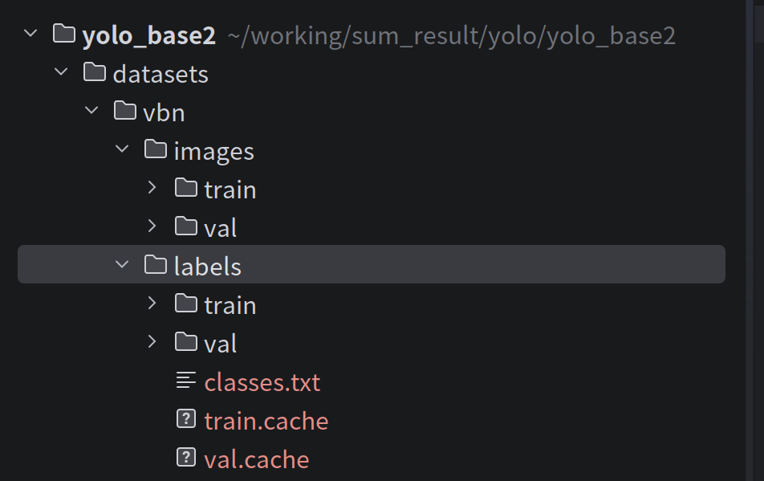
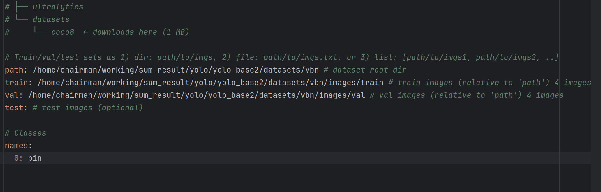

# yolo跑通的示例代码

https://github.com/qingyaozhuozhang/jingshen/tree/main/yolo_base2

# 模型训练

- 将未标注的图片（训练集和测试集）分别放置在`images`文件夹下的`train`和`val`，将标注好的秃瓢（训练集和测试集）分别放置在`labels`文件夹下的`train`和`val`

- 找到`yolo-vbn.yaml`这个配置文件
  - 将未标注图片的路径填写入对应的位置
  - 类别格式：`序号(从0开始): 属性名称`

 

- 然后使用`train.py`文件去训练模型

  - 参数调节

    - | 参数名        | 当前值 / 示例               | 含义与作用             | 深度解析 & 建议                                              |
      | ------------- | --------------------------- | ---------------------- | ------------------------------------------------------------ |
      | **`data`**    | `'yolo-vbn.yaml'`           | **数据集配置文件路径** | 指向一个 YAML 文件，该文件核心定义了： 1. **训练集/验证集路径** (path/train/val) 2. **类别数量** (nc) 3. **类别名称** (names) **注意**：`yolo-vbn` 是你的自定义文件名，请确保路径正确。 |
      | **`workers`** | `1`                         | **数据加载线程数**     | 指定用于 `DataLoader` 预读取数据的 CPU 线程数。 • **当前设置**：`1` 较保守，可能导致 GPU 计算完后需等待 CPU 读图（显卡利用率跳变）。 • **建议**：  - **Windows**: 设为 `0` 或 `1`（多线程在 Win 下常报错）。  - **Linux**: 建议设为 `8` 或 `cpu核心数`，以喂饱 GPU。 |
      | **`epochs`**  | `30`                        | **训练总轮次**         | 模型完整遍历一次数据集称为 1 个 epoch。 • **当前设置**：`30` 轮属于**快速验证**或**微调**。 • **从头训练**：建议 `100` - `300` 轮以保证收敛。 • **风险**：过少导致欠拟合（学不会），过多导致过拟合（死记硬背）。 |
      | **`batch`**   | `16`                        | **批次大小**           | 一次性送入 GPU 计算梯度的图片数量。 • **核心制约**：显存大小 (VRAM)。 • **大 Batch**：训练更快，梯度估算更准（走得稳）。 • **小 Batch**：显存占用低，但震荡大，可能有助于跳出局部最优。 • **建议**：`16` 是主流显卡（6G-8G显存）的黄金标准；高端卡可设 `32` 或 `64`。 |
      | **`device`**  | `0`  *(默认为空，自动检测)* | **计算设备选择**       | 指定模型运行的硬件设备。 • **`device=0`**：使用第 1 块 NVIDIA 显卡（最常用）。 • **`device=0,1`**：使用多块显卡进行分布式训练 (DDP)。 • **`device='cpu'`**：强制使用 CPU（极慢，仅用于调试）。 • **`device='mps'`**：使用 Mac (M1/M2/M3) 的 GPU 加速。 **注意**：如果不设置，代码会自动优先寻找可用的 GPU。 |

    - `model.train(data='yolo-vbn.yaml', workers=1, epochs=30, batch=16, device=0)`

- 训练好的结果会在`runs`文件夹中显示

  - 具体指标理解

    - #### 1. Confusion Matrix (混淆矩阵)

      以矩阵形式将数据集中的记录按照“真实的类别”与“分类模型预测的类别”两个标准进行汇总。

      - **行**：表示真实值 (True Label)
      - **列**：表示预测值 (Predicted Label)

      #### 2. F1_curve.png

      精确率和召回率的调和平均数，用于综合评估模型性能。

      #### 3. P_curve.png

      准确率 (Precision) 和置信度 (Confidence) 的关系图。

      #### 4. arg.yaml

      记录了训练时的超参数以及 `train.py` 运行过程中的中间参数。

      #### 5. PR_curve.png

      准确率 (Precision) 和召回率 (Recall) 的关系图。通常面积越大（越靠近右上角）效果越好。

      #### 6. R_curve.png

      召回率 (Recall) 和置信度 (Confidence) 的关系图。

      #### 7. results.png (综合结果)

      包含以下关键指标：

      1. **box**: 推测损失函数均值 (Box Loss)。
      2. **cls**: 目标检测分类损失均值 (Class Loss)。
      3. **dfl**: 目标检测边界框回归精度的损失函数均值 (Distribution Focal Loss)。
      4. **precision**: 精度 (查准率)。
      5. **recall**: 召回率 (查全率)。
      6. **mAP**: 使用 Precision 和 Recall 作图后围成的面积，m 表示平均 (mean)。

      > **💡 Loss 分析注意事项：**
      >
      > - **cls_loss**: 当分类损失 `< 0.1` 时，模型分类效果较好。
      > - **box_loss**: 当数值在 `0.01 - 0.1` 之间时，位置回归效果较好。

  - 训练好的模型在`runs`中的`weights`文件夹下

# 训练模型的调用

- `example.py`

  - 显示检测结果

- `onnx.py`

  - 将训练后的模型格式`pt`转成`onnx`（可以更广泛地被调用）

  

# 注意事项

- 不能只对一张图片进行训练，会“失效”
  - 至少要找20张图片

