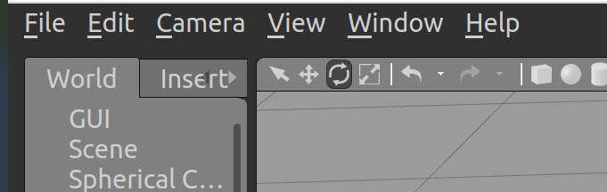

# 工具及其说明

### 工具

- urdf在线查看工具
  - https://viewer.robotsfan.com/
- Pycharm专业破解版

pycharm的2024.1.1版本

https://blog.csdn.net/2301_77160836/article/details/139028775?ops_request_misc=%257B%2522request%255Fid%2522%253A%2522152c7f65df49c5188f74f2013b103c6b%2522%252C%2522scm%2522%253A%252220140713.130102334.pc%255Fblog.%2522%257D&request_id=152c7f65df49c5188f74f2013b103c6b&biz_id=0&utm_medium=distribute.pc_search_result.none-task-blog-2~blog~first_rank_ecpm_v1~rank_v31_ecpm-1-139028775-null-null.nonecase&utm_term=pychram&spm=1018.2226.3001.4450


### 说明

- ### Rviz2

  - **常见问题说明**

  - 时间同步
    - 仿真时间和系统时间需要同步，否则无法正常初始化

  - Displays显示各种模块

    - 当模块订阅的内容冲突时，会报错关闭程序
      - 冲突情况：
      - 1.定义的数据类型与传入的数据类型不同
      - 2.同时存在两个接收同一个话题的模块
    - 先删除错误的模块，在点击`add`重新添加正确的模块

  - 图层显示

    - 点击`Panels`，勾选`Views`，在右侧方框的`Type`中选择`Orbit`，可以看到三维图层
  - 提高画面流畅程度
    - 处理DDS通信（切换到CycloneDDS）
      - `sudo apt install ros-humble-rmw-cyclonedds-cpp`
      - `export RMW_IMPLEMENTATION=rmw_cyclonedds_cpp`（在`~/.bashrc`文件末尾添加）

  

  


  - **手动配置流程**

  - **第一步**：修改 Launch 文件 (禁止自动启动)

    我们需要修改启动脚本，注释掉自动打开 RViz 的节点。

    - **编辑文件**：`fishbot_navigation2/launch/navigation2.launch.py`
    - **操作**：找到 `return launch.LaunchDescription([...])` 列表末尾的 `rviz2` 节点配置，并在每行前添加 `#` 将其注释掉。

    ```
    # 注释掉下面这一段，不让它自动启动 RViz
    # launch_ros.actions.Node(
    #     package='rviz2',
    #     executable='rviz2',
    #     name='rviz2',
    #     arguments=['-d', rviz_config_dir],
    #     parameters=[{'use_sim_time': use_sim_time}],
    #     output='screen'
    # ),
    ```

    ------

    **第二步**：启动仿真与导航系统

    保存文件后，分别在两个终端中启动仿真环境和导航节点（此时不会自动弹出 RViz 窗口）。

    **终端 1 (启动 Gazebo 仿真):**

    Bash

    ```
    ros2 launch fishbot_navigation2 gazebo_sim.launch.py
    ```

    **终端 2 (启动 Nav2 导航栈):**

    Bash

    ```
    ros2 launch fishbot_navigation2 navigation2.launch.py
    ```

    ------

    **第三步**：手动启动纯净版 RViz

    在新的终端中，启动一个不带任何默认配置的空白 RViz。

    **终端 3:**

    ```
    # 手动启动一个空的 RViz
    ros2 run rviz2 rviz2
    ```

    ------

    **第四步**：正确配置显示项 (关键步骤)

    RViz 打开后默认为黑色背景。请按照以下顺序依次添加和配置显示项，**注意话题名称的选择**：

    1. 基础设置

    - **Global Options**: 将 `Fixed Frame` 修改为 **`odom`** 或 **`map`**。

    2. 添加 2D 激光 (用于导航避障)

    - **操作**: 点击左下角 `Add` -> 选择 `LaserScan`。
    - **配置**:
      - **Topic**: 必须手动改为 **`/scan_2d`** (关键！)。
      - **Color**: 建议设为红色，方便观察。
    - *现象*: 此时应该能看到红色的激光扫描线。

    3. 添加 3D 点云 (用于视觉效果)

    - **操作**: 点击左下角 `Add` -> 选择 `PointCloud2`。
    - **配置**:
      - **Topic**: 选择 **`/scan`** (这是 Gazebo 原始的 3D 数据)。
      - **Style**: 建议改为 `Points`。
      - **Size**: 建议改为 `0.05` (像素单位)，以便看清点云。
    - *现象*: 此时应该能看到立体的 3D 点云图像。

    4. 添加地图与路径 (用于导航监控)

    - **地图**: 点击 `Add` -> `Map` -> Topic 选择 **`/map`**。
    - **路径**: 点击 `Add` -> `Path` -> Topic 选择 **`/plan`** (全局路径) 或 **`/local_plan`** (局部路径)。

    ------

    **第五步**：保存配置 (一劳永逸)

    为了避免下次还要重复配置，建议将当前的完美配置保存下来。

    **保存**: 点击 RViz 左上角的 `File` -> `Save Config As...`。

  ### Gazebo

  - 启动后一直“卡住”

    - 正在尝试下载标准模型（网络问题）。直接将模型下载到本地

    - ```
      cd ~
      git clone https://github.com/osrf/gazebo_models.git
      # 创建目录（如果不存在的话）
      mkdir -p ~/.gazebo/models
      
      # 将下载的各种模型（sun, ground_plane 等）全部复制进去
      # 注意：这里是把 gazebo_models 文件夹里面的“内容”拷进去
      cp -r ~/gazebo_models/* ~/.gazebo/models/
      ```

  - Gazebo目录的标准结构

    - ```
      ~/gazebo_project/
      ├── my_scene.world          <-- (原 text-cd-1/urdf/my_scene.world)
      └── models/                 <-- 创建这个文件夹存放模型
          └── text_cd_1/          <-- 你的机器人模型文件夹
              ├── model.config    <-- (新建文件，步骤三中创建)
              ├── model.sdf       <-- (原 text-cd-1/urdf/text-cd-1.sdf，重命名为 model.sdf)
              └── meshes/         <-- 存放 STL 文件
                  └── base-point.STL  <-- (原 text-cd-1/meshes/base-point.STL)
      ```

    - ```
      export GAZEBO_MODEL_PATH=$(pwd)/models:$GAZEBO_MODEL_PATH
      gazebo my_scene.world
      ```

  - 相对位置调整

    - 

    - 坐上角的两个按键可以直接对模块进行`x`、`y`、`z`、`roll`, `pitch`, `yaw`的位置调节

    - 在Gazebo中和获取当前坐标：在Gazebo左侧的`World`标签页下，找到`Models`列表，选中及模块名称，查看`Pose`属性，最后将参数写入

    - ```
      arguments=['-topic', '/robot_description',
                         '-entity', robot_name_in_model, 
                         '-x', '-5.380453',  # X坐标，根据需要修改
                         '-y', '1.839768',  # Y坐标，根据需要修改
                         '-z', '0.050971',
                         '-Y', '0.004870'   # Z坐标，抬高机器人 (例如0.2米)，防止卡在地下
                         ]
      ```

  - 进程阻塞

    - `sudo killall -9 gzserver gzclient`

  - 同步问题

    - rviz和gazebo没有同步
      - 仿真时间和系统时间问题
      - 话题重映射问题
        - `ros2 run teleop_twist_keyboard teleop_twist_keyboard --ros-args -r /cmd_vel:=/fishbot_diff_drive_controller/cmd_vel_unstamped`

