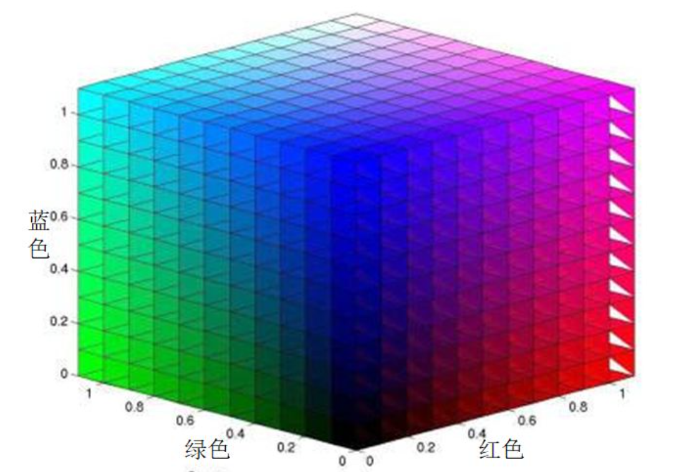
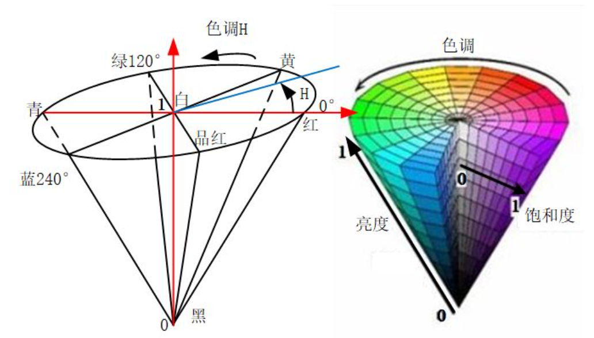
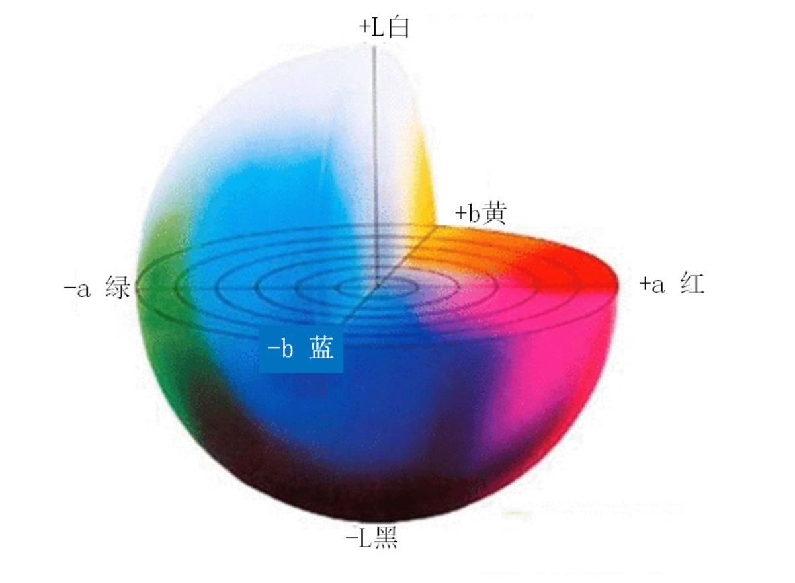
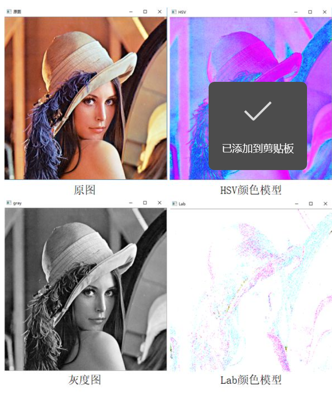
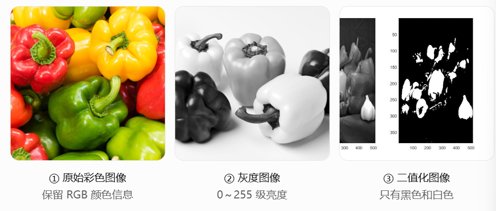

# OpenCV 计算机视觉学习笔记

## 一. OpenCV 简介与图像处理基础 🖼️

### 一. 图像处理简介

1. **图像的起源**
   - 图像是人类视觉的基础，“图”是物体反射或投射光的分布，“像”是人的视觉系统内所接收的图在人脑传给你所形成的印象或认识。
2. **模拟图像和数字图像**
   - 模拟图像通过某种物理量的强弱变化来记录图像亮度信息，容易受到干扰。
3. **数字图像的表示**
   - **位数**：数字图像也是利用 0/1 来记录信息，我们平常常见的图像都是 8 位数的图像，包含 0~255 灰度，其中 0 代表最黑，255 表示最白，人眼对灰度更敏感一些，在 16 位到 32 位之间。

### 二. 图像的分类

1. **二值图像**：仅由 0，1 两个值构成，通常用于文字、线条图的扫描识别和掩膜的存储。
2. **灰度图**：每个像素只有一个采样颜色的图像，这类图像通常显示为从最暗黑色到最亮的灰度，在黑色与白色之间也有很多级颜色深度。
3. **彩色图**：每个像素通常是由红、绿、蓝来表示的，分量介于（0~255），通常用于表示和存放真彩色图像。

- **模拟图像**：连续存储的数据
- **数字图像**：分级存储的数据

### 三. OpenCV 简介和安装方法

OpenCV 是一个计算机视觉处理开源软件。

**优势：**

1. **编程语言**：OpenCV 基于 C++ 实现，同时提供 python 等语言的接口，opencv-python 是 opencv 的 python API (接口)，结合了 opencv C++ API 和 python 语言的最佳特性。
2. **跨平台**：可以在不同平台上使用。
3. **活跃的开发团队**。
4. **丰富的 API**：完善的传统计算机视觉算法，涵盖主流的机器学习算法，同时添加了对深度学习的支持。
   - *API 是应用程序接口，它是一组规则和协议，让不同的软件组件能互相通信和交互。*

### 四. OpenCV-Python

是一个 python 绑定库，opencv-python 使用 Numpy, 这是一个高度优化的数据库操作库。

### 五. OpenCV 部署方法

1. 安装 opencv 之前需要先安装 numpy, matplotlib。

2. 创建 python 虚拟环境 cv, 在 cv 中安装即可，尽量选用 3.4.3 以下的版本。

   Bash

   ```
   pip install opencv-python==3.4.2.17
   ```

3. **测试是否安装成功的代码**

   Python

   ```
   import cv2
   lena = cv2.imread("1.jpg")
   cv2.imshow("image", lena)
   cv2.waitKey(0)
   ```

   - 效果就是直接把图片显示出来（图片的路径需要自己更改)。
   - 如果我们要利用 SIFT 和 SURF 进行特征提取时，还需要安装 `opencv-contrib-python`。
   - 都直接从 pycharm 中的 setting 中直接下载就可以了。

------

## 二. OpenCV 模块 📦

### 一. 了解 OpenCV 的主要模块

1. **基础模块**：
   - **core**：实现了最核心的数据结构及其基本运算，如绘图函数、数组操作相关函数。
   - **highgui**：实现了视频与图像的读取、显示、存储等接口。
   - **imgproc**：实现了图像处理的基础方法，包括图像滤波、图像的几何变换、平滑、阈值分割、形态学处理、边缘检测、目标检测、运动分析和对象跟踪等。
2. **高层次模块**：
   - **features2d**：用于提取图像特征以及特征匹配。
   - **nonfree**：实现了一些专利算法，如 sift 特征。
   - **objdetect**：实现了一些目标检测的功能，经典的基于 Haar、LBP 特征的人脸检测，基于 HOG 的行人、启程等目标检测，分类使用 Casade Classification (级联分类) 和 Latent SVM 等。
   - **stitching**：实现了图像拼接功能。
   - **FLANN**：包含快速近似最近邻搜索 FLANN 和聚类 Clustering 算法。
   - **ml**：机器学习模块（SVM, 决策树，Boosting 等等）。
   - **photo**：包含图像修复和图像去噪两部分。
   - **video**：针对视频处理，如背景分离，前景检测，对象跟踪等。
   - **calib3d**：即 3D, 这个模块主要是相机校准和三维重建相关的内容，包含了基本的多视角几何算法，单个立体摄像头标定，物体字条估计，立体相似性算法，3D 信息的重建等等。
   - **G-API**：包含像处理 pipeline 引擎。

### 二. 总结

- **core**: 最核心的数据结构
- **highgui**: 视频与图像的读取、显示、存储
- **imgproc**: 图像处理的基础方法
- **features2d**: 图像特征以及特征匹配

------

## 三. OpenCV 基本操作 💻

### 一. 图像的 IO 操作

1. **读取图像 API**: `cv2.imread()`
   - 参数 1: 要读取的图像
   - 参数 2: 读取方式的标志
     - `1`: 以彩色模式加载图像，任何图像的透明度都将被忽略，这是默认参数。
     - `0`: 以灰度模式加载图像。
     - `-1`: 包括 alpha通道的加载图像模式。
   - 示例：`img = cv2.imread("mess.jpg", 0)`
   - *注意：如果加载的路径有错误，不会报错，会返回一个 None 值。*

### 二. 显示图像

1. **API**: `cv2.imshow()`
   - 参数 1: 显示图像的**窗口名称**、以字符串类型表示。
   - 参数 2: 要加载的图像。
   - *注意：在调用显示图像的 API 后，要调用 `cv2.waitKey()` 给图像绘制留下时间，否则窗口会出现无响应情况，并且图像无法显示出来，`cv2.waitKey(0)` 表示永远地显示下去。*
   - `cv2.waitKey(delay)`:
     - delay > 0: 等待指定毫秒数。
     - delay <= 0: 无限期等待。
2. **在 matplotlib 中展示** (需要导入 matplotlib 中的 pyplot)
   - `pyplot.imshow(img[:,:,::-1])` (需要将 RGB 翻转一下)
   - `pyplot.show()`
   - *注意：灰度图像（二维数组）只能使用 `plt.imshow(img, cmap=plt.cm.gray)` 来显示图像。*

### 三. 保存图像

1. **API**: `cv2.imwrite()`
   - 参数 1: 文件名，要保存在哪里 (如 `"文件夹名称/图像名称.png"`)。
   - 参数 2: 要保存的图像。

**综合示例：**

Python

```
import numpy as np
import cv2 as cv
import matplotlib.pyplot as plt

img = cv.imread("guojia.jpg", 0)
# 使用opencv来显示图像
# cv.imshow("image", img)
# cv.waitKey(0)
# cv.destroyAllWindows()

# 使用matplotlib来显示图像
plt.imshow(img, cmap=plt.cm.gray)
plt.show()

# 3图像保存
cv.imwrite("build/guojia.png", img) 
```

### 四. 绘制几何图形

1. **绘制直线**: `cv2.line(img, start, end, color, thickness)`
2. **绘制圆形**: `cv2.circle(img, centerpoint, r, color, thickness)` (thickness 为负数时填充颜色)
3. **绘制矩形**: `cv2.rectangle(img, leftupper, rightdown, color, thickness)`
4. **向图像中添加文字**: `cv2.putText(img, text, station, font, fontsize, color, thickness, cv2.LINE_AA)`
   - `LINE_AA` 代表抗锯齿线条。

**示例代码：**

Python

```
import numpy
import cv2
from matplotlib import pyplot

img = numpy.zeros((512, 512, 3), numpy.uint8)
cv2.line(img, (0, 0), (511, 511), (255, 0, 0), 5)
cv2.circle(img, (256, 256), 60, (0, 0, 255), -10)
cv2.rectangle(img, (100, 100), (400, 400), (0, 255, 0), 5)
cv2.putText(img, "hello", (100, 150), cv2.FONT_HERSHEY_SIMPLEX, 5, (255, 255, 255), 3)
pyplot.imshow(img[:, :, ::-1])
pyplot.show()
```

### 五. 获取并修改图像中的像素点

- 获取某个像素点的值: `px = img[100, 100]` (BGR)
- 仅获取蓝色通道的强度值: `blue = img[100, 100, 0]`
- 修改某个位置的像素值: `img[100, 100] = [255, 255, 255]`

### 六. 获取图像的属性

| 属性     | API         | 说明               |
| -------- | ----------- | ------------------ |
| 形状     | `img.shape` | 行数、列数、通道数 |
| 图像大小 | `img.size`  | 像素总个数         |
| 数据类型 | `img.dtype` | 数据类型           |

导出到 Google 表格

### 七. 图像通道的拆分与合并

- **拆分**: `b, g, r = cv.split(img)`
- **合并**: `img = cv2.merge((b, g, r))`

### 八. 色彩空间的改变

- **API**: `cv.cvtColor(input_image, flag)`

- **Flag**:
  - `cv.COLOR_BGR2GRAY`: BGR -> Gray
  - `cv.COLOR_BGR2HSV`: BGR -> HSV
  
- 颜色模型解析

  - **RGB颜色模型**

  - 

  - 如果三种颜色分量都为0，则表示为黑色，如果三种颜色的分量相同且都为最大值，则表示为白色。

  - **HSV颜色模型**

  - 

  - HSV是色度（Hue）、饱和度（Saturation）和亮度（Value）的简写

  - **Lab颜色模型**

  - 

  - L表示亮度（Luminosity），a和b是两个颜色通道

  - **GRAY颜色模型**

  - GRAY模型并不是一个彩色模型，他是一个灰度图像的模型，灰度图像只有单通道，灰度值根据图像位数不同由0到最大依次表示由黑到白

  - **颜色模型转换**

  - 

  - **灰度图像和二值化图像的区别**

  - 

  - 灰度图像颜色种类有256种灰度，不是仅有黑白两种颜色，而二值化图像只有黑白两种颜色；灰度化是减少颜色信息，二值化是根据条件把像素分成两类

  - 

  - | 图像处理任务          | 推荐方法       | 原因                       |
    | --------------------- | -------------- | -------------------------- |
    | 边缘检测（Canny）     | 灰度图         | 保留亮度变化，方便检测边缘 |
    | 角点检测              | 灰度图         | 保留局部亮度信息           |
    | 特征匹配（SIFT、ORB） | 灰度图         | 保留纹理特征               |
    | 物体轮廓提取          | 二值图         | 容易区分目标和背景         |
    | 面积、形心计算        | 二值图         | 方便计算目标区域           |
    | 形状识别              | 二值图或灰度图 | 根据算法选择               |
    | 颜色识别              | RGB / HSV      | 需要保留颜色信息           |
    | YOLO 目标检测         | 彩色图         | 通常使用 RGB 图像输入模型  |

------

## 四. 图像处理总结 📝

1. **图像 IO 操作**: `cv.imread()`, `cv.imshow()`, `cv.imwrite()`
2. **绘制几何**: `cv.line()`, `cv.circle()`, `cv.rectangle()`, `cv.putText()`
3. **像素操作**: 索引获取与修改
4. **图像属性**: `shape`, `size`, `dtype`
5. **通道**: `cv.split()`, `cv.merge()`
6. **色彩空间**: `cv.cvtColor()`

------

## 五. 图像的加法 ➕

### 一. 图像的加法

- **OpenCV 加法**: `cv.add(x, y)` -> 饱和操作 (大于 255 取 255)
- **Numpy 加法**: `x + y` -> 模运算 (取余)
- *要求：两个图像具有相同的大小和类型。*

### 二. 图像的混合

- **公式**: g(x)=(1−a)f(x)+af(x)
- **API**: `img = cv.addWeighted(img1, 1-a, img2, a, 0)`

------

## 六. 几何变换 📐

### 一. 图像缩放

- **API**: `cv2.resize(src, dsize, fx=0, fy=0, interpolation=cv2.INTER_LINEAR)`
- **插值方法**:
  - `cv2.INTER_LINEAR`: 双线性插值
  - `cv2.INTER_NEAREST`: 最近邻插值
  - `cv2.INTER_AREA`: 像素区域重采样（默认）
  - `cv2.INTER_CUBIC`: 双三次插值

### 二. 图像平移

- **API**: `cv.warpAffine(img, M, dsize)`
- **平移矩阵 M**: `np.float32([[1, 0, m], [0, 1, n]])` (m 向右, n 向下)

### 三. 图像旋转

- **API**: `M = cv.getRotationMatrix2D(center, angle, scale)`
- **应用**: `cv.warpAffine(img, M, dsize)`

### 四. 仿射变换

- **原理**: 保持共线共面性，形状改变。需要找到三个点。
- **API**:
  1. `M = cv.getAffineTransform(pts1, pts2)`
  2. `dst = cv.warpAffine(img, M, (cols, rows))`

### 五. 透射变换

- **原理**: 保持投影几何图形不变。需要找到四个点（任意三个不共线）。
- **API**:
  1. `T = cv.getPerspectiveTransform(pts1, pts2)`
  2. `dst = cv.warpPerspective(img, T, (cols, rows))`

### 六. 图像金字塔

- **API**:
  - `cv.pyrUp(img)`: 向上采样 (扩大)
  - `cv.pyrDown(img)`: 向下采样 (缩小)

------

## 七. 几何变换总结 📝

1. **缩放**: `cv.resize()`
2. **平移**: `cv.warpAffine()` (配合平移矩阵)
3. **旋转**: `cv.getRotationMatrix2D()` -> `cv.warpAffine()`
4. **仿射**: `cv.getAffineTransform()` -> `cv.warpAffine()`
5. **透射**: `cv.getPerspectiveTransform()` -> `cv.warpPerspective()`
6. **金字塔**: `cv.pyrUp()`, `cv.pyrDown()`

------

## 八. 形态学操作 🦠

### 一. 连通性

- 邻接关系: 4 邻接, 8 邻接, D 邻接。
- 连通性: 4 连通, 8 连通, m 连通。

### 二. 腐蚀和膨胀

- **腐蚀 (Erosion)**: 求局部最小值，消除边界点，使目标缩小。
  - `cv.erode(img, kernel, iterations)`
- **膨胀 (Dilation)**: 求局部最大值，扩张高亮区域，填补孔洞。
  - `cv.dilate(img, kernel, iterations)`

### 三. 开闭运算

1. **开运算 (Open)**: 先腐蚀后膨胀。消除噪点，分离物体。
2. **闭运算 (Close)**: 先膨胀后腐蚀。填充闭合区域孔洞。

- **API**: `cv.morphologyEx(img, op, kernel)`
  - `cv.MORPH_OPEN`
  - `cv.MORPH_CLOSE`

### 四. 礼帽和黑帽

1. **礼帽 (TopHat)**: 原图 - 开运算。突出比周围明亮的区域。
2. **黑帽 (BlackHat)**: 闭运算 - 原图。突出比周围暗的区域。

- **API**: `cv.morphologyEx`
  - `cv.MORPH_TOPHAT`
  - `cv.MORPH_BLACKHAT`

------

## 九. 形态学操作总结 📝

- **腐蚀**: 局部最小值 `erode`
- **膨胀**: 局部最大值 `dilate`
- **开运算**: 先腐后膨 `MORPH_OPEN`
- **闭运算**: 先膨后腐 `MORPH_CLOSE`
- **礼帽**: 原图 - 开 `MORPH_TOPHAT`
- **黑帽**: 闭 - 原图 `MORPH_BLACKHAT`

------

## 十. 图像平滑 🌫️

### 一. 图像噪声

1. **椒盐噪声**: 随机出现的白点或黑点。
2. **高斯噪声**: 服从高斯分布的噪声。

### 二. 平滑滤波

1. **均值滤波**:
   - API: `cv.blur(src, ksize)`
   - 缺点: 去除细节，变模糊。
2. **高斯滤波**:
   - API: `cv.GaussianBlur(src, ksize, sigmaX)`
   - 特点: 去除高斯噪声有效。
3. **中值滤波**:
   - API: `cv.medianBlur(src, ksize)`
   - 特点: 去除椒盐噪声尤其有用。

------

## 十一. 图像平滑总结 📝

- **均值**: `cv.blur()`
- **高斯**: `cv.GaussianBlur()` (去除高斯噪声)
- **中值**: `cv.medianBlur()` (去除椒盐噪声)

------

## 十二. 直方图 📊

### 一. 灰度直方图

1. **原理**: 统计每个亮度值的像素个数。
2. **API**: `cv2.calcHist(images, channels, mask, histSize, ranges)`
   - `images`: [img]
   - `channels`: [0] (灰度), [0],[1],[2] (BGR)
   - `histSize`: [256]
   - `ranges`: [0, 256]

### 二. 掩膜的应用

- 利用掩膜 (Mask) 提取感兴趣区域 (ROI) 的直方图。
- `cv.bitwise_and(img, img, mask=mask)`

### 三. 直方图均衡化

- **目的**: 增强对比度。
- **API**: `dst = cv.equalizeHist(img)` (仅限灰度图)

### 四. 自适应直方图均衡化 (CLAHE)

- **原理**: 分块均衡化，限制对比度，去噪。

- **API**:

  Python

  ```
  clahe = cv.createCLAHE(clipLimit=2.0, tileGridSize=(8,8))
  res = clahe.apply(img)
  ```

------

## 十三. 直方图总结 📝

- **统计**: `cv.calcHist`
- **掩膜**: Mask 获取 ROI
- **均衡化**: `cv.equalizeHist`
- **自适应**: `cv.createCLAHE`

------

## 十四. 边缘检测 〽️

### 一. 原理

- **基于搜索**: 一阶导数最大值 (Sobel, Scharr)。
- **基于零穿越**: 二阶导数零穿越 (Laplacian)。

### 二. Sobel 检测算子

- **API**: `cv2.Sobel(src, ddepth, dx, dy, ksize)`
- **注意**: `ddepth` 使用 `cv2.CV_16S`, 后续使用 `cv2.convertScaleAbs()` 转回 uint8。
- **合并**: `cv2.addWeighted()`

### 三. Laplacian 算子

- **API**: `cv2.Laplacian(src, ddepth)`

### 四. Canny 边缘检测

1. **流程**: 噪声去除 -> 计算梯度 -> 非极大值抑制 -> 滞后阈值。
2. **API**: `cv2.Canny(image, threshold1, threshold2)`

------

## 十五. 边缘检测总结 📝

- **Sobel**: 一阶导数，抗噪较好。
- **Laplacian**: 二阶导数，对噪声敏感。
- **Canny**: 多步算法，效果最好，不易受噪声干扰。

------

## 十六. 模板匹配和霍夫变换 🎯

### 一. 模板匹配

- **API**: `res = cv.matchTemplate(img, template, method)`
- **获取结果**: `cv.minMaxLoc(res)`

### 二. 霍夫变换 (直线)

- **原理**: 笛卡尔坐标系 -> 霍夫空间 (p, θ)。
- **API**: `cv.HoughLines(img, rho, theta, threshold)` (输入需为二值图)

### 三. 霍夫圆检测

- **方法**: 霍夫梯度法。
- **API**: `cv.HoughCircles(image, method, dp, minDist, ...)`

------

## 十七. 模板/霍夫总结 📝

- **模板匹配**: `cv.matchTemplate`
- **霍夫线**: `cv.HoughLines` (需二值化)
- **霍夫圆**: `cv.HoughCircles` (霍夫梯度法)

------

## 十八. 图像特征提取与描述 ✨

### 一. 角点特征

- **Harris 角点**: 利用窗口内灰度变化 (`cv.cornerHarris`)。
- **Shi-Tomasi**: Harris 的改进，更适合追踪 (`cv.goodFeaturesToTrack`)。

### 二. SIFT / SURF

- **SIFT**: 尺度不变特征变换 (DoG, 关键点定位, 方向, 描述符)。
- **SURF**: SIFT 的加速版。
- **OpenCV API**: `sift = cv.xfeatures2d.SIFT_create()`, `sift.detectAndCompute()`

### 三. FAST / ORB

- **FAST**: 快速角点检测。
- **ORB**: FAST 特征点 + BRIEF 描述符，速度快，免费。

------

## 十九. 视频操作 📹

### 一. 视频读写

1. **读取**: `cap = cv.VideoCapture(filepath)`
2. **获取属性**: `cap.get(propId)`
3. **读取帧**: `ret, frame = cap.read()`
4. **保存**: `cv2.VideoWriter('filename', fourcc, fps, frameSize)`

### 二. 视频追踪

1. **Meanshift**: `cv.meanShift(probImage, window, criteria)`
2. **Camshift**: `cv.CamShift()` (尺寸可变的 Meanshift)

------

## 二十. 霍夫圆进阶笔记 📓

### 一. 识别图片 (自写)

1. 转灰度
2. 中值滤波
3. 调参循环

### 二. 识别图片 (AI 辅助)

1. 转 HSV
2. 掩码 (inRange)
3. 轮廓查找 (findContours)
4. 最小外接圆 (minEnclosingCircle)
