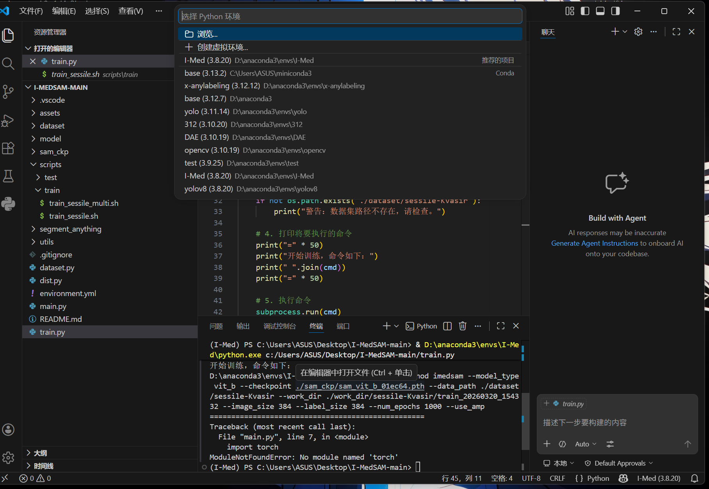
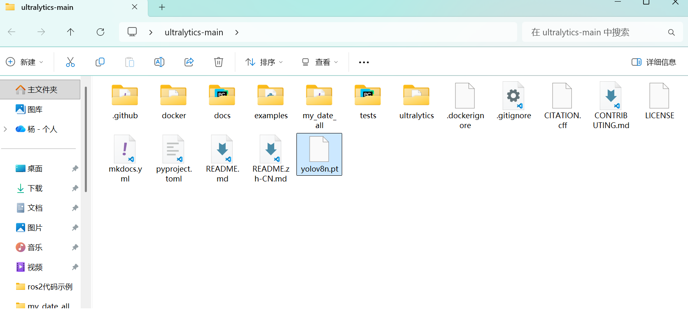
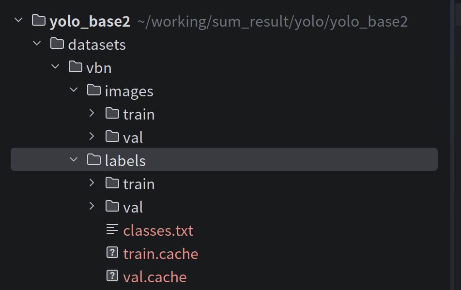
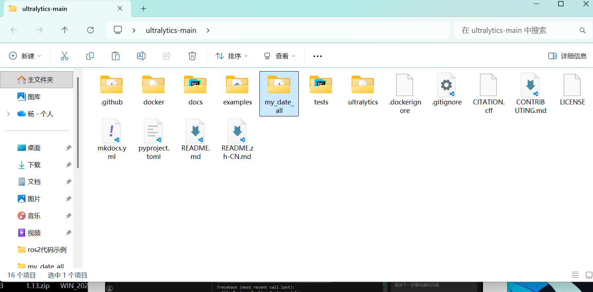
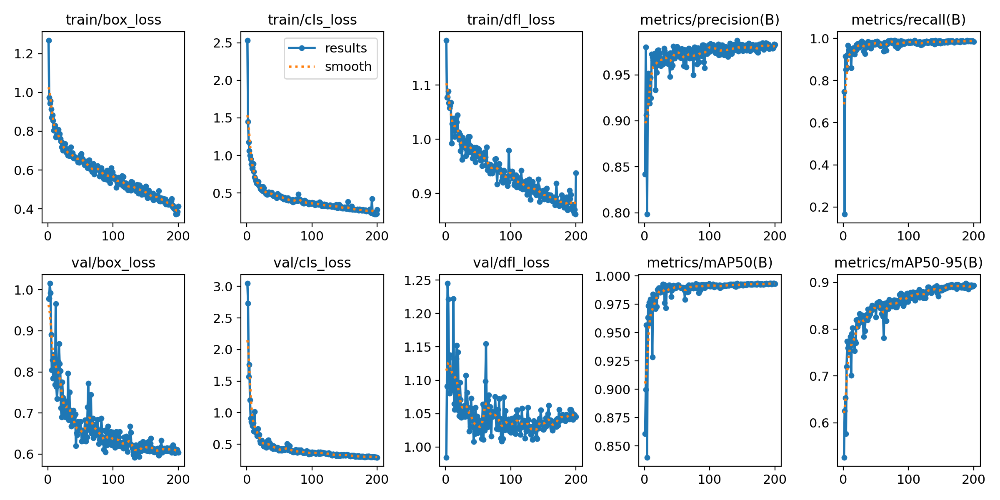
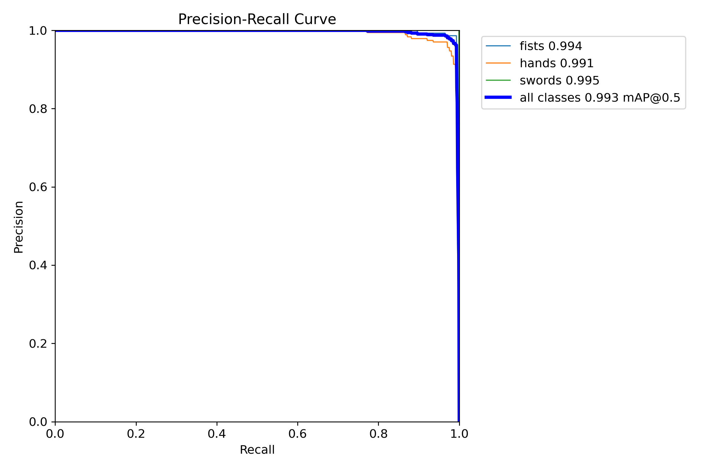
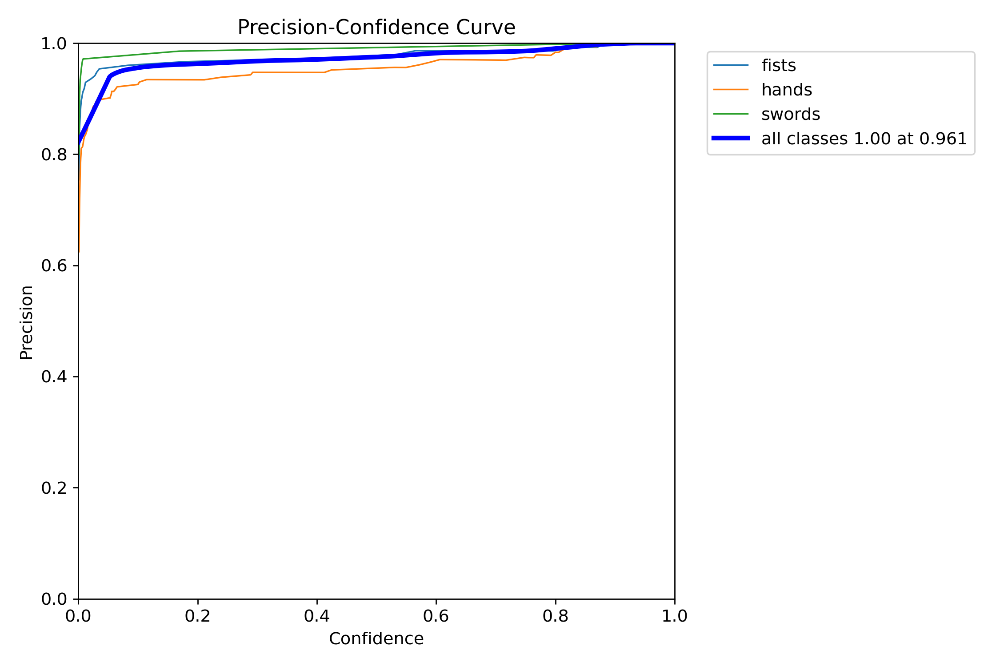
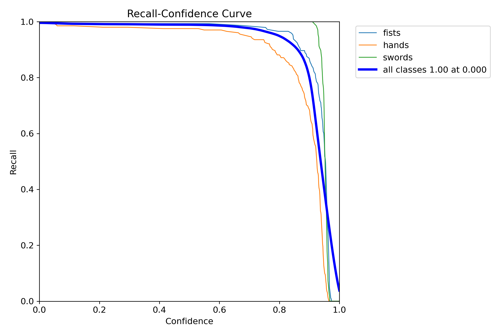
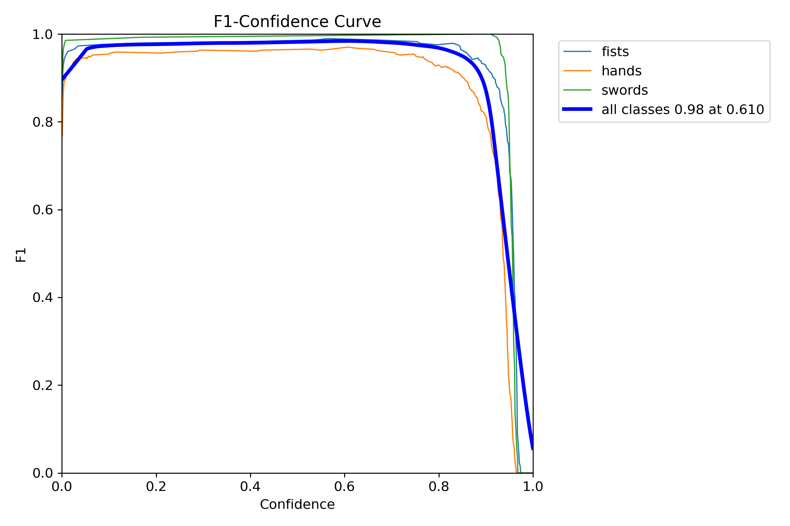
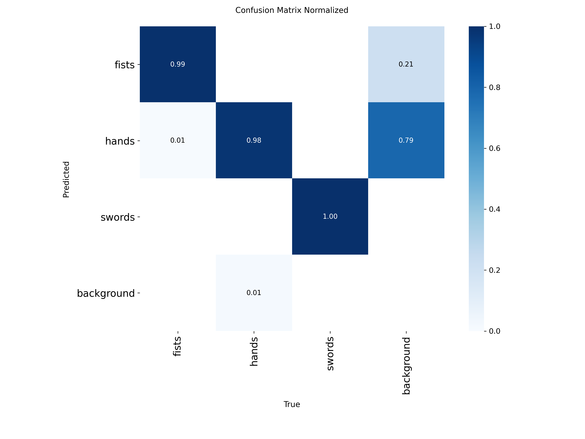

# yolov8部署及训练结果分析


## 下载yolov8

1.在github上打开[ultralytics/ultralytics: Ultralytics YOLO 🚀](https://github.com/ultralytics/ultralytics)

2.点击code下载zip，或者克隆仓库

## 配置环境

### 1.创建虚拟环境

```
conda create -n yolov8 python=3.9
```

### 2.激活虚拟环境

```
conda activate yolov8
```

### 3.安装依赖

进入代码文件目录然后pip

```
cd  yolo文件所在路径
pip install 所有需要的依赖模块（报错了再安装）
```


## 训练模型

### 1.选择虚拟环境解释器



### 2.放入标记好的数据集

- 

- 将未标注的图片（训练集和测试集）分别放置在`images`文件夹下的`train`和`val`，将标注好的图片（训练集和测试集）分别放置在`labels`文件夹下的`train`和`val`
  - 

### 3.写配置文件

- 在图中文件夹下新建一个yaml文件


```
train: C:\Users\ASUS\Desktop\ultralytics-main\my_date_all\images\train 
val: C:\Users\ASUS\Desktop\ultralytics-main\my_date_all\images\val
test: C:\Users\ASUS\Desktop\ultralytics-main\my_date_all\test 

# Classes
names:
# 类的名字
  0 : 
  1 :
```

- 将未标注图片的路径填写入对应的位置
- 类别格式：`序号(从0开始): 属性名称`


### 4.下载pt文件

https://github.com/ultralytics/assets/releases/download/v8.4.0/yolov8n.pt



### 5.训练参数调节

- 参数调节示例

```
yolo train data=配置文件所在地址 model=yolov8n.pt文件所在地址 epochs=100 imgsz=640 batch=16 device=0
```

- | 参数名        | 当前值 / 示例               | 含义与作用             | 深度解析 & 建议                                              |
  | ------------- | --------------------------- | ---------------------- | ------------------------------------------------------------ |
  | **`data`**    | `'yolo-vbn.yaml'`           | **数据集配置文件路径** | 指向一个 YAML 文件，该文件核心定义了： 1. **训练集/验证集路径** (path/train/val) 2. **类别数量** (nc) 3. **类别名称** (names) **注意**：`yolo-vbn` 是你的自定义文件名，请确保路径正确。 |
  | **`workers`** | `1`                         | **数据加载线程数**     | 指定用于 `DataLoader` 预读取数据的 CPU 线程数。 • **当前设置**：`1` 较保守，可能导致 GPU 计算完后需等待 CPU 读图（显卡利用率跳变）。 • **建议**：  - **Windows**: 设为 `0` 或 `1`（多线程在 Win 下常报错）。  - **Linux**: 建议设为 `8` 或 `cpu核心数`，以喂饱 GPU。 |
  | **`epochs`**  | `30`                        | **训练总轮次**         | 模型完整遍历一次数据集称为 1 个 epoch。 • **当前设置**：`30` 轮属于**快速验证**或**微调**。 • **从头训练**：建议 `100` - `300` 轮以保证收敛。 • **风险**：过少导致欠拟合（学不会），过多导致过拟合（死记硬背）。 |
  | **`batch`**   | `16`                        | **批次大小**           | 一次性送入 GPU 计算梯度的图片数量。 • **核心制约**：显存大小 (VRAM)。 • **大 Batch**：训练更快，梯度估算更准（走得稳）。 • **小 Batch**：显存占用低，但震荡大，可能有助于跳出局部最优。 • **建议**：`16` 是主流显卡（6G-8G显存）的黄金标准；高端卡可设 `32` 或 `64`。 |
  | **`device`**  | `0`  *(默认为空，自动检测)* | **计算设备选择**       | 指定模型运行的硬件设备。 • **`device=0`**：使用第 1 块 NVIDIA 显卡（最常用）。 • **`device=0,1`**：使用多块显卡进行分布式训练 (DDP)。 • **`device='cpu'`**：强制使用 CPU（极慢，仅用于调试）。 • **`device='mps'`**：使用 Mac (M1/M2/M3) 的 GPU 加速。 **注意**：如果不设置，代码会自动优先寻找可用的 GPU。 |

- `model.train(data='yolo-vbn.yaml', workers=1, epochs=30, batch=16, device=0)`


### 6.训练结果分析

#### a. result分析

1.`box_loss`全称是bounding box loss，表示边界框损失。它表明AI通过训练和学习之后，对于边界框的预测和标准答案之间的损失

2.`cla_loss`它叫分类损失，全称为classification loss。它衡量的是预测类别和真实类别之间的差异

如何判断效果

3.`dfl_loss`全称是Distribution Focal Loss，中文名称为“分布式焦点损失”。 它辅助`box_loss`，提供额外的信息，通过对边界框位置的概率分布进行优化，进一步提高模型对边界框位置的细化和准确度、4.`metrics/mAP50(B)`

mean Average Precision at IoU=0.5：在 IoU 阈值为 0.5 的标准下，综合评估模型的**检测精度**这是目标检测最常用的核心指标之一，数值越接近 1，说明模型在宽松定位要求下的整体性能越好

5.`metrics/mAP50-95(B)`

mean Average Precision across IoU thresholds 0.5 to 0.95:在多个严格 IoU 阈值下，综合评估模型**更精细的检测 + 定位能力**



loss图像（左六张）只要是从高位快速下降，并且后期趋势稳定没有出现反弹等现象，说明训练过程没出大问题

B图像（右四张）只要趋势是上升，且无限接近上限就没问题

**loss：**

| 观察点                       | 正常表现                             | 异常问题 & 原因                                              |
| ---------------------------- | ------------------------------------ | ------------------------------------------------------------ |
| **训练损失 vs 验证损失趋势** | 两者都持续下降并趋于平稳，且数值接近 | - 训练损失持续降、验证损失后期上升 → **过拟合**- 两者都居高不下且不下降 → **欠拟合 / 学习率太低 / 训练不足**- 剧烈上下抖动 → **学习率太高 / 数据批次太小 / 数据噪声大** |
| **单条损失曲线形态**         | 初期快速下降，后期平缓收敛           | - 完全不下降 → 模型结构 / 初始化 / 优化器问题- 下降后突然飙升 → 学习率爆炸、数据损坏或梯度爆炸 |
| **不同损失项的相对变化**     | box/cls/dfl 三类损失同步下降         | - 某一项损失始终很高 → 对应模块问题（如 `cls_loss` 高 → 分类头学习困难） |

**B：**

| 观察点                       | 正常表现                              | 异常问题 & 原因                                              |
| ---------------------------- | ------------------------------------- | ------------------------------------------------------------ |
| **整体趋势**                 | 快速上升后趋于平稳                    | - 指标长期停滞不涨 → 模型容量不足 / 数据质量差 / 任务太难- 指标先升后降 → 过拟合或训练后期优化方向跑偏 |
| **precision vs recall 平衡** | 两者同步上升，最终都处于高位          | - precision 高、recall 低 → 模型太 “保守”，漏检多（阈值太高）- recall 高、precision 低 → 模型误报多，置信度阈值太低 |
| **mAP50 vs mAP50-95**        | 两者同步上升，mAP50 通常高于 mAP50-95 | - mAP50 高但 mAP50-95 低 → 框定位不准，只在低 IoU 阈值下表现好- 两者都低 → 整体性能差，需从数据 / 模型 / 训练策略排查 |

#### b.**准确率**和召回率

精确率precision和recall都越高越好，但又很难同时很高（0.9代表很高，0.7代表中等，0.3代表很低）

准确率：模型预测为“正”的样本中，有多少真的是正

召回率：所有真正的“正”样本中，模型找出了多少

​               （正类为置信度大于阈值的类）

怎么看这两个指标：根据你的任务目的确定


根据你的目标调整阈值使模型匹配

- **阈值提高**：预测为正的门槛变高 → 更少样本被预测为正 → 准确率一般升高（因为留下的更可靠），召回率下降（漏掉更多正类）。

- **阈值降低**：更多样本被预测为正 → 召回率升高，准确率下降（引入更多误报）。







- **下面来说明如何进行阈值调整**

  - **调整阈值**是**训练完成后**在验证集上进行的后处理步骤，目的是根据准确率（Precision）和召回率（Recall）的权衡，找到一个最适合业务需求的分类决策点。这个过程不会改变模型本身的参数，但能显著提升最终效果。

  - F1 是准确率和召回率的调和平均，能兼顾两者，在没有明确任务需求时候通常用F1改阈值



- 找到F1最高的置信度阈值作为你的阈值效果最好，如这里的阈值定位0.61最好

- 如何判断效果：<u>如果长期忽高忽低，或者一直不明显收敛，那说明训练存在问题。如果box_loss的损失不断降低，而后持续稳定，则说明训练没有问题，也没有必要再投入资源训练了</u>

#### c.混淆矩阵：

- 行代表真实类别，列代表预测类别，单元格的值代表：**在“真实为A类”的样本中，有多少比例被预测为了B类**



- 第一列的数据代表，模型有0.01的fists识别成了hands

- 从左上角到右下角为1排列，代表效果很好

- 如果某个标签识别效果不好可以多加一些这个标签的数据集，或者增强数据集


### 9.导出onnx文件

```python
from ultralytics import YOLO

model =YOLO(model="模型路径")

model.export(format="onnx")
```

- 可以把`onnx`部署在`xanylabeling`上，观察检测效果如何，从而判断`onnx`文件是否有问题

- **模型“训练得好”并不等同于“实际效果（应用效果）好”**
  - 输入格式的裁剪方式也会影响最终效果（可以采用官方给的程序来显示识别效果）
  - [官方程序](https://github.com/qingyaozhuozhang/jingshen/tree/main/%E6%91%84%E5%83%8F%E5%A4%B4/yolo)
